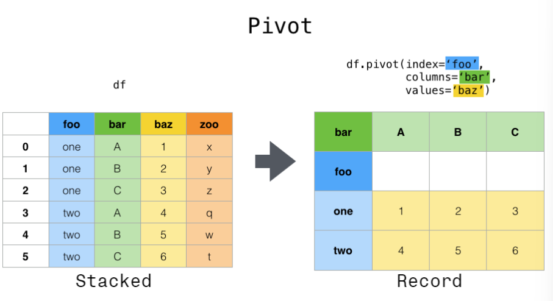
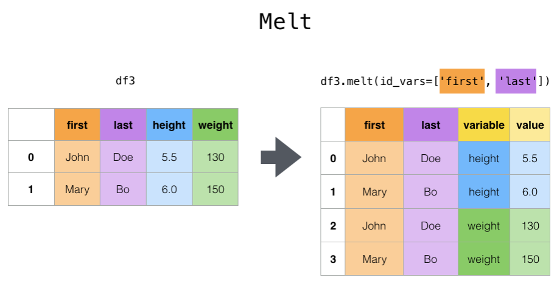

# pandas透视表和reshape

[TOC]

本文总结了pandas对Series/DataFrame改变形状的方法（总结自pandas[官方文档](https://pandas.pydata.org/docs/user_guide/reshaping.html#reshaping-melt)）。

## pivot()和pivot_table()

### pivot()

- 功能：将DataFrame按照指定的index、columns和values进行重构

- 用法：`pandas.pivot(data, *, columns, index=_NoDefault.no_default, values=_NoDefault.no_default)`
- 参数：
  - data: DataFrame；DataFrame数据对象
  - columns：str / [str1,str2...] / object; 需要得到的DataFrame包含的列
  - index: str / [str1,str2...] / object (可选参数);  新的DataFrame的index对应的列，如果未指定则使用原始index
  - values：str / [str1,str2...] / object (可选参数); 新的DataFrame的值，如果未指定则使用剩余的列
- 说明：
  - 对应方法为`df.pivot()`
  - 变换示例图：

### pivot_table()

## melt()和wide_to_long()

### melt()

- 功能：将DataFrame指定的列做为指示变量，其他列压缩成两列，一列表示变量名，另一列作为值
- 用法：`pandas.melt(frame, id_vars=None, value_vars=None, var_name=None, value_name='value', col_level=None, ignore_index=True)`
- 参数：
  - id_vars: tuple, list, ndarray (可选参数)；作为指示变量的列
  - value_vars: tuple, list, ndarray (可选参数)；指定要把哪些列用于逆透视表，如果未指定则把剩余所有列做逆透视表操作
  - var_name: scalar； 指定变量名列的名称
  - value_name: scalar, 默认为'value'；指定值列的名称
  - col_level：int，str（可选参数）；index为MultiIndex使用
  - ignore_index: bool,默认为True；是否使用原始的index id

- 说明：
  - 对应方法为：`df.melt()`
  - 变换示意图：