# 代码-动态规划

[TOC]

## 动规解题思路

- 动规题目四个关键：（1）`dp`数组含义；（2）递推公式；（3）初始化方式；（4）遍历顺序
- 背包问题几个关键点：
  - 01背包（每个物品只能使用一次）和完全背包（物品可多次使用）在采用一维`dp`数组时遍历顺序不同，01背包为了保证物品不重复使用，需要倒序遍历背包；而完全背包则需要正序遍历；==01背包>>倒叙遍历背包；完全背包>>正向遍历背包==
  - 求排列数和组合数时遍历背包和物品的顺序不同，如果先遍历物品，那么产生组合数（假设前两个元素是a,b,那么遍历只能产生a,b这样顺序的组合）；而如果先遍历背包，那么则产生排列数。此外，求排列数和组合数时`dp[0]`都需要初始化为1。==排列>>先遍历背包；组合>>先遍历物品==
  - 初始化方式需要根据递推公式以及题目来确定，首先除第一个元素之外的元素的初始化需要根据递推公式来判断，如果递推公式包含min/max，则初始化为inf/-inf；第一个元素的初始化则需要具体问题具体分析，不一定有很好解释的意义。

## 题目

### [62. 不同路径](https://leetcode.cn/problems/unique-paths/)

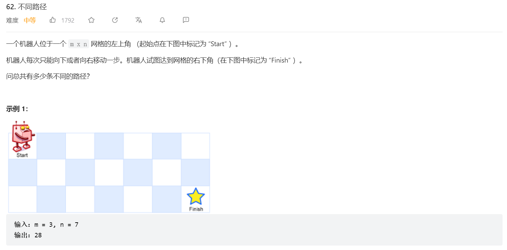

**题解：**

- 这道题`dp`数组含义以及递推公式都很容易求得，关键在于`dp`数组的初始化方式,因为第一行和第一列都需要等于1，所以这里初始化为全1数组。

```python
class Solution:
    def uniquePaths(self, m: int, n: int) -> int:
        dp = [[1] * n for _ in range(m)]
        for i in range(1, m):
            for j in range(1, n):
                dp[i][j] = dp[i][j-1] + dp[i-1][j]
        return dp[m-1][n-1]
```

### [63. 不同路径 II](https://leetcode.cn/problems/unique-paths-ii/)

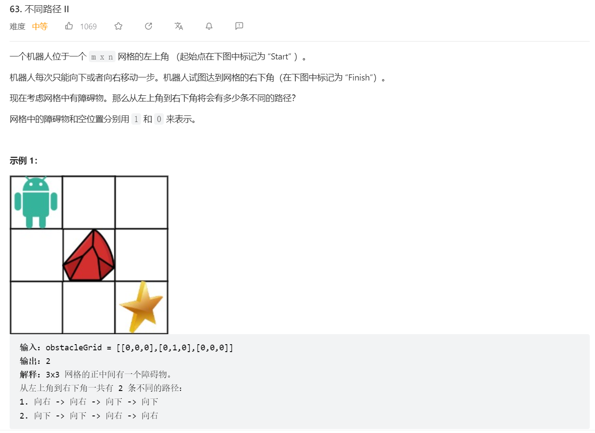

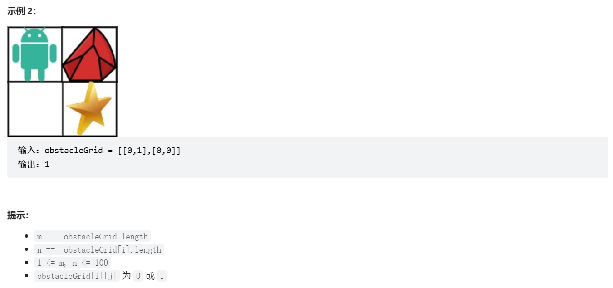

**题解：**

- 这道题的关键在于初始化方式，第一行和第一列在没有遇到障碍物之前`dp`数组应该为1，但是遇到之后应该等于0（另外要注意的是python中数组用列表表示时不能按照索引同时修改多个子列表，例如`dp[1:][0]=0`是不行的）

```python
class Solution:
    def uniquePathsWithObstacles(self, obstacleGrid: List[List[int]]) -> int:
        m, n = len(obstacleGrid), len(obstacleGrid[0])
        dp = [[0] * n for _ in range(m)]
        for i in range(n):
            if obstacleGrid[0][i] == 0:
                dp[0][i] = 1
            else:
                break
        for i in range(m):
            if obstacleGrid[i][0] == 0:                
                dp[i][0] = 1
            else:
                break
        for i in range(1, m):
            for j in range(1, n):
                if obstacleGrid[i][j] == 1:
                    dp[i][j] = 0
                else:
                    dp[i][j] = dp[i-1][j] + dp[i][j-1]
        return dp[m-1][n-1]
```

### [343. 整数拆分](https://leetcode.cn/problems/integer-break/)

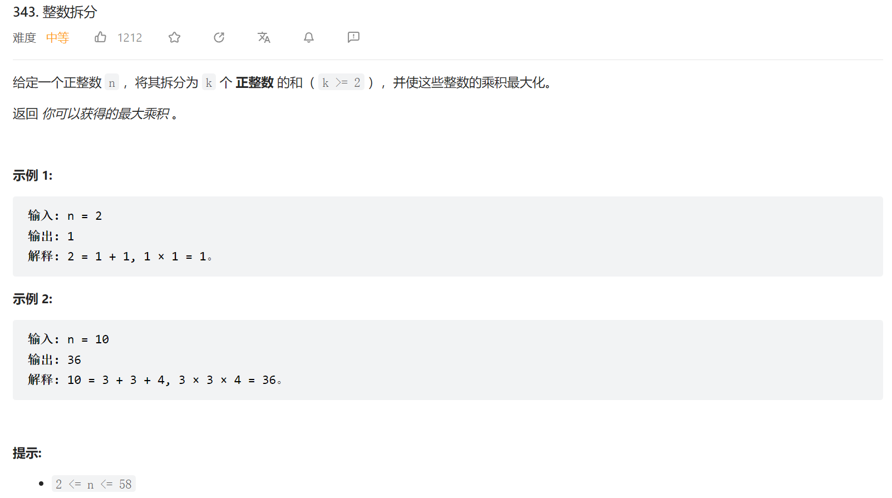

**题解:**

- 这道题的关键是找到递推公式，`dp[i]`表示整数i分解之后乘积的最大值，那么遍历i，则i可以划分成j和i-j两部分，乘积可以表示成`j*(i-j)`或者`j*dp[i-j]`，其中前者表示拆成两个数，后者表示拆成3个以上的数，那么递推公式就可以表示成`dp[i]=max(dp[i],j*(i-j),j*dp[i-j])`
- 这里一开始我写的递推公式是`dp[i] = max(dp[i], dp[j] * dp[i-j], dp[j] * (i-j), j * dp[i-j], j * (i-j))`
- 另外j的取值范围可以写成到`i//2+1`

```python
class Solution:
        # 假设对正整数 i 拆分出的第一个正整数是 j（1 <= j < i），则有以下两种方案：
        # 1) 将 i 拆分成 j 和 i−j 的和，且 i−j 不再拆分成多个正整数，此时的乘积是 j * (i-j)
        # 2) 将 i 拆分成 j 和 i−j 的和，且 i−j 继续拆分成多个正整数，此时的乘积是 j * dp[i-j]
    def integerBreak(self, n):
        dp = [0] * (n + 1)   # 创建一个大小为n+1的数组来存储计算结果
        dp[2] = 1  # 初始化dp[2]为1，因为当n=2时，只有一个切割方式1+1=2，乘积为1
       
        # 从3开始计算，直到n
        for i in range(3, n + 1):
            # 遍历所有可能的切割点
            for j in range(1, i // 2 + 1):

                # 计算切割点j和剩余部分(i-j)的乘积，并与之前的结果进行比较取较大值
                
                dp[i] = max(dp[i], max((i - j) * j, dp[i - j] * j))
        
        return dp[n]  # 返回最终的计算结果
```

### [96. 不同的二叉搜索树](https://leetcode.cn/problems/unique-binary-search-trees/)

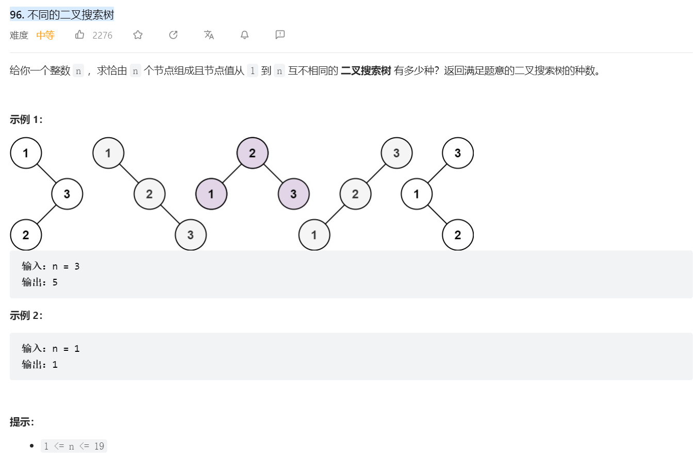

**题解：**

- 关键是要找到递推公式。首先定义`dp`数组表示1-n个数字可组成的搜索二叉树的数目（其实==等价于n个不用的数可组成的搜索二叉树数目==）考虑一般情况，对于整数i，如果以j为头节点，那么左子树包含j-1个数字，右子树包含i-j个数字，那么容易推出递推公式为：`dp[i]+=dp[j-1]*dp[i-j]`

```python
class Solution:
    def numTrees(self, n: int) -> int:
        dp = [0] * (n+1)
        dp[0] = 1
        for i in range(1, n+1):
            for j in range(1, i+1):
                dp[i] += dp[j-1] * dp[i-j]
        return dp[-1]
```

### [125 · 背包问题（二）](https://www.lintcode.com/problem/125/description)

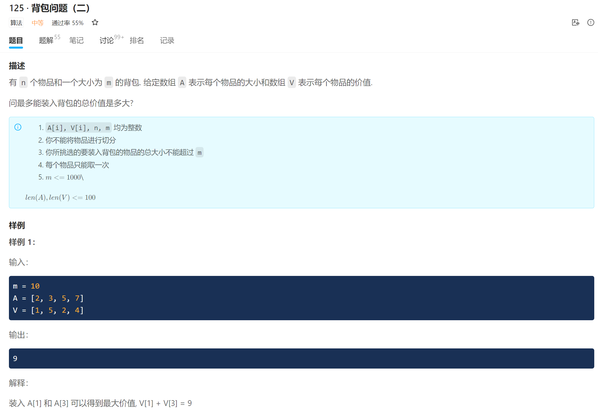

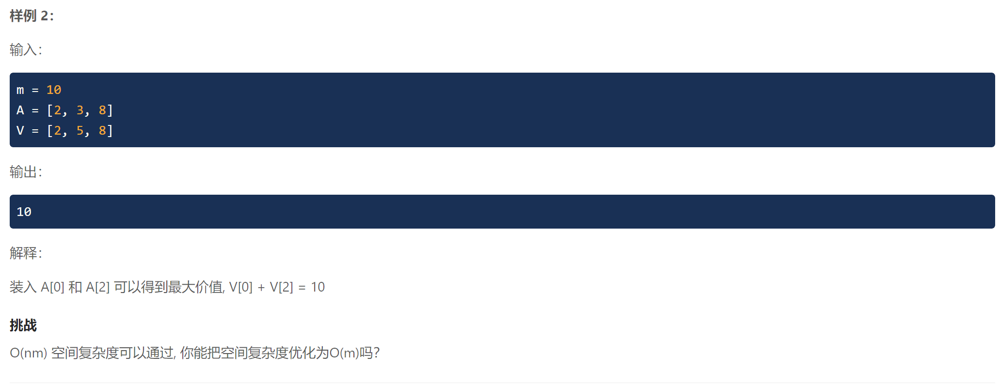

**题解：**

- 首先考虑二维`dp`数组的情形，此时`dp[i][j]`表示从前i个物品中选择，背包容量为j时的最大价值；递推公式容易推得为`dp[i][j]=max(dp[i-1][j], dp[i-1][j-A[i]]+V[i])`
- 因为在二维情况下`dp`数组第i行只与第i-1行有关，因此可以用一维`dp`数组表示，也就是==每一轮i对应一组一维`dp`==，也就是说当更新到新一轮i的时候，`dp`保存的是i-1时的结果，此时如果顺序遍历j，则更小的j已经被更新了，不再是i-1的结果了，所以j需要逆序遍历。递推公式为`dp[j]=max(dp[j], dp[j-A[i]]+V[i])`
- 参考https://www.acwing.com/solution/content/116859/

```python
# 二维dp数组情况
class Solution:
    """
    @param m: An integer m denotes the size of a backpack
    @param a: Given n items with size A[i]
    @param v: Given n items with value V[i]
    @return: The maximum value
    """
    def back_pack_i_i(self, m: int, a: List[int], v: List[int]) -> int:
        # write your code here
        dp = [[0] * (m+1) for _ in range(len(a))]
        # 先初始化第一行,因为dp数组更新要求已知前一行
        for j in range(m+1):
            if j >= a[0]:
                dp[0][j] = v[0]
        for i in range(1, len(a)):
            for j in range(1, m+1):
                if j >= a[i]:
                    dp[i][j] = max(dp[i-1][j], dp[i-1][j-a[i]]+v[i])
                else:
                    dp[i][j] = dp[i-1][j]
        return dp[-1][-1]
    
# 一维dp数组情况
class Solution:
    """
    @param m: An integer m denotes the size of a backpack
    @param a: Given n items with size A[i]
    @param v: Given n items with value V[i]
    @return: The maximum value
    """
    def back_pack_i_i(self, m: int, a: List[int], v: List[int]) -> int:
        # write your code here
        dp = [0] * (m+1)
      	# 这里不用初始化第一行,因为这里的递推公式就包含了第一行初始化的逻辑
        for i in range(len(a)):
            for j in range(m, a[i]-1, -1):
                dp[j] = max(dp[j], dp[j-a[i]]+v[i])
        return dp[-1]
```

### [53. 最大子数组和](https://leetcode.cn/problems/maximum-subarray/)

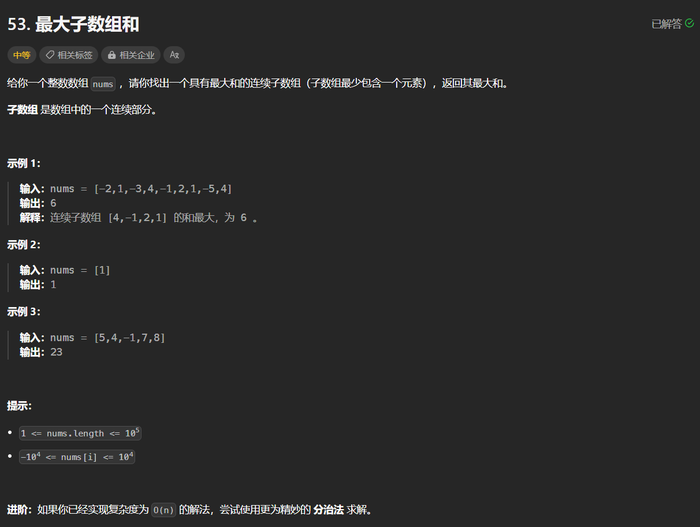


**题解：**

- 动态规划很好理解：

  > `dp`数组元素`dp[i]`定义为以`nums[i]`结尾的最大连续子数组，当`dp[i-1]<0`时,`dp[i]=nums[i]`; 当`dp[i-1]>=0`时，`dp[i]=dp[i-1]+nums[i]`。初始化方式为`dp[0]=nums[0]`。
  >
  > ==由于`dp[i]`只与`dp[i-1]`和`nums[i]`相关，所以可以直接修改`nums[i]`==

```python
# 基础dp
class Solution:
    def maxSubArray(self, nums: List[int]) -> int:
        n = len(nums)
        dp = [0] * n
        dp[0] = nums[0]
        for i in range(1, n):
            if dp[i-1] > 0:
                dp[i] = dp[i-1] + nums[i]
            else:
                dp[i] = nums[i]
        return max(dp)
    
# dp进一步优化
class Solution:
    def maxSubArray(self, nums: List[int]) -> int:
        for i in range(1, len(nums)):
            nums[i] += max(nums[i - 1], 0)
        return max(nums)
```

### [1049. 最后一块石头的重量 II](https://leetcode.cn/problems/last-stone-weight-ii/)

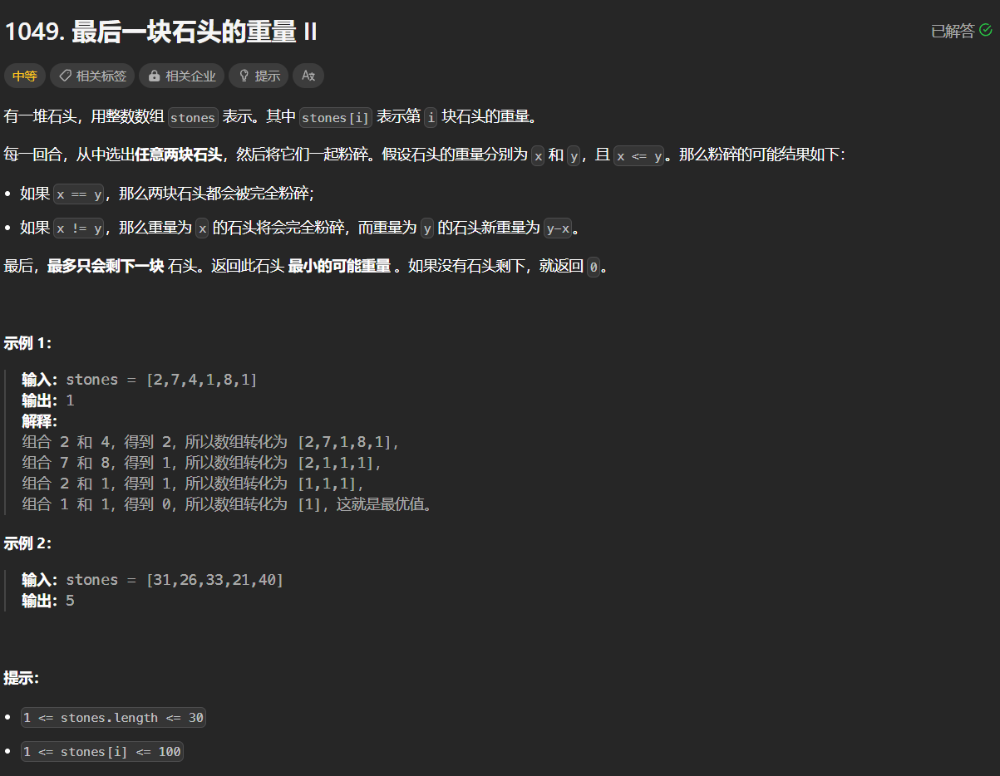

**题解：**

- 首先根据题意可以做如下抽象：$\sum_{i=0}^{n-1} k_i*stones[i], k_i \sub \{ -1, 1\}$中的合理组合可以表示最终石头的重量。下面证明此假设(摘录自`leetcode`官方题解)：

  > 假设存在一组$\sum_{i=0}^{n-1} k_i*stones[i], k_i \sub \{ -1, 1\}$使得最终留下的石头重量最小，也就是说明当将石头分成$k_i$分别为-1，1两类后，一定可以找到一种分解方式使得最终留下的石头重量最小。
  >
  > 假设$k_i=1$和$k_i=-1$的两组石头分别为A，B，（A，B质量和的差值等于`diff`）每次从A中拿出最大的一块石头和B中任意一块碰撞，那么结果是两组石头重量同时减少，将剩下的石头放入A中并继续此流程，最终剩下的石头重量就为`diff`。

- 根据上述合理性证明，假设A,B两组的重量分别为a，b=sum-a，那么它们之间的质量差为`diff=|a-(sum-a)|=|2a-sum|`，所以此题等价于找到一种分解方式，使得一组石头重量接近总重量的一半。这就可以利用01背包问题求解，其中背包重量等于石头总重量的一半。

```python
class Solution:
    def lastStoneWeightII(self, stones: List[int]) -> int:
        s = sum(stones)
        target = s // 2
        dp = [0] * (target + 1)
        for stone in stones:
            for j in range(target, stone-1, -1):
                dp[j] = max(dp[j], dp[j-stone]+stone)
        return s - dp[-1] * 2
```

### [416. 分割等和子集](https://leetcode.cn/problems/partition-equal-subset-sum/description/)

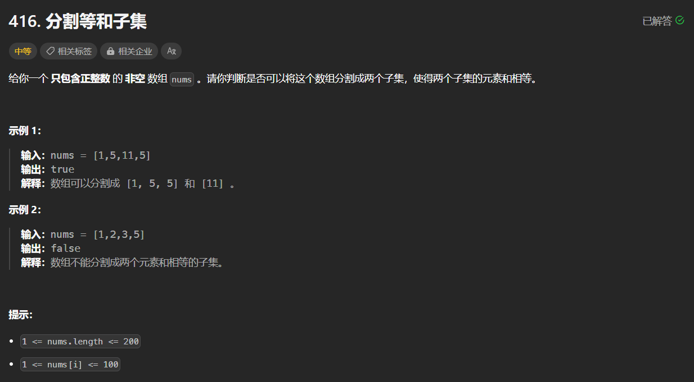

**题解：**

- 首先明确本题为背包问题，背包最大可装物品重量为数组和的一半，物品重量和价值都等于数组元素数值。

```python
class Solution:
    def canPartition(self, nums: List[int]) -> bool:
        n = len(nums)
        target = sum(nums) // 2
        if target * 2 != sum(nums):
            return False
        dp = [0] * (target + 1)
        for i in range(n):
            for j in range(target, nums[i]-1, -1):
                dp[j] = max(dp[j], dp[j-nums[i]]+nums[i])
        if dp[-1] == target:
            return True
        return False
```

### [494.目标和](https://leetcode.cn/problems/target-sum/)

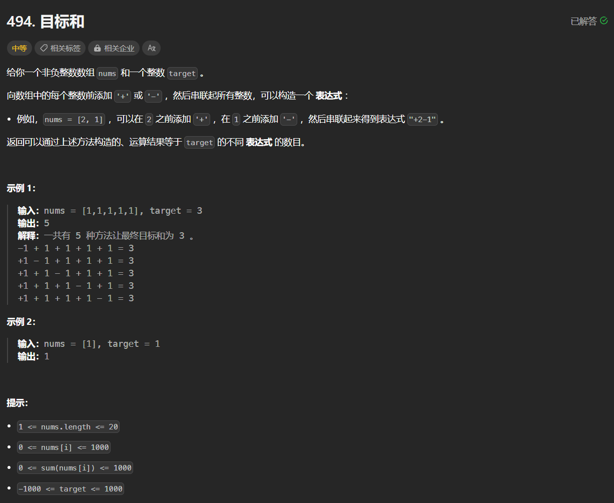

**题解：**

- 假设添加`+`号的元素和为`l`,添加负号的元素和为`r`，可以计算得到`r=(s-target)/2`。那么本题就转化为可以找到多少组数使得和等于`r`，每个数只能使用一次，这等价于01背包问题。但是`dp`数组含义略有不同，这里`dp`数组元素表示背包大小为j时，有多少种组合方式可以装满背包。递推公式为：`dp[j]+=dp[j-num]`

- 初始化方式：`dp[0]=1,`其他`dp`数组元素初始化为0。`dp[0]=1`有两种解释：

  - 直接从`dp`数组含义角度，0个元素装满背包大小为0有1种组合方式；
  - 如果有一个元素可以选择，元素为k，那么装满k的背包有几种组合？按照递推公式，应该有`dp[k]+dp[0]`种方式，可以看出`dp[0]`应该初始化为1。==另外，如果`dp[0]=0`,那么所有`dp`数组的元素都将是0==

  > 这种问题叫组合类背包问题，`dp`数组和递推公式与原始01背包问题不同。

```python
class Solution:
    def findTargetSumWays(self, nums: List[int], target: int) -> int:
        s = sum(nums)
        if target > s:
            return 0
        r = (s - target) // 2
        if r * 2 != s - target:
            return 0
        dp = [0] * (r + 1)
        dp[0] = 1
        for num in nums:
            for i in range(r, num-1, -1):
                dp[i] += dp[i-num]
        return dp[-1]
```

### [474.一和零](https://leetcode.cn/problems/ones-and-zeroes/)

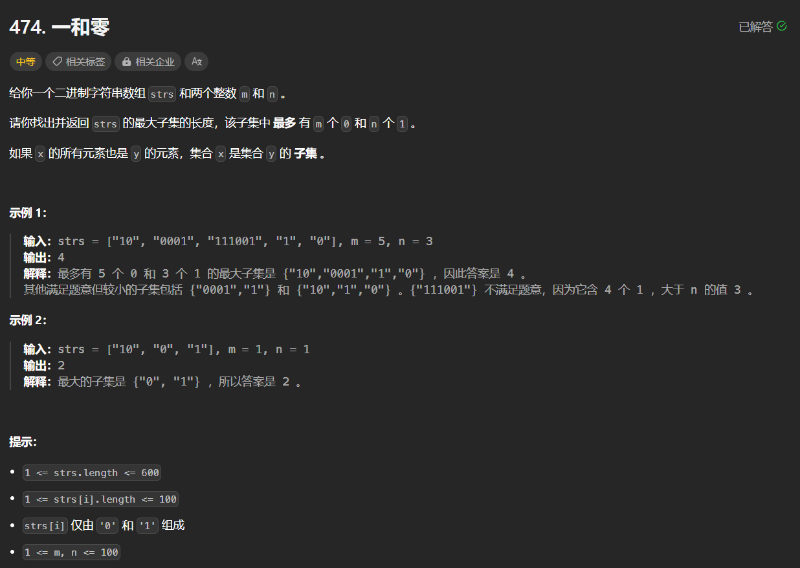

**题解：**

- 本题01背包的维度有两维

```python
class Solution:
    def findMaxForm(self, strs: List[str], m: int, n: int) -> int:
        dp = [[0] * (n+1) for _ in range(m+1)]
        for s in strs:
            n_zero = s.count('0')
            n_one = len(s) - n_zero
            for i in range(m, n_zero-1, -1):
                for j in range(n, n_one-1, -1):
                    dp[i][j] = max(dp[i][j], dp[i-n_zero][j-n_one]+1)
        return dp[-1][-1]
```

### [440.背包问题（三）](https://www.lintcode.com/problem/440/)

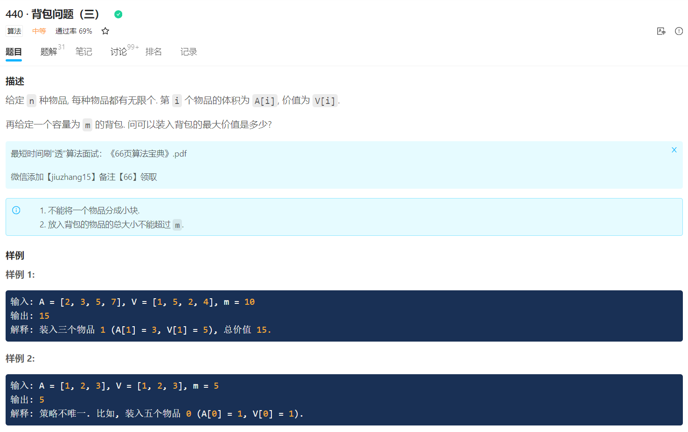


**题解：**

- 本题属于==完全背包问题==，即每个物品可以重复使用；采用一维`dp`数组时，完全背包问题和01背包问题的解决方式唯一的不同之处在于背包的遍历顺序。
- 采用二维`dp`数组时，则存在两点不同之处，一个是初始化的方式，另一个就是递推公式。

```python
# 二维dp数组
class Solution:
    """
    @param a: an integer array
    @param v: an integer array
    @param m: An integer
    @return: an array
    """
    def back_pack_i_i_i(self, a: List[int], v: List[int], m: int) -> int:
        # write your code here
        n = len(a)
        if n == 0:
            return 0
        dp = [[0] * (m+1) for _ in range(n)]
        for j in range(m+1):
            if j >= a[0]:
                dp[0][j] = dp[0][j-a[0]]+v[0]
        for i in range(1, n):
            for j in range(m+1):
                if j >= a[i]:
                    dp[i][j] = max(dp[i-1][j], dp[i][j-a[i]]+v[i])
                else:
                    dp[i][j] = dp[i-1][j]
        return dp[-1][-1]
    
# 一维dp数组
class Solution:
    """
    @param a: an integer array
    @param v: an integer array
    @param m: An integer
    @return: an array
    """
    def back_pack_i_i_i(self, a: List[int], v: List[int], m: int) -> int:
        # write your code here
        dp = [0] * (m+1)
        n = len(a)
        for i in range(n):
            for j in range(a[i], m+1):
                dp[j] = max(dp[j], dp[j-a[i]]+v[i])
        return dp[-1]
```

### [518.零钱兑换||](https://leetcode.cn/problems/coin-change-ii/description/)


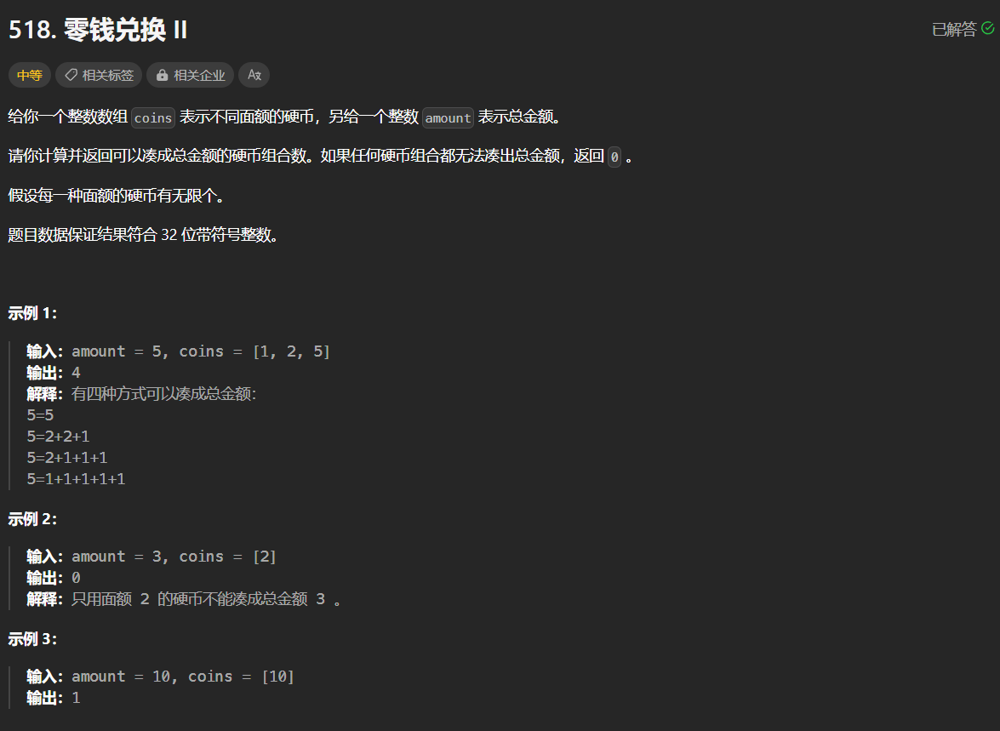

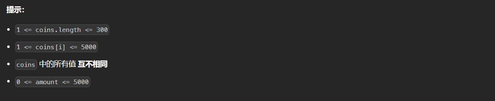

**题解：**

- 完全背包问题；组合问题；
- `dp[i]`表示组合成`i`的组合数；`dp[0]`初始化为1，其他初始化为0；递推公式：`dp[i]+=dp[i-coin]`;先遍历物品，再遍历背包；正向遍历背包

```python
class Solution:
    def change(self, amount: int, coins: List[int]) -> int:
        dp = [0] * (amount + 1)
        dp[0] = 1
        for coin in coins:
            for i in range(coin, amount+1):
                dp[i] += dp[i-coin]
        return dp[-1]
```

### [377.组合综合VI](https://leetcode.cn/problems/combination-sum-iv/description/)

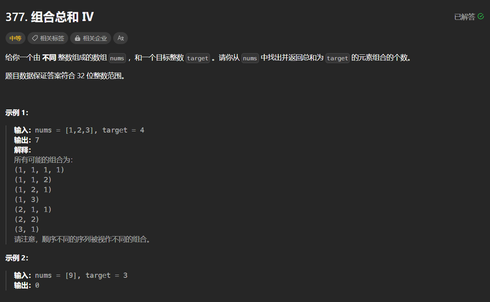

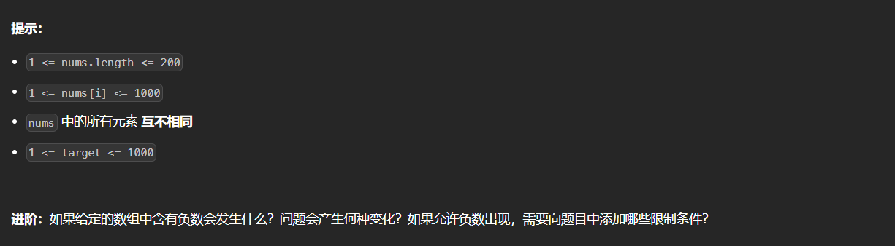

**题解：**

- 完全背包；排列问题
- `dp[i]`表示目标为`i`时的组合个数；递推公式：`dp[i]+=dp[i-num]`;`dp[0]=0`，其他元素初始化为0；正向遍历背包；先遍历背包，再遍历物品
- 本题可以从爬楼梯问题进阶得到：爬楼梯，每次可以走1，2，...，m步，总共n步，问有多少种走法？

```python
class Solution:
    def combinationSum4(self, nums: List[int], target: int) -> int:
        dp = [0] * (target + 1)
        dp[0] = 1
        for i in range(1, target + 1):
            for num in nums:
                if i >= num:
                    dp[i] += dp[i-num]
        return dp[-1]
```

### [322.零钱兑换](https://leetcode.cn/problems/coin-change/description/)

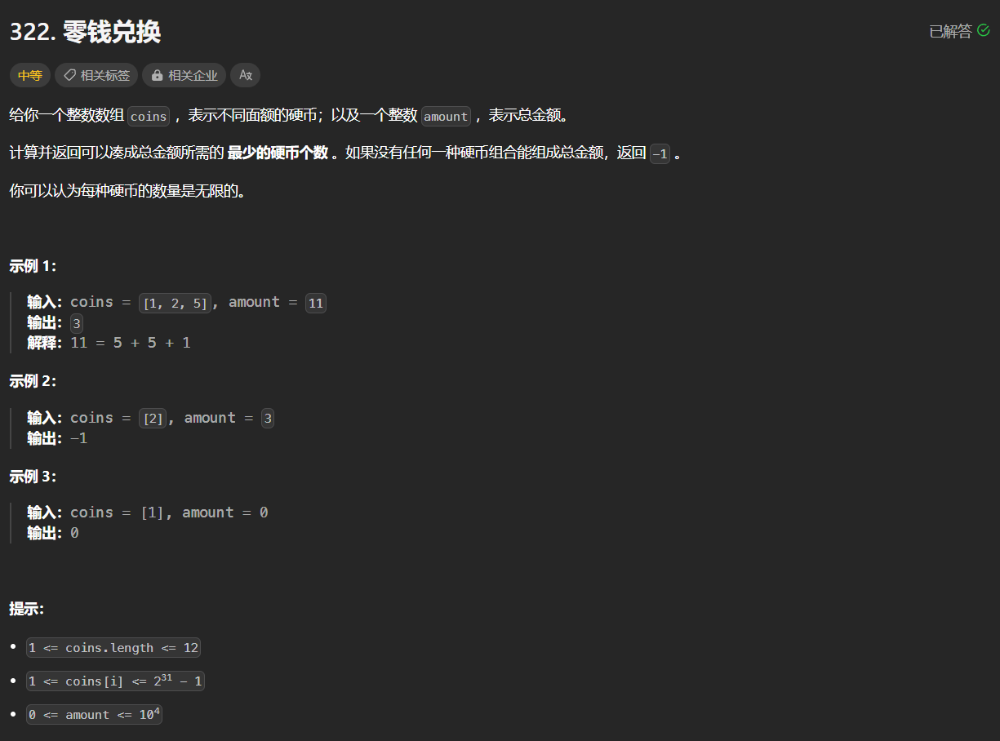

**题解：**

- 完全背包；
- `dp[i]`表示凑足总金额为i所需的最小硬币个数；递推公式：`dp[i]=min(dp[i],dp[i-coin]+1)`;初始化方式：`dp[0]=0`其他元素初始化为无穷大（由于递推公式包含最小的比较）；背包正向遍历；背包和物品之间的遍历顺序没有限制

```python
class Solution:
    def coinChange(self, coins: List[int], amount: int) -> int:
        dp = [float('inf')] * (amount + 1)
        dp[0] = 0
        for coin in coins:
            for i in range(coin, amount + 1):
                dp[i] = min(dp[i], dp[i - coin] + 1)
        return dp[-1] if dp[-1] != float('inf') else -1
```

### [279.完全平方数](https://leetcode.cn/problems/perfect-squares/description/)

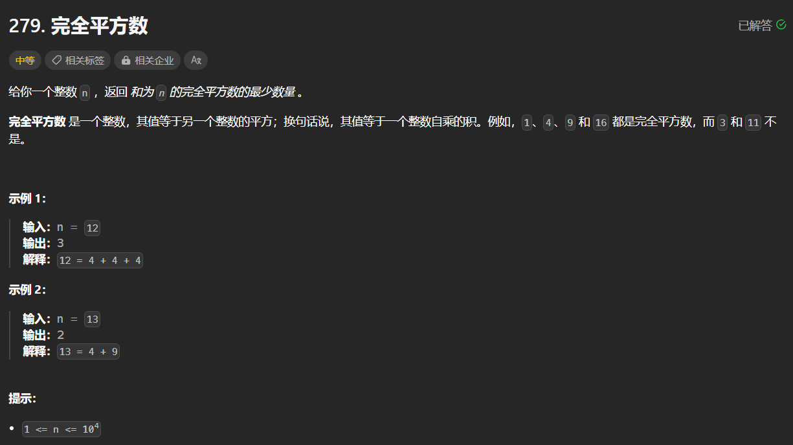

**题解：**

- 完全背包问题；
- `dp[j]`表示和为`j`的完全平方数的最小数量；递推公式：`dp[j] = min(dp[j], dp[j - i * i] + 1)`;初始化：递推公式涉及min，所以初始化为无穷大`dp = [float('inf')] * (n + 1)`，`dp[0]`初始化为0，表示和为0的完全平方数为0；遍历顺序：非组合/排列问题`->`先遍历背包还是物品都行，完全背包`->`正向遍历背包。

```python
class Solution:
    def numSquares(self, n: int) -> int:
        target = int(n ** 0.5) 
        dp = [float('inf')] * (n + 1)
        dp[0] = 0
        for i in range(1, target + 1):
            for j in range(i * i, n + 1):
                dp[j] = min(dp[j], dp[j - i * i] + 1)
        return dp[-1]
```

### [139.单词拆分](https://leetcode.cn/problems/word-break/description/)

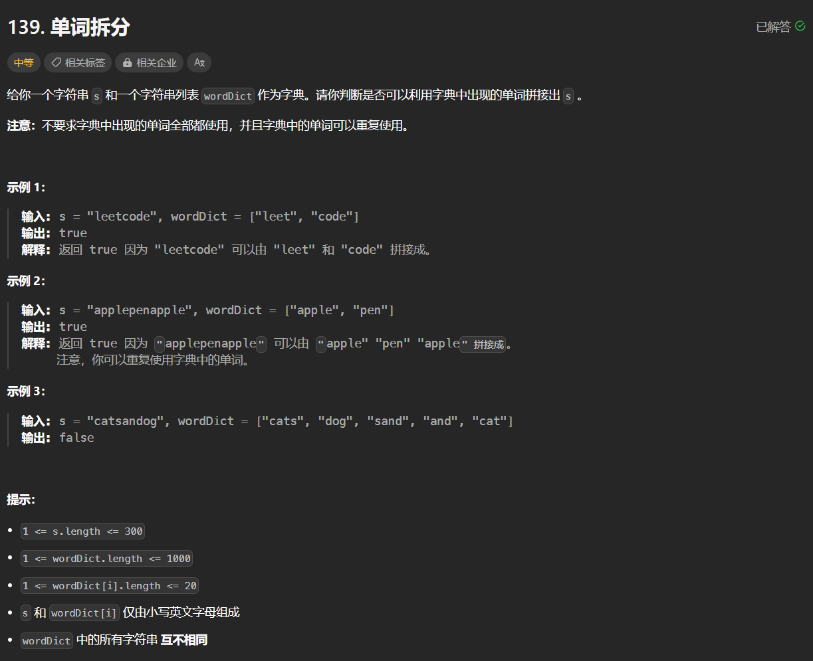

**题解：**

- 完全背包；排列问题
- `dp[i]`表示字符串的前i个元素是否可以被单词字典组成；递推公式：如果`s[j-i:i]`在单词字典中，并且`dp[j]`为真，那么`dp[i]`为真；初始化：`dp[0]=True`（如果为False，则所有元素都是False），其他元素初始化为False；遍历顺序：排列问题`->`先遍历背包
- ==本题需要注意`dp`数组和字符串长度不一样，需要注意下标对齐的问题==

```python
class Solution:
    def wordBreak(self, s: str, wordDict: List[str]) -> bool:
        n = len(s)
        dp = [False] * (n + 1)
        dp[0] = True
        for i in range(1, n + 1):
            for word in wordDict:
                if i >= len(word) and (dp[i - len(word)] and word == s[i - len(word) : i]):
                    dp[i] = True
        return dp[-1]
```

### [198.打家劫舍](https://leetcode.cn/problems/house-robber/description/)

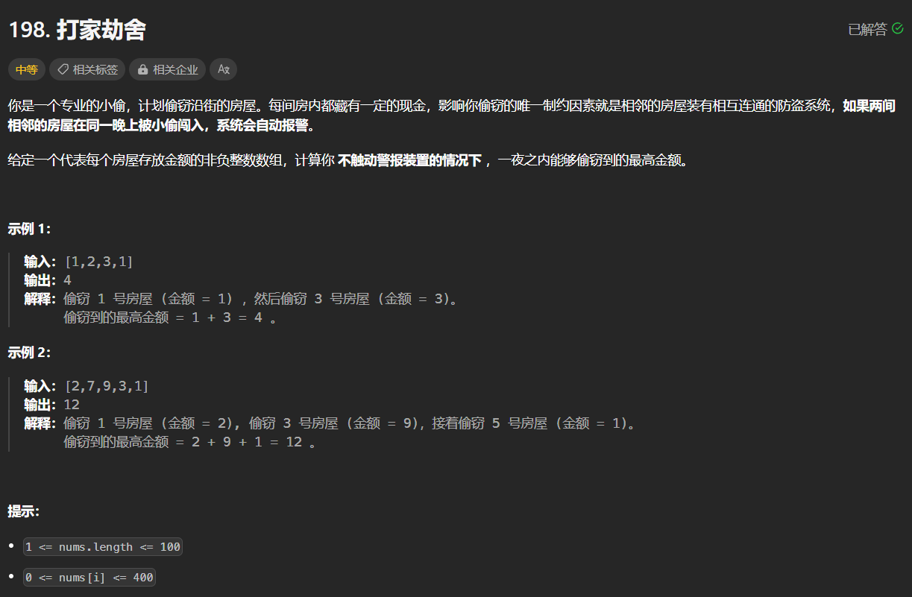

**题解：**

- `dp[i]`表示前i家可以偷窃得到的最高金额；递推公式：如果偷第i家，那么最高金额为`nums[i]+dp[i-2]`,如果不偷第i家，则为`dp[i-1]`,所以递推公式为`dp[i]=max(dp[i-1],nums[i]+dp[i-2])`;初始化：`dp[0]=nums[0],dp[1]=max(dp[0],dp[1])`,其他元素初始化为-inf

```python
class Solution:
    def rob(self, nums: List[int]) -> int:
        n = len(nums)
        if n < 3:
            return max(nums)
        dp = [-float('inf')] * n
        dp[0] = nums[0]
        dp[1] = max(nums[0], nums[1])
        for i in range(2, n):
            dp[i] = max(dp[i-1], dp[i-2] + nums[i])
        return dp[-1] 
    
# 由于dp数组之和nums[i]以及dp[i-1],dp[i-2]相关,因此有两种空间优化方式：
# 1. 只记录dp[i-1],dp[i-2]两个量
# 2. 只更新nums
class Solution:
    def rob(self, nums: List[int]) -> int:
        n = len(nums)
        if n < 3:
            return max(nums)
        nums[1] = max(nums[0], nums[1])  
        for i in range(2, len(nums)):
            nums[i] = max(nums[i - 2] + nums[i], nums[i - 1])
        return nums[-1]  
```

