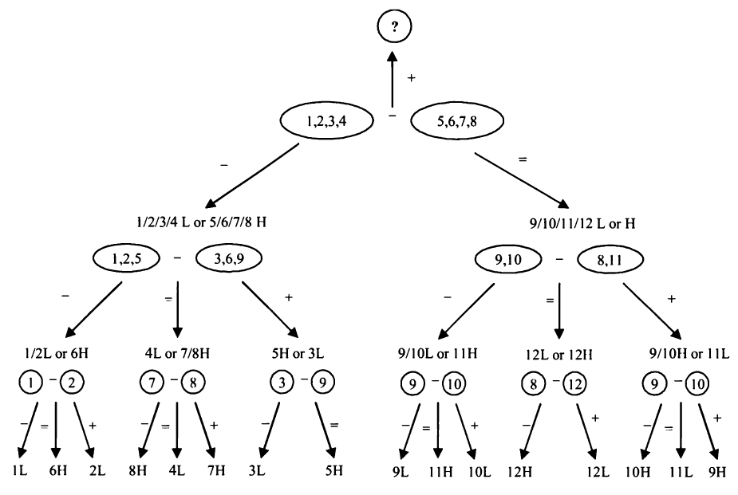

# Brain Teaser

[TOC]

## 拆分问题

### 贪婪的海盗

5个海盗分100个金币：由等级最高的海盗提出一个分配方案，如果至少50%的海盗赞成，那么方案通过；否则1号海盗被扔进海里，接下来由等级第二高的海盗提出分配方案，以此类推...。假定每个海盗都足够冷血，在获得相同金币的情况下，他们更希望存活的海盗更少。那么1号海盗应该提出什么方案？

> Solution:
>
> 假定海盗等级按照数字大小排列，即数字越大等级越高。
>
> 假如有2个海盗，那么2号海盗会把所有金币给自己，即分配方案为（0，100）
>
> 假如有3个海盗，那么3号海盗为了活命必须拉拢1号海盗，因为如果3号的方案被否决，那么1号将什么也拿不到，所以此时的分配方案是（1，0，99）
>
> 假如有4个海盗，那么4号海盗为了活命只需要给2号海盗一枚金币即可，分配方案为（0，1，0，99）
>
> 加入有5个海盗，那么5号海盗需要拉拢1号和3号海盗，因为如果5号的方案被否决，下一轮1号和3号可能什么都拿不到，此时分配方案为（1，0，1，0，98）
>
> ...
>
> 可以看到如果有`2n+1（n<=100）`个海盗，那么分配方案是`1，3，...，2n-1`号海盗各得一个金币

### 老虎和羊

草原上有一百只老虎和一只羊，如果一只老虎把羊吃掉了，那么它会变成羊，假定每次只能由一只老虎吃掉一只羊，并且所有老虎足够理性，最终这只羊会被吃掉吗？

> Solution:
>
> 假如有1只老虎，那么老虎一定会吃掉羊；
>
> 假如有2只老虎，那么老虎一定不会吃羊；
>
> 假如有3只老虎，那么其中一只老虎一定会吃羊；
>
> 假如有4只老虎，那么它们都不会吃羊；
>
> ...
>
> 依此类推，当有偶数只老虎时，羊不会被吃掉。

## 逻辑推理

### 过桥问题

A,B,C,D个人过桥，过桥需要手电，每次最多只能走两个人，只有一个手电，四个人过桥所需时间分别为10，5，2，1分钟，两个人一起过桥耗时由所需时间更久的人决定，问四个人全部过桥最少需要多少分钟？

>Solution:
>
>==耗时最久的两个人一定要同时过桥==，所以A,B一定同时过桥，并且他们不能最先过桥，因为此时他们返回也很耗时，所以一开始一定是C,D先过桥（2 m），然后D回来（1 m），接下来A,B过桥（10 m）,然后C回来（2 m），最后C,D一起过桥（2 m），总共17 m。

### 生日问题

你和同事A知道老板的生日一定是以下日期中的一个：3.4，3.5，3.8，6.4，6.7，9.1，9.5，12.1，12.2，12.8。你只知道老板生日的月份，你的同事A只知道日期。在你说完：我不知道老板的生日，A也不知道之后，你的同事A说：我之前不知道，但是现在知道了。听到这之后你也笑着说你也知道了。当另一个同事看到这个些日期和你们的对话后，另一个同事猜出了老板的生日，请问老板的生日是？

>Solution:
>
>按逻辑来。首先我确信A不知道具体月份，那么说明A知道的日期一定不能只有一个，也就是7和2，那么月份一定不能是6和12月；接下来A说他知道日期了，那么说明他知道的日子一定不能是5号，因为存在3.5和9.5两种可能；随后我也知道了日期，那么我知道的月份一定是9月，所以日期是9.1。

### 卡牌游戏

庄家提供一种卡牌游戏，规则是下家不断从52张牌里摸牌，每次摸两张，如果都是黑色把牌给装甲，都是红色就自己拿走，一黑一红就弃掉，直到摸完一副牌游戏结束；如果下家得到的牌数多于庄家则获得100元，否则赔掉本钱，问应该下注多少？

>Solution:
>
>因为丢掉的黑牌和红牌数目相等，那么最终庄家和下家手中牌数一定相同，所以下家不可能赢。

### 烧绳子

有两根不均匀的绳子，烧完它们均需要1 h，用这两根绳子怎么测量45 m？

> Solution:
>
> 一根绳子烧完耗时1 h，把绳子对折烧完一定耗时0.5 h，所以只需要把一根绳子对折，然后同时烧对折的和不对折的绳子，半小时后对折的绳子烧完了，另一根绳子还能烧半小时，所以只需把这根绳子再次对折，就能得到15 m。

### 不同的球

有12个相同的球，其中一个比其他11个更轻或者更重，只用一个没有刻度的天平可以在3次测量的情况下找到这个不同的球吗？

> Solution:
>
> 如果按照常规思路，每次拿出一半的球来称重，那么需要4次称重，因为每次可以排除一半，4次最多可以排除$2^4=16$个球；
>
> 但是其实如果把球分成三份，一次称重可以排除2/3；如果只需要找到这个不同的球，那么n次称重可以排除$3^n$个球；但是如果需要判断这个球是更轻还是更重，则n次称重最多只能排除$\frac{3^n-3}{2}$个球。
>
> 

### 末尾0的个数

100！末尾有多少个0？

> Solution:
>
> 只有$2 \times 5$ 才能得到0，显而易见100！中能分解出的因数2的个数比5更多，那么只需要判断100！能分解出多少个因数5就行。5，10，15，...，100,这里总共有20个数，它们除以5之后为1，2，...，20，其中又有4个数包含5的因子，并且再继续除下去没有包含因数5的数了，所以总共可以分解出24个5，那么100！末尾一共有24个0。

### 赛马

有25匹马，它们的速度各不相同，每次只能赛5匹，怎么用最少的比赛次数找到跑得最快的3匹马，最少需要几场比赛？

> Solution:
>
> 首先将马分成5组，每一组进行一次比赛，假定马的编号为1-25，第一组马的编号为1-5，第二组为6-10，依此类推。假定每一组最快的马分别是1，6，11，16，21，那么最快的马一定在这5匹马中，对它们进行异常比赛，假定排名顺序为1，6，11，16，21，那么16，21一定不在前3名中，第二名和第三名只可能在6，11，2，3，12这5匹马中，对它们进行一场比赛就可以找到第2，3名，所以总共需要7场比赛。

### 无限序列

如果$x^{x^{x^{x^{...}}}}=2$，x等于多少？

> Solution:
>
> 假设$y=x^{x^{x^{x^{...}}}}=2$，那么$x^y$也等于2，所以可知$x=\sqrt2$。

## 跳出思维定势

### 装长条

可以把53个$1 \times 1 \times 4$的长条放入一个$6 \times 6 \times 6$的盒子中吗？

> Solution:
>
> 本题还有另外一种变体：在一个$8 \times 8$的正方形中，其中一条对角线顶端有两个空格，能否用31个$1 \times 2$的矩形填满这个正方形？
>
> 如果把任意相邻的小正方形分别涂上黑色和白色，按照这种颜色涂取方式，对角线上顶点的两个网格一定颜色相同；并且每个小矩形一定是由一个黑色和一个白色方格组成，因为去掉这两个顶点的方格之后黑色方格和白色方格数目不相等，所以不能用31个$1 \times 2$的矩形填满这个正方形。
>
> 回到本题，可以考虑把原始$6 \times 6 \times 6$的正方体拆分成27个$2 \times 2 \times 2$的小正方体，如果将每两个相邻的小正方体分别涂上黑色和白色，那么$1 \times 1 \times 4$的长条一定有2个白色和2个黑色方格。而27个小正方体中只可能有13个黑色或者13个白色小正方体，因此盒子中最多只能放$13 \times 4 = 52$个长条。

### 用骰子组成日期

有两个骰子，怎么放置骰子上的数字使得两个骰子可以表示01-31（即日历中的日期）？

> Solution:
>
> 因为01-31中包含11，22，所以两个骰子上必须都要有1，2，此外因为要表示01-09，所以两个骰子上还必须都有0，这样还剩6个位置，但是还剩下7个数字（3-9）；==考虑到6和9可以互相替代==，所以6和9只需要一个就行。

### 怎么问只讲真话和只讲假话的人一个问题

两扇门分别对应有奖品和没有奖品，两扇门前分别站了两个守卫，其中一个只讲真话，一个只讲假话，怎么只问一个答案为是或否的问题确定哪扇门后面有奖品？

>Solution:
>
>首先问的问题必须要把另一个守卫也包括进去才行，比如问一个守卫：另一个守卫会说你所在的门后面有奖品吗？然后分析一下唯一性：
>
>假定你问的守卫门后有奖品，那么他一定会回答没有（否），无论他是只讲振华的人还是只讲假话的人，因为1&0=0，如果问的守卫门后没有奖品，同理他一定会说有（是），所以如果守卫回答是，就选另一扇门，守卫回答否就选这扇门。

### 信件上锁问题

A要通过邮递把信件送到B处，信件必须上锁，怎么邮递？

> Solution:
>
> 关键点在于信件可以上不止一把锁。如果A直接邮递一封带锁的信件，那么B打不开，所以B需要再将这封上锁的信件再加一把锁送到A处，A开锁后再送到B处。

### 最后一个球的颜色

袋子里有20个蓝色球和14个红色球，每次随机不放回拿出两个，如果拿出同色球则向袋子中加入一个蓝色球；如果不同色，则向袋子中加入一个红色球。重复拿，最终袋子中会是什么颜色的球？如果20个蓝色和13个红色的球情况如何？

> Solution:
>
> 分别分析三种情况：
>
> 拿出两个蓝色球$\rightarrow$拿出一蓝；
>
> 拿出两个红色球$\rightarrow$拿出两红；放回一蓝；
>
> 拿出一蓝一红$\rightarrow$拿出一蓝；
>
> 可以看到三种操作红球按照偶数变化，蓝球则按奇数变化，所以在蓝球和红球都是偶数的情况下，最终剩下的球一定是蓝球；如果蓝球是偶数，红球是奇数，那么剩下的一定是红球。

### 判断灯的开关是哪一个

基础版：房间外有3个开关，分别对应房价内部的3盏灯，怎么只进入房间一次判断开关的对应关系？

升级版：房间外面有4个开关，其中一个能打开房价内的灯，怎么只进入一次房间找到开关？

> Solution:
>
> 直接从灯泡是亮还是灭的只能判断两个开关，必须借助另一个二进制量得到另外2个判断。
>
> 基础：打开开关A，一段时间后关掉，然后打开开关B再进入房间；
>
> 升级：打开开关A，B，一段时间后关掉B，打开开关C，然后进入房间。

### 计算8个人薪资的薪水均值

8个人聚在一起，他们都想知道8个人的平均薪资，但是都不愿意把自己的真实薪资告诉其他人，怎么设计方案实现这个目标？

> Solution:
>
> 将8个人编号为1-8，1号将自己的薪资加上一个随机数告诉2号，2号把自己的薪资加上1号的结果再告诉三号，依此类推，当8号把结果告诉1号时，他减去随机数就可以得到平均薪资。

## 应用对称

### 怎么分一堆硬币使得两堆人脸朝上一面的数目相同

房间里有1000枚硬币，其中20枚人脸朝上，其他的字朝上，硬币可以翻转，怎么把硬币分成两堆使得这两堆人脸朝上的数目相同？

> Solution:
>
> 假设将硬币分成两堆，一堆个数为m，另一堆为1000-m，假设m个硬币中有a个人脸朝上，那么另一堆人脸朝上的个数为20-a；因为第一堆中反面（字）朝上的个数为m-a，如果将第一堆中所有硬币翻转，那么人脸朝上的个数就等于m-a，只需要m=20，就一定可以满足条件。也即随机选20个硬币翻转，这20个硬币的人脸朝上个数一定和剩余硬币人脸朝上个数相同。

### 怎么抽取最小次数确定三个完全贴错标签的包

三个包分别装有A，B，A和B，但是它们的标签完全错了，怎么抽取最小数量的物品确定标签？

> Solution:
>
> 标签完全贴错说明标签和物品的对应关系只有两种。抽取时可以从标签为A或者B以及混合标签的包中抽取，因为无论从标签为A还是B的包中抽取均无法确定包里面的物品，所以说明要从标签为混合的包中抽取，假设抽取物品为A，那么标签为A的包里面装的一定是B，标签为B的包中为混合物品。

## 模运算

### 变色龙

一个岛上有三种颜色的变色龙，分别为13条红色，15条蓝色，17条绿色，假设任意两种不同颜色的变色龙相遇后都会变成另一种颜色，相同颜色变色龙相遇颜色不变，请问最终变色龙会变为同一种颜色吗？

>Solution:
>
>:one:简单解法：易知数目组合为(x,y,z)的变色龙和数目组合为(x+1,y+1,z+1)的情形是相同的，那么题目中的红、蓝、绿变色龙组合等价于(0,2,4)，颜色组合为(0,2,4)的变色龙可以得到的颜色组合为(1,2,3)和(0,1,5)，无法变成同一种颜色；
>
>:two:通用解法：假定a,b,c表示三种不同颜色的变色龙的数目，如果$a-n=b+2n$，那么最终变色龙将可以同色，这要求a,b的差为3的倍数，且c不小于此差值的$\frac{1}{3}$。