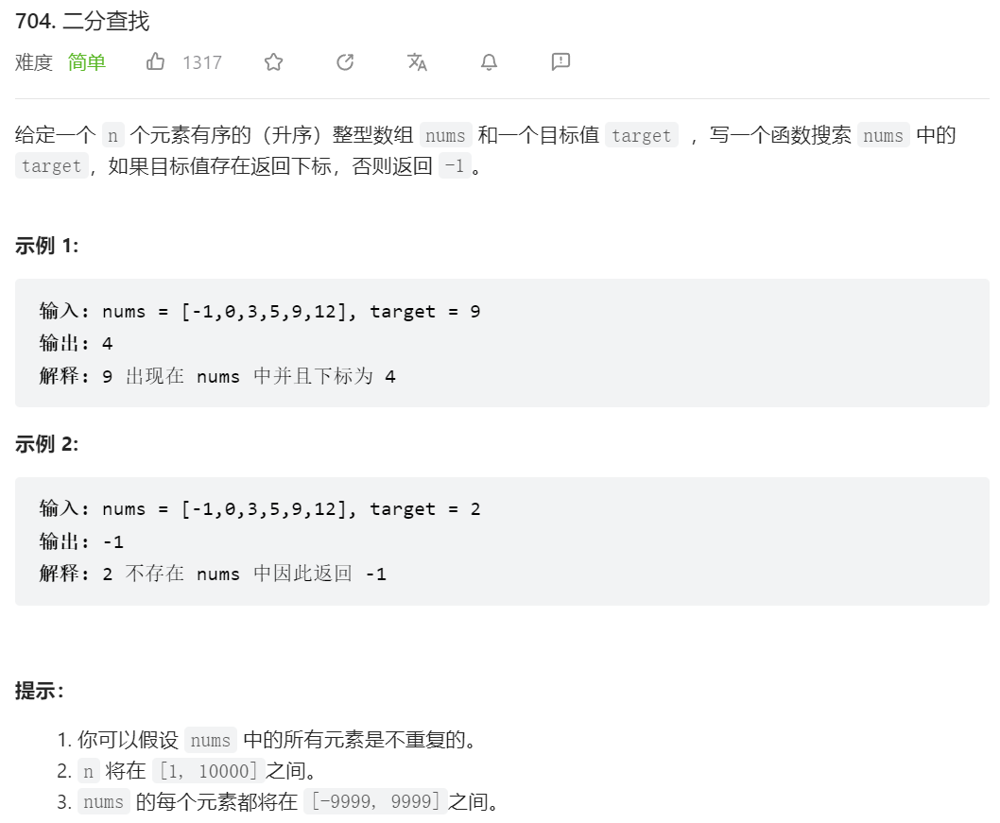
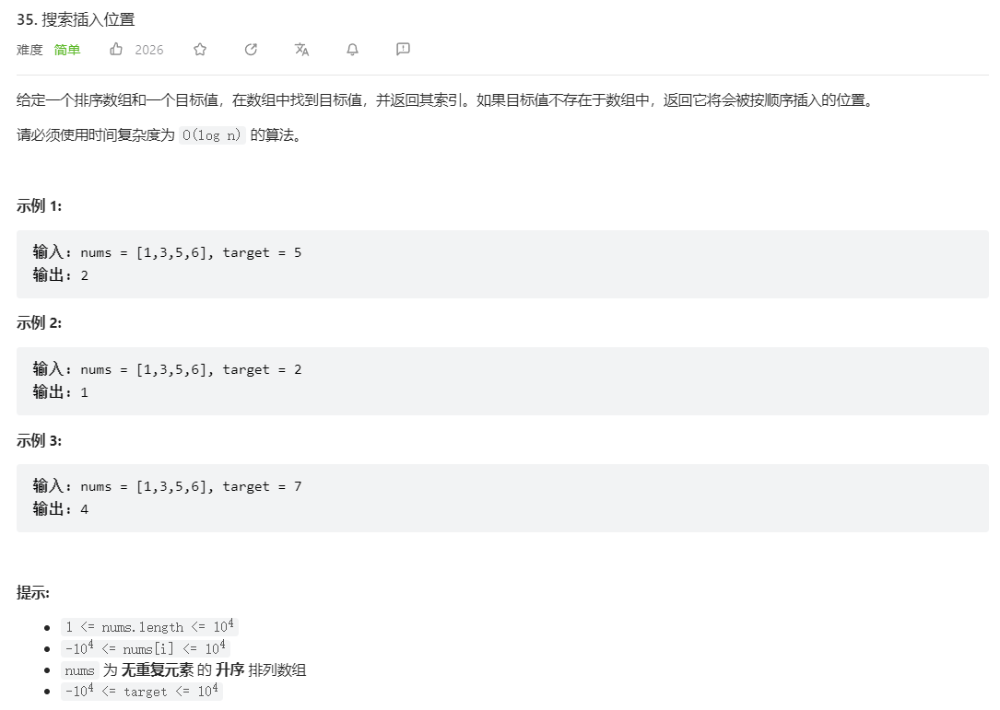
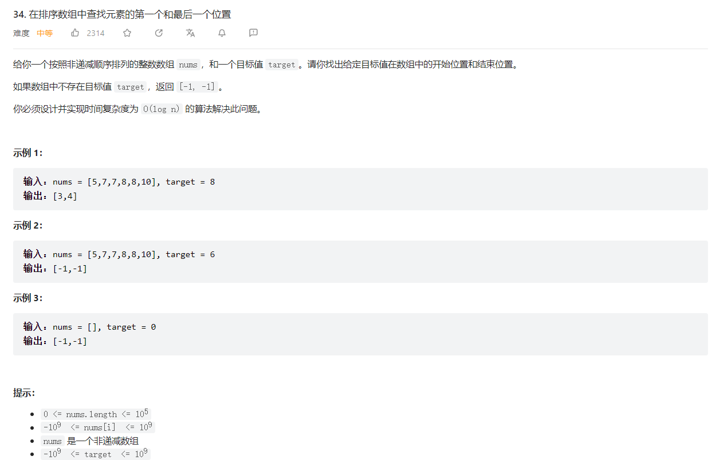
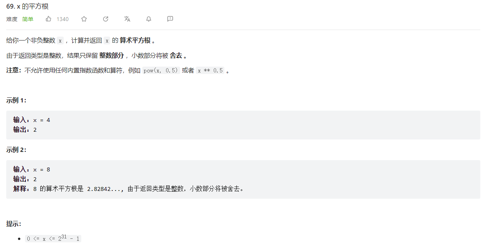
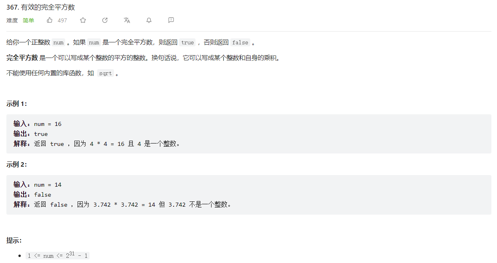

# 代码-二分法

[TOC]

## 题目介绍

题目关键词：升序数组，是否有重复数字

(1) 选择左闭右闭区间`left=0,right=n-1`则循环终止条件为`left>right`，即循环条件为`while left<=right`;

(2) 选择左闭右开区间`left=0,right=n`则循环终止条件为`left>=right`，即循环条件为`while left<right`，并且mid的更改也需要更改;

==始终选择(1)左闭右开区间的做法！比较符合直觉==

1. 简单二分查找：分三种情况，=，>，<
2. 找到升序数组中大于等于target的最小元素下标（注意可能存在相同元素的情况）：>，<情况不变，但是=情况不同，此时应该right=mid-1（因为可能存在相同元素，相等时还需要在左边继续查找）

**首先二分法适用的一定是排序数组，当数组可能存在重复元素时需要使用找大于等于target的最小边界，当数组不存在重复元素时直接三个条件判断就可以，注意返回值可能是left也可能是right，取决于需要找大于还是小于target的下标，==不存在等式成立的下标时，总是有left>target,right<target==**

## 题目

### [704. 二分查找](https://leetcode.cn/problems/binary-search/)



**题解：**

- 简单二分查找，分三种情况

  ```python
  class Solution:
  	def search(self, nums: List[int], target: int) -> int:
       	left_id = 0
       	right_id = len(nums) - 1
       	while left_id <= right_id:
           	mid_id = (right_id - left_id) // 2 + left_id
           	if target > nums[mid_id]:
               	left_id = mid_id + 1
           	elif target < nums[mid_id]:
               	right_id = mid_id - 1
           	else:
               	return mid_id
      return -1
  ```

### [35. 搜索插入位置](https://leetcode.cn/problems/search-insert-position/)



**题解：**

- 分三种情况，相等时返回mid，否则right或left改变，最终返回left（因为终止条件是left>right，并且==最终一定是需要插入元素位于`[nums[right]], nums[left]]`之间，即使目标位于所有元素之前或者之后，此条件都满足==。

  ```python
  class Solution:
   	def searchInsert(self, nums: List[int], target: int) -> int:
     		left_id = 0
     		right_id = len(nums) - 1
     		while left_id <= right_id:
         		mid_id = left_id + (right_id - left_id) // 2
         	if nums[mid_id] > target:
             	right_id = mid_id - 1 
         	elif nums[mid_id] < target:
             	left_id = mid_id + 1
         	else:
             	return mid_id
     		return right_id + 1
  ```

- 分两种情况，将等于的时候right=mid-1合并（这种方式对于有重复元素的情况仍然适用，因为相等时仍然需要到左边查找是否存在相等元素），==等价于找大于等于目标值的最小下标==

  ```python
  class Solution:
   	def searchInsert(self, nums: List[int], target: int) -> int:
       	left_id = 0
       	right_id = len(nums) - 1
       	while left_id <= right_id:
          	mid_id = left_id + (right_id - left_id) // 2
           	if nums[mid_id] >= target:
               	right_id = mid_id - 1 
           	elif nums[mid_id] < target:
               	left_id = mid_id + 1
       	return right_id + 1
  ```

### [34. 在排序数组中查找元素的第一个和最后一个位置](https://leetcode.cn/problems/find-first-and-last-position-of-element-in-sorted-array/)



**题解：**

- 本题需要转化为找到大于等于目标值的第一个下标，以及大于等于目标值加一的第一个下标。另一个需要注意的点是目标不在数组中的情况，可以验证无论目标比数组所有数字都小或者都大时，得到的`left_id`均小于`right_id`，而当目标仅有一个时，`left_id=right_id`，目标有多个时，`left_id<right_id`。

  ```python
  class Solution:
      def searchRange(self, nums: List[int], target: int) -> List[int]:
          def binarySearch(nums, target):
              left, right = 0, len(nums) - 1
              while left <= right:
                  mid = (left + right) // 2
                  if nums[mid] >= target:
                      right = mid - 1
                  else:
                      left = mid + 1
              return left
          left_id = binarySearch(nums, target)
          right_id = binarySearch(nums, target + 1) - 1
          return [left_id, right_id] if left_id <= right_id else [-1, -1]
  ```

### [69. x 的平方根 ](https://leetcode.cn/problems/sqrtx/)



**题解：**

- ==这道题老是出错==，其实这道题和寻找升序数组中大于等于某个数的第一个数类似，如果不存在满足等式的mid，此时最终循环终止条件都是left>target，right<target，对应到本题就是`left*left>target, right*right<target`，只不过本题需要返回right。

  ```python
  class Solution:
      def mySqrt(self, x: int) -> int:
          left, right = 0, x
          while left <= right:
              mid = (left + right) // 2
              if mid * mid > x:
                  right = mid - 1
              elif mid * mid < x:
                  left = mid + 1
              else:
                  return mid
          return right
  ```

- 牛顿法：这个问题其实就是求$f(x)=num - x ^ 2$的零点。已知牛顿法递推公式：$X_{n+1} = X_n - f(X_n)/f'(X_n)$.带入$f'(x) = -2x$. 得： $X_{n+1} = X_n +(num - X_n ^ 2)/2X_n = (num + X_n ^ 2) / 2X_n = (num / X_n + X_n) / 2$.用代码表示则为$num = (num + x / num) / 2$.

  ```python
  class Solution(object):
      def mySqrt(self, x):
          num = x
          while num * num > x:
              num = (num + x // num) // 2
          return num
  ```

### [367. 有效的完全平方数](https://leetcode.cn/problems/valid-perfect-square/)



**题解：**

- 跟[69. x 的平方根 ](https://leetcode.cn/problems/sqrtx/)思路一样。

  ```python
  class Solution:
      def isPerfectSquare(self, num: int) -> bool:
          left, right = 1, num
          while left <= right:
              mid = (left + right) // 2
              if mid * mid < num:
                  left = mid + 1
              elif mid * mid > num:
                  right = mid - 1
              else:
                  return True
          return False
  ```

