# 代码-二叉树

[TOC]

## 概述

### 重点

- 需要记住的遍历方式：

  |      | 前序遍历                                                     | 后序遍历                                                     | 中序遍历                                                     | 层序遍历                          |
  | ---- | ------------------------------------------------------------ | ------------------------------------------------------------ | ------------------------------------------------------------ | --------------------------------- |
  | 递归 | [直接递归](#前序直接递归)<br>[使用`dfs`函数递归](#前序使用`dfs`递归) | [直接递归](#后序直接递归)<br>[使用`dfs`函数递归](#后序使用`dfs`递归) | [直接递归](#中序直接递归)<br>[使用`dfs`函数递归](#中序使用`dfs`递归) | [使用`bfs`函数递归](#层序递归)    |
  | 迭代 | [不使用指针](#前序不使用指针迭代)<br>[使用指针的通用模板](#前序使用指针迭代) | [不使用指针](#后序不使用指针迭代)<br>[使用指针的通用模板](#后序使用指针迭代) | [使用指针的通用模板](#中序使用指针迭代)                      | [使用`deque/list`迭代](#层序迭代) |

### 二叉树题目易错点

- 需要注意二叉树节点数目是否可能为0，如果节点数目为0往往需要单独判断；

### 二叉树的种类

- 满二叉树：除了最后一层外其他层所有节点都包含两个子节点，且最后一层所有节点都没有子节点（深度为k的满二叉树包含$2^k-1$个节点）
- 完全二叉树：在完全二叉树中，除了最底层节点可能没填满外，其余每层节点数都达到最大值，并且最下面一层的节点都集中在该层最左边的若干位置。若最底层为第 h 层，则该层包含 $[1, 2^{h-1}]$ 个节点。
- 二叉搜索树：若它的左子树不空，则左子树上所有结点的值均小于它的根结点的值；若它的右子树不空，则右子树上所有结点的值均大于它的根结点的值；它的左、右子树也分别为二叉排序树
- 平衡二叉搜索树：它是一棵空树或它的左右两个子树的高度差的绝对值不超过1，并且左右两个子树都是一棵平衡二叉树

### 二叉树的存储方式

- 链式存储：类似于链表，python定义二叉树：

  ```python
  class TreeNode:
      def __init__(self, val=0, left=None, right=None):
          self.val = val
          self.left = left
          self.right = right
  ```

- 顺序存储：等价于层序遍历，对于满二叉树，此时如果父节点的数组下标是`i`，那么左右子节点的下标分别是`2i+1`和`2i+2`

### 二叉树的遍历方式

- 二叉树的遍历方式可以分为`深度优先搜索（depth-first search,DFS）`和`广度优先搜索（breadth-first search,BFS）`两种，其中深度优先搜索包含前/中/后序遍历，这里前/中/后序遍历都是指父节点相对左右子节点的位置而言，例如前序对应`中左右`；广度优先搜索称为层序遍历；首先前/中/后序遍历可以采用递归和迭代的方式实现，其中递归实现时三种遍历代码形式类似，而采用迭代时有不同的实现方式；层序遍历同样也可以采用递归和迭代两种方式实现。

- 前/中/后序遍历

  - 递归实现：用相似的递归代码形式可以实现前/中/后序遍历。当碰到空节点时返回，否则分别对左子节点和右子节点进行遍历，按照遍历顺序返回结果

    ```python
    # 第一种
    # 前序遍历
    class Solution:
        def preorderTraversal(self, root: Optional[TreeNode]) -> List[int]:
            if not root:
                return []
            left = self.preorderTraversal(root.left)
            right = self.preorderTraversal(root.right)
            return [root.val] + left + right
    
    # 中序遍历
    class Solution:
        def inorderTraversal(self, root: Optional[TreeNode]) -> List[int]:
            if not root:
                return []
            left = self.inorderTraversal(root.left)
            right = self.inorderTraversal(root.right)
            return left + [root.val] + right
    
    # 后序遍历
    class Solution:
        def postorderTraversal(self, root: Optional[TreeNode]) -> List[int]:
            if not root:
                return []
            left = self.postorderTraversal(root.left)
            right = self.postorderTraversal(root.right)
            return left + right + [root.val]
    
    # 第二种
    # 前序遍历
    class Solution:
        def preorderTraversal(self, root: Optional[TreeNode]) -> List[int]:
            def dfs(node):
                nonlocal res
                if not node:
                    return
                res.append(node.val)
                dfs(node.left)
                dfs(node.right)
            res = []
            dfs(root)
           	return res
                
    # 考虑python的语言特性,函数传参过程中可迭代对象会被更改
    class Solution:
        def preorderTraversal(self, root: Optional[TreeNode]) -> List[int]:
            def dfs(node, res):
                if not node:
                    return
                res.append(node.val)
                dfs(node.left, res)
                dfs(node.right, res)
    
            res = []
            dfs(root, res)
            return res
    
    # 中序遍历
    class Solution:
        def inorderTraversal(self, root: Optional[TreeNode]) -> List[int]:
            def dfs(node):
                nonlocal res
                if not node:
                    return
                dfs(node.left)
                res.append(node.val)
                dfs(node.right)
            res = []
            dfs(root)
           	return res
    
    # 考虑python的语言特性,函数传参过程中可迭代对象会被更改
    class Solution:
        def inorderTraversal(self, root: Optional[TreeNode]) -> List[int]:
            def dfs(node, res):
                if not node:
                    return
                dfs(node.left, res)
                res.append(node.val)
                dfs(node.right, res)
    
            res = []
            dfs(root, res)
            return res
        
    # 后序遍历
    class Solution:
        def postorderTraversal(self, root: Optional[TreeNode]) -> List[int]:
            def dfs(node):
                nonlocal res
                if not node:
                    return
                dfs(node.left)
                dfs(node.right)
                res.append(node.val)
            res = []
            dfs(root)
           	return res
    
    # 考虑python的语言特性,函数传参过程中可迭代对象会被更改
    class Solution:
        def postorderTraversal(self, root: Optional[TreeNode]) -> List[int]:
            def dfs(node, res):
                if not node:
                    return
                dfs(node.left, res)
                dfs(node.right, res)
                res.append(node.val)
    
            res = []
            dfs(root, res)
            return res
    ```

  - 迭代实现1：前序和后续代码形式类似，没有类似形式的中序遍历（因为后序相比前序就是左右节点入栈顺序改变，然后对返回列表翻转）。对于前序遍历，每次将当前节点添加到结果列表中，然后按照先加入右子节点再左子节点的方式将子节点加入到栈中。对于后续遍历，每次将当前节点添加到结果列表中，然后按照先加入左子节点再右子节点的方式将子节点加入到栈中，最后输出列表翻转。

    ```python
    # 前序遍历
    class Solution:
        def preorderTraversal(self, root: Optional[TreeNode]) -> List[int]:
            if not root:
                return []
            res = []
            stk = [root]
            while stk:
                node = stk.pop()
                res.append(node.val)
                if node.right:
                    stk.append(node.right)
                if node.left:
                    stk.append(node.left)
            return res
        
    # 后续遍历
    class Solution:
        def postorderTraversal(self, root: Optional[TreeNode]) -> List[int]:
            if not root:
                return []
            res = []
            stk = [root]
            while stk:
                node = stk.pop()
                res.append(node.val)
                if cur.left:
                    stk.append(node.left)
                if node.right:
                    stk.append(node.right)
            return res[::-1]
    ```

  - 迭代实现2：用相似的代码形式实现前/中/后序遍历。==利用指针==。对于前序遍历，如果指针非空，则不断把头节点加入结果列表中，并使指针指向左子节点；当指针指向空节点时，指针回退到头节点，并指向右子节点；当栈和指针都非空的时候，持续上述循环。后序遍历注意需要翻转列表，且子节点入栈顺序与前序遍历相反。==记下来（实在想不出来）==

    ```python
    # 前序遍历
    class Solution:
        def preorderTraversal(self, root: Optional[TreeNode]) -> List[int]:
            res = []
            stack = []
            cur = root
            while stack or cur:
                while cur:
                    res.append(cur.val)
                    stack.append(cur)
                    cur = cur.left
                cur = stack.pop()
                cur = cur.right
            return res
        
    # 中序遍历
    class Solution:
        def inorderTraversal(self, root: Optional[TreeNode]) -> List[int]:
            res = []
            stack = []
            cur = root
            while stack or cur:
                while cur:
                    stack.append(cur)
                    cur = cur.left
                cur = stack.pop()
                res.append(cur.val)
                cur = cur.right
            return res
        
    # 后序遍历
    class Solution:
        def postorderTraversal(self, root: Optional[TreeNode]) -> List[int]:
            res = []
            stack = []
            cur = root
            while stack or cur:
                while cur:
                    res.append(cur.val)
                    stack.append(cur)
                    cur = cur.right
                cur = stack.pop()
                cur = cur.left
            return res[::-1]
    ```

  - 迭代实现3：用相似的代码形式实现前/中/后序遍历。不使用指针，在遇到头节点后将None入栈，效果类似于指针。==也想不出来，不用记==

    ```python
    # 前序遍历
    class Solution:
        def preorderTraversal(self, root: TreeNode) -> List[int]:
            res = []
            stk = []
            if root:
                stk.append(root)
            while stk:
                node = stk.pop()
                if node != None:
                    if node.right: 
                        stk.append(node.right)
                    if node.left: 
                        stk.append(node.left)
                    stk.append(node) 
                    stk.append(None)
                else:
                    node = stk.pop()
                    res.append(node.val)
            return res
        
    # 中序遍历
    class Solution:
        def inorderTraversal(self, root: TreeNode) -> List[int]:
            result = []
            st = []
            if root:
                st.append(root)
            while st:
                node = st.pop()
                if node != None:
                    if node.right: #添加右节点（空节点不入栈）
                        st.append(node.right)
                    
                    st.append(node) #添加中节点
                    st.append(None) #中节点访问过，但是还没有处理，加入空节点做为标记。
                    
                    if node.left: #添加左节点（空节点不入栈）
                        st.append(node.left)
                else: #只有遇到空节点的时候，才将下一个节点放进结果集
                    node = st.pop() #重新取出栈中元素
                    result.append(node.val) #加入到结果集
            return result
        
    # 后序遍历
    class Solution:
        def postorderTraversal(self, root: TreeNode) -> List[int]:
            result = []
            st = []
            if root:
                st.append(root)
            while st:
                node = st.pop()
                if node != None:
                    st.append(node) #中
                    st.append(None)
                    
                    if node.right: #右
                        st.append(node.right)
                    if node.left: #左
                        st.append(node.left)
                else:
                    node = st.pop()
                    result.append(node.val)
            return result
    ```

- 层序遍历

  - 递归实现：

    ```python
    class Solution:
        def levelOrder(self, root: Optional[TreeNode]) -> List[List[int]]:
            levels = []
            self.bfs(root, 0, levels)
            return levels
        
        def bfs(self, node, level, levels):
            if not node:
                return
            if len(levels) == level:
                levels.append([])
            levels[level].append(node.val)
            self.bfs(node.left, level + 1, levels)
            self.bfs(node.right, level + 1, levels)
    
    ```

  - 迭代实现1：使用队列

    ```python
    class Solution:
        def levelOrder(self, root: Optional[TreeNode]) -> List[List[int]]:
            if not root:
                return []
            queue = deque([root])
            result = []
            while queue:
                level = []
                for _ in range(len(queue)):
                    cur = queue.popleft()
                    level.append(cur.val)
                    if cur.left:
                        queue.append(cur.left)
                    if cur.right:
                        queue.append(cur.right)
                result.append(level)
            return result
    ```

  - 迭代实现2：使用栈

    ```python
    class Solution:
        def levelOrder(self, root: TreeNode) -> List[List[int]]:
            if not root:
                return []
            cur_lay, res = [root], []
            while cur_lay:
                lay, layval = [], []
                for node in cur_lay:
                    layval.append(node.val)
                    if node.left: 
                        lay.append(node.left)
                    if node.right: 
                        lay.append(node.right)
                cur_lay = lay
                res.append(layval)
            return res
    ```

## 题目

### [144. 二叉树的前序遍历](https://leetcode.cn/problems/binary-tree-preorder-traversal/description/)

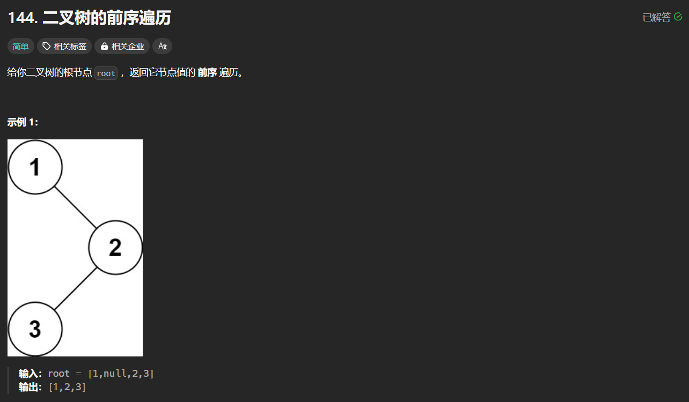

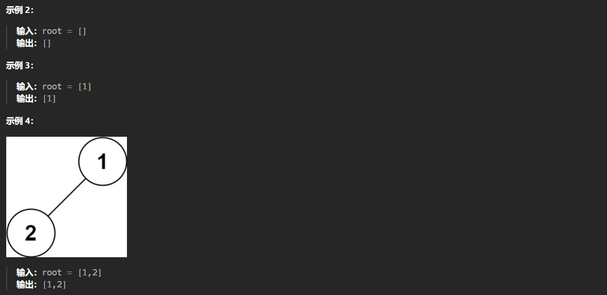

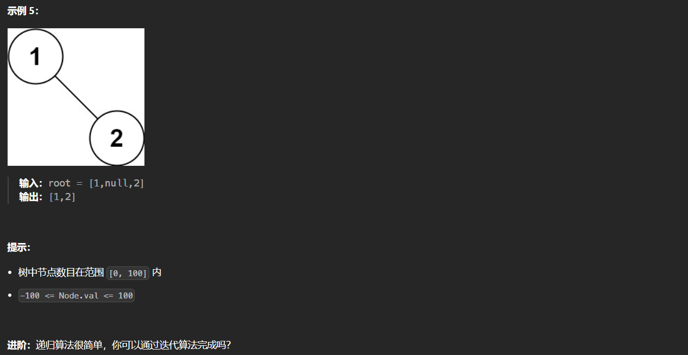

#### 前序直接递归

```python
class Solution:
    def preorderTraversal(self, root: Optional[TreeNode]) -> List[int]:
        if not root:
            return []
        left = self.preorderTraversal(root.left)
        right = self.preorderTraversal(root.right)
        return [root.val] + left + right
```

#### 前序使用`dfs`递归

```python
# 借助python函数传参特性
class Solution:
    def preorderTraversal(self, root: Optional[TreeNode]) -> List[int]:
        def dfs(node, res):
            if not node:
                return
            res.append(node.val)
            dfs(node.left, res)
            dfs(node.right, res)
        res = []
        dfs(root, res)
        return res

# 利用nonlocal关键字
class Solution:
    def preorderTraversal(self, root: Optional[TreeNode]) -> List[int]:
        def dfs(node):
            nonlocal res
            if not node:
                return
            res.append(node.val)
            dfs(node.left)
            dfs(node.right)
        res = []
        dfs(root)
        return res
```

#### 前序不使用指针迭代

```python
class Solution:
    def preorderTraversal(self, root: Optional[TreeNode]) -> List[int]:
        if not root:
            return []
        stk, res = [root], []
        while stk:
            node = stk.pop()
            res.append(node.val)
            if node.right:
                stk.append(node.right)
            if node.left:
                stk.append(node.left)
        return res
```

#### 前序使用指针迭代

```python
class Solution:
    def preorderTraversal(self, root: Optional[TreeNode]) -> List[int]:
        if not root:
            return []
        cur, stk, res = root, [], []
        while cur or stk:
            while cur:
                stk.append(cur)
                res.append(cur.val)
                cur = cur.left
            cur = stk.pop()
            cur = cur.right
        return res
```

### [145. 二叉树的后序遍历](https://leetcode.cn/problems/binary-tree-postorder-traversal/description/)

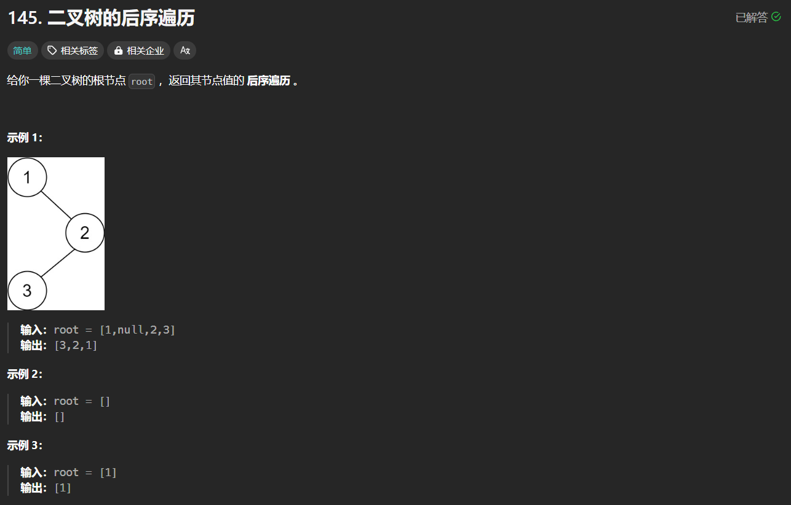

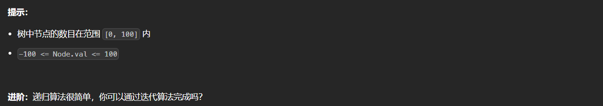

#### 后序直接递归

```python
class Solution:
    def postorderTraversal(self, root: Optional[TreeNode]) -> List[int]:
        if not root:
            return []
        left = self.postorderTraversal(root.left)
        right = self.postorderTraversal(root.right)
        return left + right + [root.val]
```

#### 后序使用`dfs`递归

```python
# 借助python函数传参特性
class Solution:
    def postorderTraversal(self, root: Optional[TreeNode]) -> List[int]:
        def dfs(node, res):
            if not node:
                return
            res.append(node.val)
            dfs(node.right, res)
            dfs(node.left, res)
        res = []
        dfs(root, res)
        return res[::-1]
    
# 利用nonlocal关键字
class Solution:
    def postorderTraversal(self, root: Optional[TreeNode]) -> List[int]:
        def dfs(node):
            nonlocal res
            if not node:
                return
            res.append(node.val)
            dfs(node.right)
            dfs(node.left)
        res = []
        dfs(root)
        return res[::-1]
```

#### 后序不使用指针迭代

```python
class Solution:
    def postorderTraversal(self, root: Optional[TreeNode]) -> List[int]:
        if not root:
            return []
        stk, res = [root], []
        while stk:
            node = stk.pop()
            res.append(node.val)
            if node.left:
                stk.append(node.left)
            if node.right:
                stk.append(node.right)
        return res[::-1]
```

#### 后序使用指针迭代

```python
class Solution:
    def postorderTraversal(self, root: Optional[TreeNode]) -> List[int]:
        if not root:
            return []
        cur, stk, res = root, [], []
        while cur or stk:
            while cur:
                stk.append(cur)
                res.append(cur.val)
                cur = cur.right
            cur = stk.pop()
            cur = cur.left
        return res[::-1]
```

### [94. 二叉树的中序遍历](https://leetcode.cn/problems/binary-tree-inorder-traversal/description/)

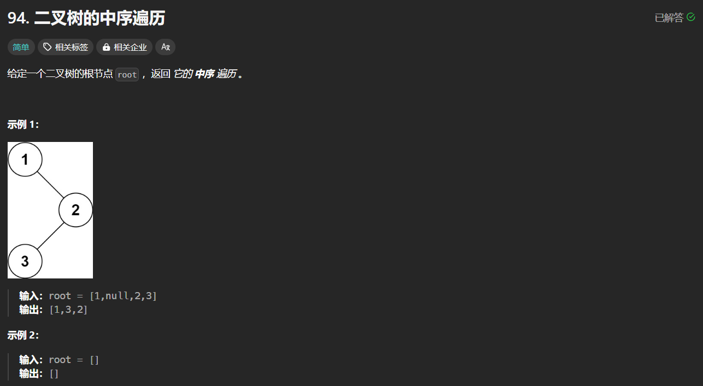

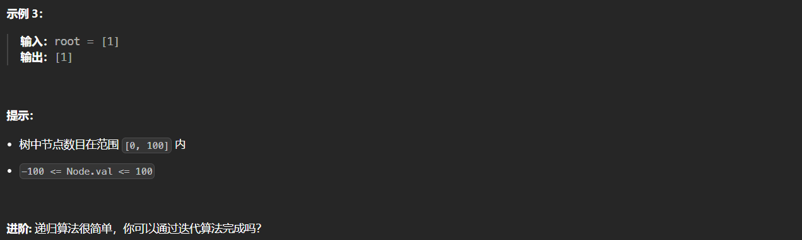

#### 中序直接递归

```python
class Solution:
    def inorderTraversal(self, root: Optional[TreeNode]) -> List[int]:
        if not root:
            return []
        left = self.inorderTraversal(root.left)
        right = self.inorderTraversal(root.right)
        return left + [root.val] + right
```

#### 中序使用`dfs`递归

```python
# 借助python函数传参特性
class Solution:
    def inorderTraversal(self, root: Optional[TreeNode]) -> List[int]:
        def dfs(node, res):
            if not node:
                return 
            dfs(node.left, res)
            res.append(node.val)
            dfs(node.right, res)
        res = []
        dfs(root, res)
        return res
    
# 利用nonlocal关键字
class Solution:
    def inorderTraversal(self, root: Optional[TreeNode]) -> List[int]:
        def dfs(node):
            nonlocal res
            if not node:
                return 
            dfs(node.left)
            res.append(node.val)
            dfs(node.right)
        res = []
        dfs(root)
        return res
```

#### 中序使用指针迭代

```python
class Solution:
    def inorderTraversal(self, root: Optional[TreeNode]) -> List[int]:
        cur, stk, res = root, [], []
        while cur or stk:
            while cur:
                stk.append(cur)
                cur = cur.left
            cur = stk.pop()
            res.append(cur.val)
            cur = cur.right
        return res
```

### [102. 二叉树的层序遍历](https://leetcode.cn/problems/binary-tree-level-order-traversal/description/)

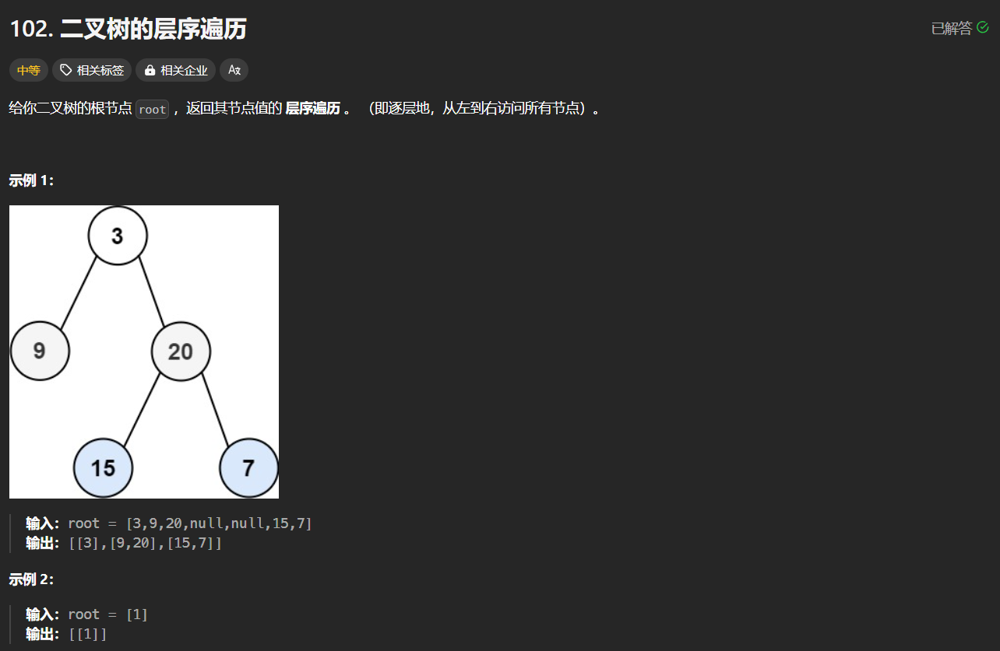

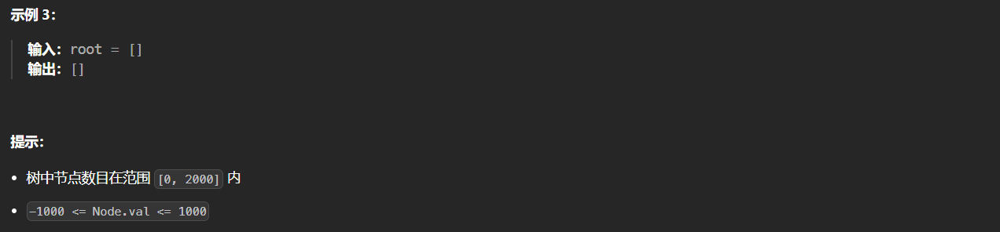

#### 层序递归

```python
class Solution:
    def levelOrder(self, root: Optional[TreeNode]) -> List[List[int]]:
        def bfs(node, level, levels):
            if not node:
                return 
            if len(levels) == level:
                levels.append([])
            levels[level].append(node.val)
            bfs(node.left, level+1, levels)
            bfs(node.right, level+1, levels)
        res = []
        bfs(root, 0, res)
        return res
```

#### 层序迭代

```python
# 使用deque
class Solution:
    def levelOrder(self, root: Optional[TreeNode]) -> List[List[int]]:
        if not root:
            return []
        que, res = deque([root]), []
        while que:
            len_que = len(que)
            level = []
            for _ in range(len_que):
                cur = que.popleft()
                level.append(cur.val)
                if cur.left:
                    que.append(cur.left)
                if cur.right:
                    que.append(cur.right)
            res.append(level)
        return res
    
# 使用列表
class Solution:
    def levelOrder(self, root: TreeNode) -> List[List[int]]:
        if not root:
            return []
        cur_level, res = [root], []
        while cur_level:
            level, level_val = [], []
            for node in cur_level:
                level_val.append(node.val)
                if node.left: 
                    level.append(node.left)
                if node.right: 
                    level.append(node.right)
            cur_level = level
            res.append(level_val)
        return res
```

### [199.二叉树的右视图](https://leetcode.cn/problems/binary-tree-right-side-view/description/)

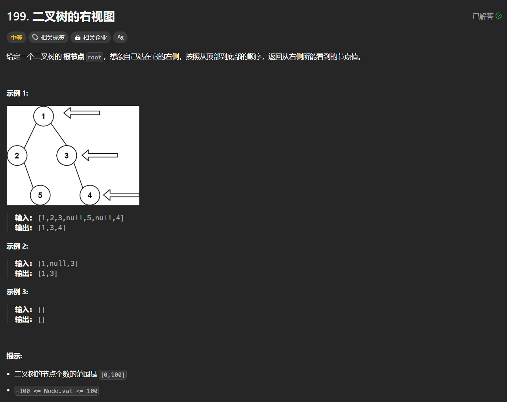

**题解：**

- 显然层序遍历取每层最后一个节点即可

  ```python
  class Solution:
      def rightSideView(self, root: Optional[TreeNode]) -> List[int]:
          if not root:
              return []
          res, que = [], deque([root])
          while que:
              len_que = len(que)
              for i in range(len(que)):
                  cur = que.popleft()
                  if cur.left:
                      que.append(cur.left)
                  if cur.right:
                      que.append(cur.right)
                  if i == len_que - 1:
                      res.append(cur.val)
          return res
  ```

### [637.二叉树的层平均值](https://leetcode.cn/problems/average-of-levels-in-binary-tree/description/)

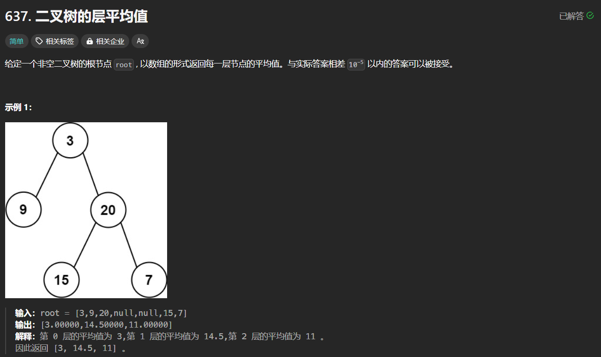


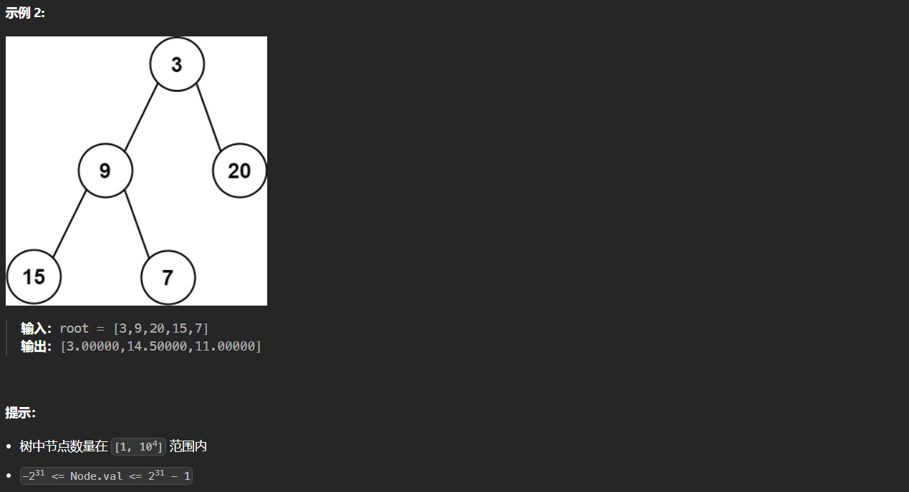

**题解：**

- 显然层序遍历求每层均值即可

  ```python
  class Solution:
      def averageOfLevels(self, root: Optional[TreeNode]) -> List[float]:
          res, que, = [], deque([root])
          while que:
              level = []
              for _ in range(len(que)):
                  cur = que.popleft()
                  level.append(cur.val)
                  if cur.left:
                      que.append(cur.left)
                  if cur.right:
                      que.append(cur.right)
              res.append(sum(level) / len(level))
          return res
  ```

### [429. N叉树的层序遍历](https://leetcode.cn/problems/n-ary-tree-level-order-traversal/description/)

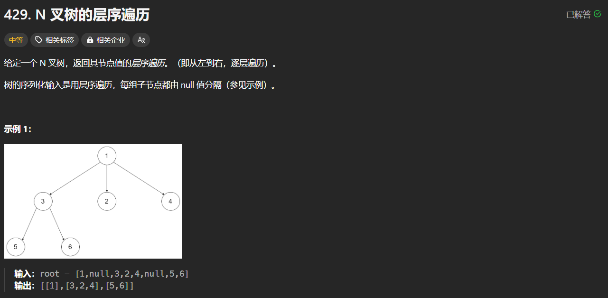

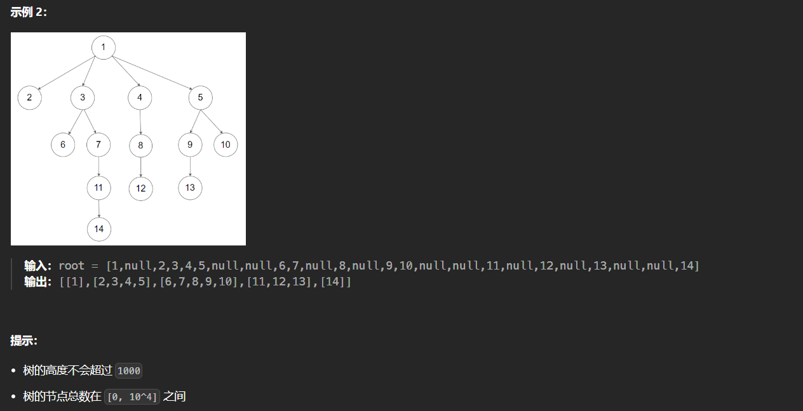

**题解：**

- 类似于二叉树的层序遍历，只不过这里每个节点加入的是子节点，而二叉树分别加入左右节点

  ```python
  """
  # Definition for a Node.
  class Node:
      def __init__(self, val=None, children=None):
          self.val = val
          self.children = children
  """
  
  class Solution:
      def levelOrder(self, root: 'Node') -> List[List[int]]:
          if not root:
              return []
          res, que = [], deque([root])
          while que:
              level = []
              for _ in range(len(que)):
                  cur = que.popleft()
                  level.append(cur.val)
                  for child in cur.children:
                      que.append(child)
              res.append(level)
          return res
  ```

### [515. 在每个树行中找最大值](https://leetcode.cn/problems/find-largest-value-in-each-tree-row/description/)

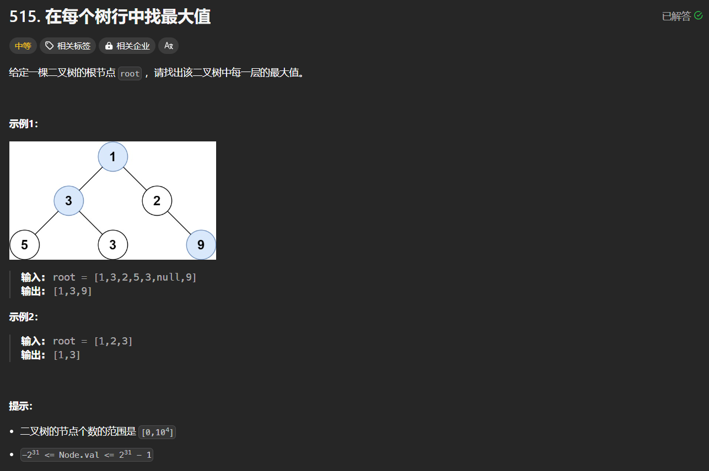

**题解：**

- 层序遍历并返回每一层的最大值

  ```python
  # 使用迭代
  class Solution:
      def largestValues(self, root: Optional[TreeNode]) -> List[int]:
          if not root:
              return []
          res, que = [], deque([root])
          while que:
              level = []
              for _ in range(len(que)):
                  cur = que.popleft()
                  level.append(cur.val)
                  if cur.left:
                      que.append(cur.left)
                  if cur.right:
                      que.append(cur.right)
              res.append(max(level))
          return res
      
  # 使用递归
  class Solution:
      def largestValues(self, root: Optional[TreeNode]) -> List[int]:
          res = []
          def bfs(root, h):
              if root:
                  if h >= len(res):
                      res.append(root.val)
                  else:
                      res[h] = max(res[h], root.val)
                  bfs(root.left, h + 1)
                  bfs(root.right, h + 1)
          bfs(root, 0)
          return res
  ```


