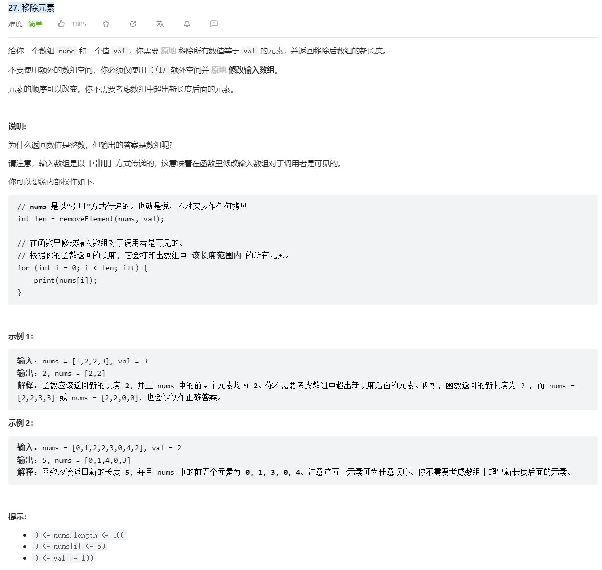
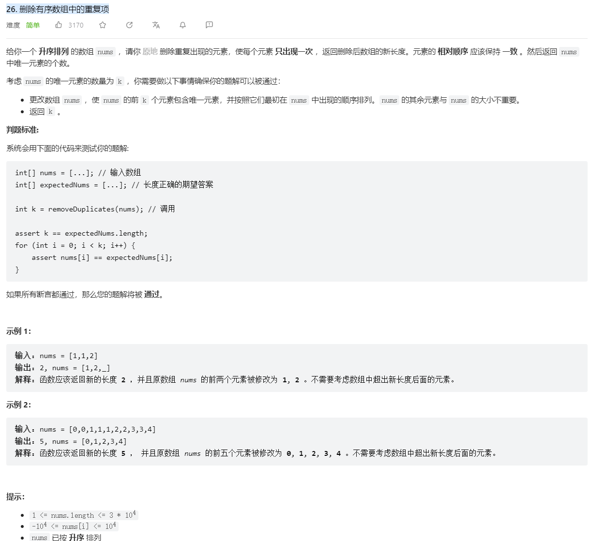
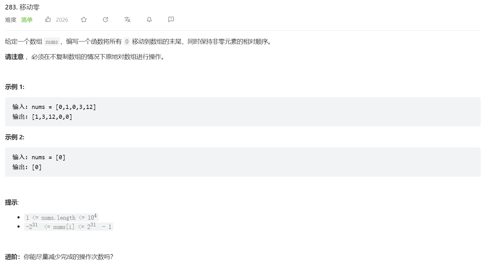
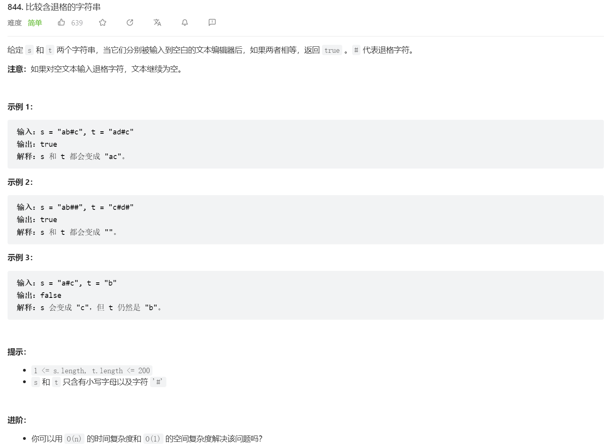
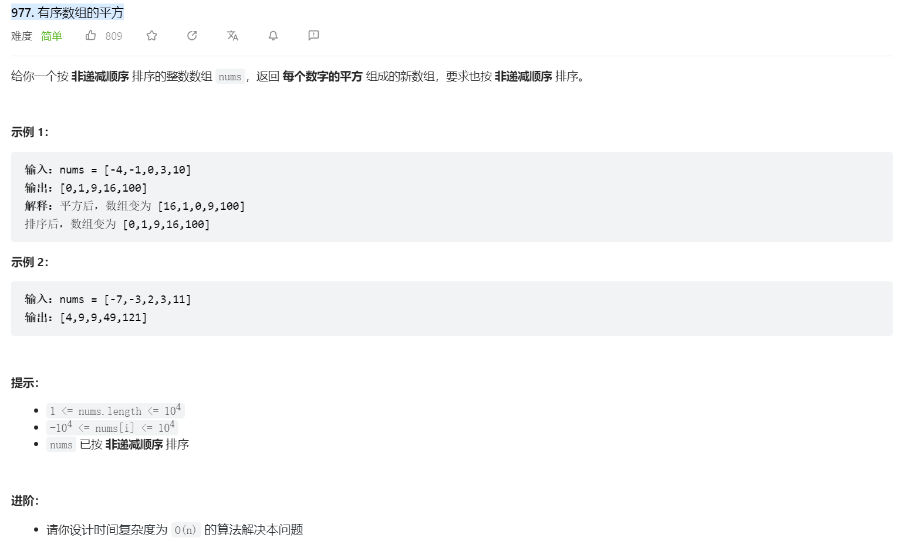
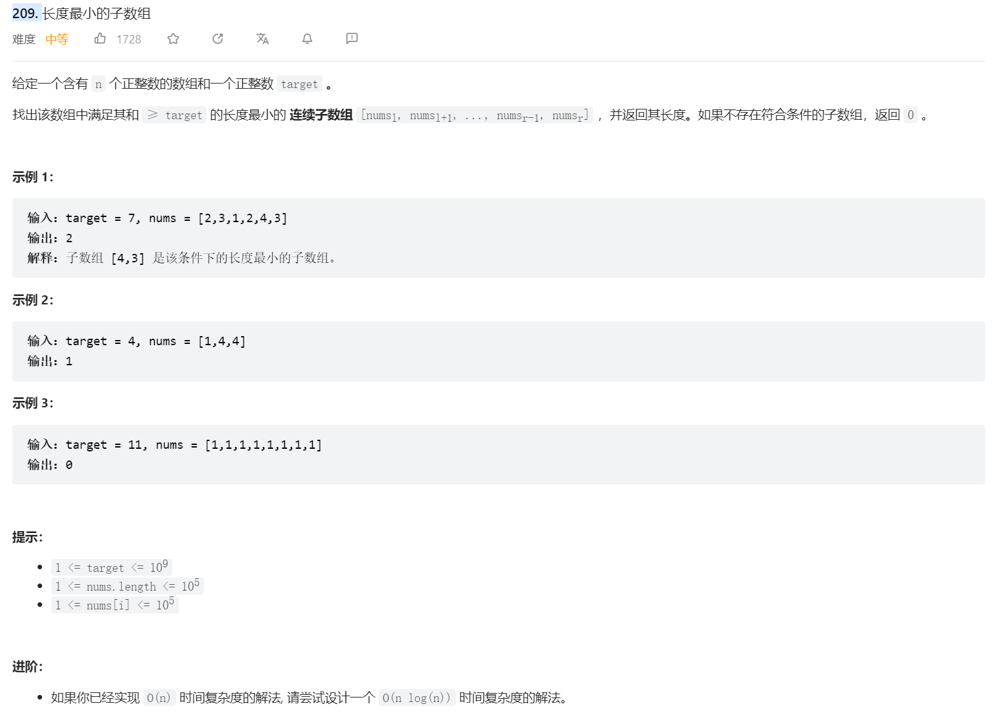
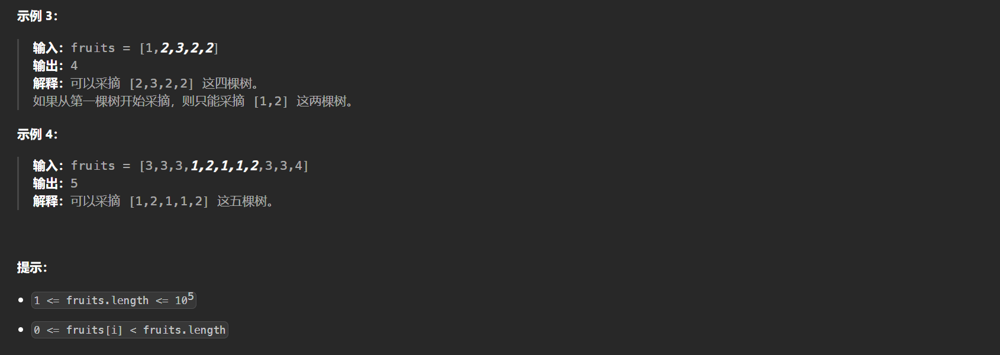
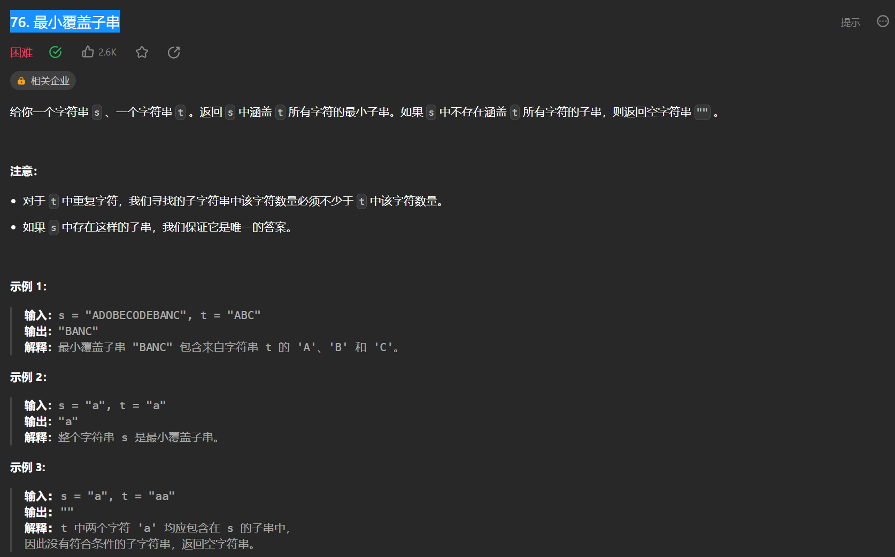

# 代码-双指针

[TOC]

## 概述

- 常见的双指针问题是为了==将数组中特定元素原地删除==，根据题意剩下的元素可能保持原来的顺序，也可能不需要保持原有顺序，快慢指针可以保持剩下元素的顺序，如果在更新慢指针的过程中交换快慢指针的顺序，还能做到将指定元素移到数组末尾；双向指针不一定能保持剩下元素的顺序；其他需要用到双指针的题目一般是根据题目需要用两个位置信息遍历数组。
- 另一类双指针问题也可以称作滑动数组问题，思想类似于快慢指针，只是此时需要做一些不仅仅移动数组元素的操作。

## 题目

### [27. 移除元素](https://leetcode.cn/problems/remove-element/)



**题解：**

- 快慢指针：快指针遍历数组，找到不能放入新数组的元素，慢指针把满足条件的元素放入新数组；==快慢指针的结果是新数组前面的元素顺序不改变，而新数组后续部分元素则不确定==

  ```python
  class Solution:
      def removeElement(self, nums: List[int], val: int) -> int:
          slow = 0
          fast = 0
          while fast < len(nums):
              if nums[fast] != val:
                  nums[slow] = nums[fast]
                  slow += 1
              fast += 1
          return slow
  ```

- 相向双指针：左指针记录是否遇到目标，如果遇到目标则与右指针交换，否则仅有左指针前进；==相向双指针的结果是目标被移到数组的末尾，而前面的数字顺序可能发生改变==

  ```python
  class Solution:
      def removeElement(self, nums: List[int], val: int) -> int:
          # 相向双指针
          left = 0
          right = len(nums) - 1
          while left <= right:
              # left 用来记录边界
              if nums[left] == val: 
                  if nums[right] != val:
                      nums[left], nums[right] = nums[right], nums[left]
                      left += 1
                  right -= 1  # 如果nums[right] 不是val,那么要交换位置，然后right-1，如果是val,那正好，是要去掉的对象，也要right-1
              else:
                  left += 1 # 没找到val,left就一直前进
          return left
  ```

### [26. 删除有序数组中的重复项](https://leetcode.cn/problems/remove-duplicates-from-sorted-array/)



**题解：**

- 本题要求不改变元素顺序删除原地删除特定元素，因此想到用快慢指针求解

  ```python
  class Solution:
      def removeDuplicates(self, nums: List[int]) -> int:
          slow, fast = 1, 1
          while fast < len(nums):
              if nums[fast] != nums[fast - 1]:
                  nums[slow] = nums[fast]
                  slow += 1
              fast += 1
          return slow
  ```

### [283. 移动零](https://leetcode.cn/problems/move-zeroes/)



**题解：**

- 首先题目要求将不为0的元素放在数组前面，且不改变元素相对位置，则考虑使用快慢指针；又因为题目要求末尾元素需要都是0，那么不同于[27. 移除元素](https://leetcode.cn/problems/remove-element/)，不能仅仅是将慢指针更新为快指针位置的数值，而需要将快指针也更新为慢指针对应数值，这样的效果等价于0一直后移。另一种方式则是按照原始快慢指针的方式得到新数组长度，然后将数组末尾置为全0；

  ```python
  # 1
  class Solution:
      def moveZeroes(self, nums: List[int]) -> None:     
          slow, fast = 0, 0
          while fast < len(nums):
              if nums[fast] != 0:
                  nums[slow], nums[fast] = nums[fast], nums[slow]
                  slow += 1
              fast += 1
          return nums
  
  # 2
  class Solution:
      def moveZeroes(self, nums: List[int]) -> None:
          fast, slow = 0, 0
          while fast < len(nums):
              if nums[fast] != 0:
                  nums[slow] = nums[fast]
                  slow += 1
              fast += 1
          nums[slow:] = [0] * (len(nums) - slow)
          return nums
  ```

### [844. 比较含退格的字符串](https://leetcode.cn/problems/backspace-string-compare/)



**题解：**

- 首先题目可以抽象成原地删除满足特定条件的数组元素，且保持数组元素位置不变，那么这就想到快慢指针；相比[27. 移除元素](https://leetcode.cn/problems/remove-element/)，本题的区别在于当快指针指向特定元素时，慢指针需要后退一步；

  ```python
  class Solution:
      def backspaceCompare(self, s: str, t: str) -> bool:
          def delBackspace(s):
              s = list(s)
              slow, fast = 0, 0
              while fast < len(s):
                  if s[fast] != '#':
                      s[slow] = s[fast]
                      slow += 1
                  else:
                      if slow >= 1:
                          slow -= 1
                  fast += 1
              return s[:slow]
          return delBackspace(s) == delBackspace(t)
  ```

- 本题用栈更容易理解：首先创建空栈，遇到非#号就入栈，否则pop栈顶元素

  ```python
  class Solution:
      def backspaceCompare(self, s: str, t: str) -> bool:
          # 借用栈操作更容易理解
          def delBackspace(s: str):
              ls = []
              for c in s:
                  if c == '#':
                      if ls:
                          ls.pop()
                  else:
                      ls.append(c)
              return ls
          return delBackspace(s) == delBackspace(t)
  ```

### [977. 有序数组的平方](https://leetcode.cn/problems/squares-of-a-sorted-array/)



**题解：**

- 本题与前面的双指针问题是为了将特定元素原地删除/移位置不同，只是因为数组两端元素更大，所以想到需要用双向指针；同时还有一点是需要创建一个从后向前遍历的数组用于保存结果。

  ```python
  class Solution:
      def sortedSquares(self, nums: List[int]) -> List[int]:
          n = len(nums)
          left, right = 0, n - 1
          res = [0] * n
          idx = n - 1
          while left <= right:
              if abs(nums[left]) > abs(nums[right]):
                  res[idx] = nums[left] ** 2
                  left += 1
              else:
                  res[idx] = nums[right] ** 2
                  right -= 1
              idx -= 1
          return res
  ```

### [209. 长度最小的子数组](https://leetcode.cn/problems/minimum-size-subarray-sum/)



**题解：**

- 首先想到应该用两个指针来更新连续子数组，其中右指针遍历数组，左指针只有在目前的子数组满足条件时才更新（需要注意使用while，而不是if，因为可能更新一个值之后仍然满足条件）

  ```python
  class Solution:
      def minSubArrayLen(self, s: int, nums: List[int]) -> int:
          sub_sum = 0
          left = 0
          res = float('inf')
          for right in range(len(nums)):
              sub_sum += nums[right]
              while sub_sum >= s:
                  res = min(res, right - left + 1)
                  sub_sum -= nums[left]
                  left += 1
          return res if res != float('inf') else 0
  ```

### [904. 水果成篮](https://leetcode.cn/problems/fruit-into-baskets/)



**题解：**

- 本题很容易可以想到用双指针/滑动窗口，难点是怎么记录状态，因为不仅要记录类别个数，还要记录不同水果的个数，因此考虑使用字典来记录不同水果个数，因为`python`默认字典不支持索引不存在的键，因此使用`collections`库中的`defaultdict`或者`Counter`更方便，前者可以索引不存在的键（返回0）

  ```python
  # 使用字典
  class Solution:
      def totalFruit(self, fruits: List[int]) -> int:
          left = 0
          res = 0
          class_cnt = 0
          class_map = {}
          for right in range(len(fruits)):
              if (fruits[right] not in class_map) or (class_map[fruits[right]] == 0):
                  class_cnt += 1
                  class_map[fruits[right]] = 1
              else:
                  class_map[fruits[right]] += 1
  
              while class_cnt > 2:
                  if class_map[fruits[left]] == 1:
                      class_cnt -= 1
                  class_map[fruits[left]] -= 1
                  left += 1
              
              res = max(res, right - left + 1)
          return res
      
  # 使用defaultdict
  class Solution:
      def totalFruit(self, fruits: List[int]) -> int:
          left = 0
          res = 0
          class_cnt = 0
          class_map = defaultdict(int)
          for right in range(len(fruits)):
              if class_map[fruits[right]] == 0:
                  class_cnt += 1
              class_map[fruits[right]] += 1
              while class_cnt > 2:
                  if class_map[fruits[left]] == 1:
                      class_cnt -= 1
                  class_map[fruits[left]] -= 1
                  left += 1
              res = max(res, right - left + 1)
          return res
      
  # 使用Counter
  class Solution:
      def totalFruit(self, fruits: List[int]) -> int:
          cnt = Counter()
          left = ans = 0
          for right, x in enumerate(fruits):
              cnt[x] += 1
              while len(cnt) > 2:
                  cnt[fruits[left]] -= 1
                  if cnt[fruits[left]] == 0:
                      cnt.pop(fruits[left])
                  left += 1
              ans = max(ans, right - left + 1)
          return ans
  ```

### [76. 最小覆盖子串](https://leetcode.cn/problems/minimum-window-substring/)



**题解：**

- 本题关键点在于怎么比较子字符串是否覆盖目标字符串，如果每次遍历都按元素比较这两个字符串，则时间复杂度达到$O(n^2)$，因此需要考虑其他方式来比较：可以维护一个目前还需要的字符（用于填充目标字符串）的字典来达到这一目的

  ```python
  class Solution:
      def minWindow(self, s: str, t: str) -> str:
          left = 0
          res = ''
          need_map = {}
          for c in t:
              if c not in need_map:
                  need_map[c] = 1
              else:
                  need_map[c] += 1
          need_cnt = len(t)
          for right in range(len(s)):
              if s[right] in need_map:
                  if need_cnt > 0:
                      need_cnt -= 1
                  need_map[s[right]] -= 1
              while need_cnt == 0:
                  if not res or right - left + 1 < len(res):
                      res = s[left: right + 1]
                  if s[left] in need_map:
                      # 这里需要注意字典中某个元素对应数值可能小于0
                      if need_map[s[left]] == 0:
                          need_cnt += 1
                      need_map[s[left]] += 1
                  left += 1
          return res
  ```

  