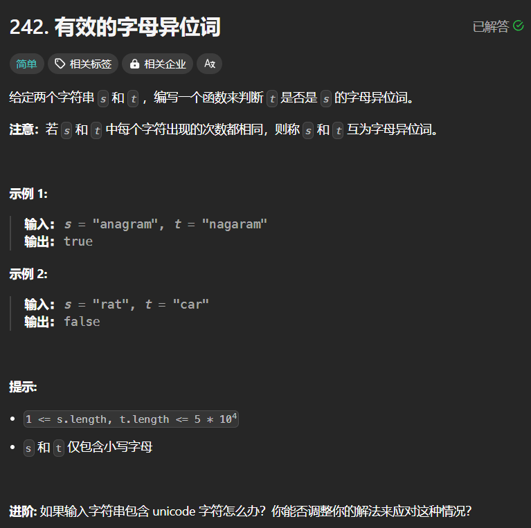
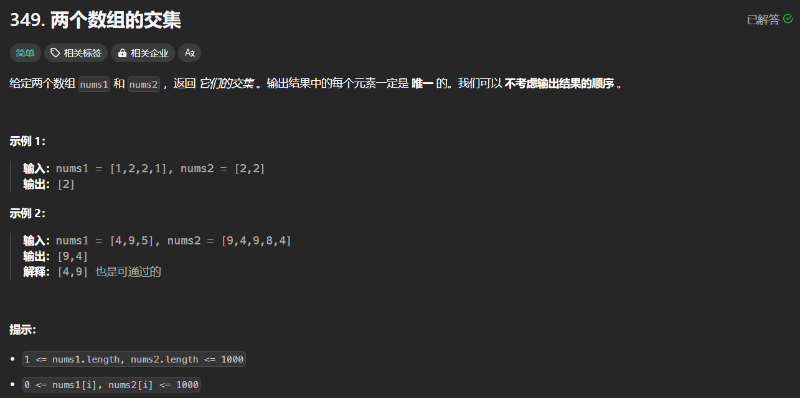
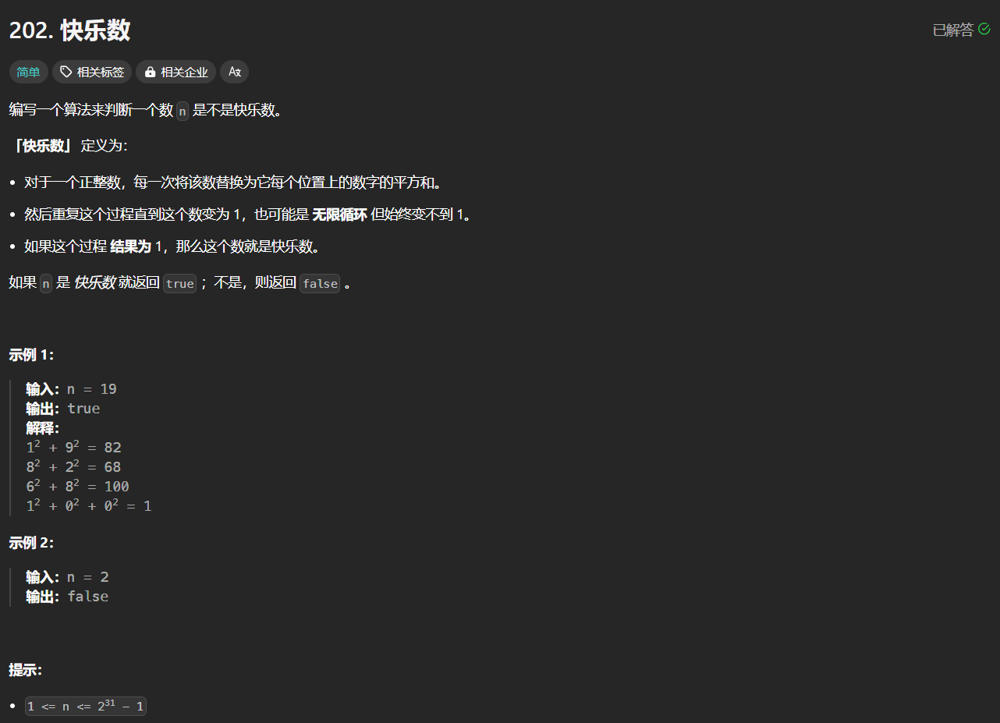
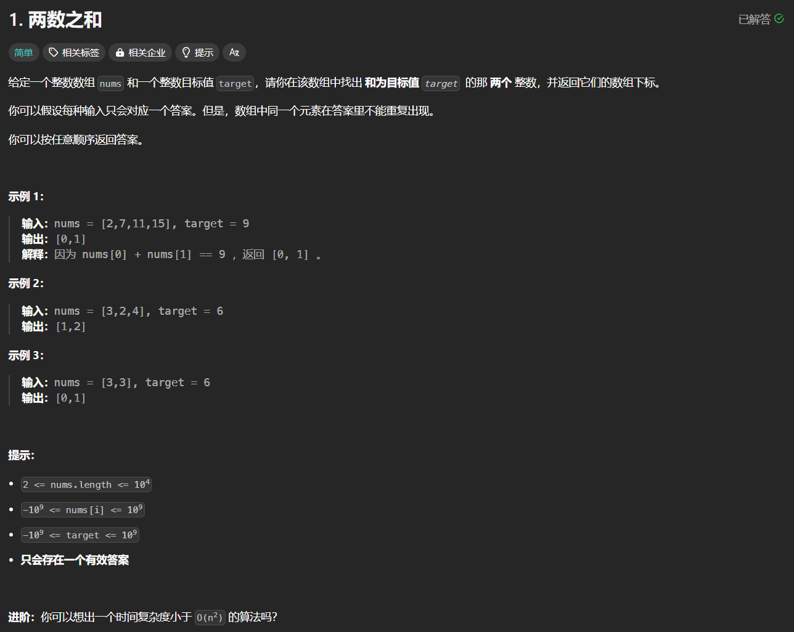
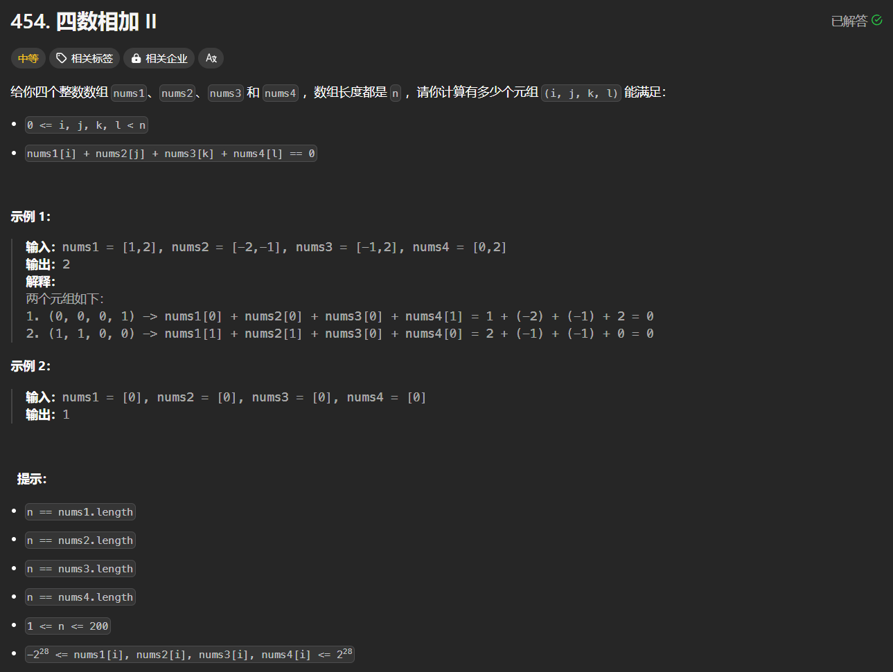
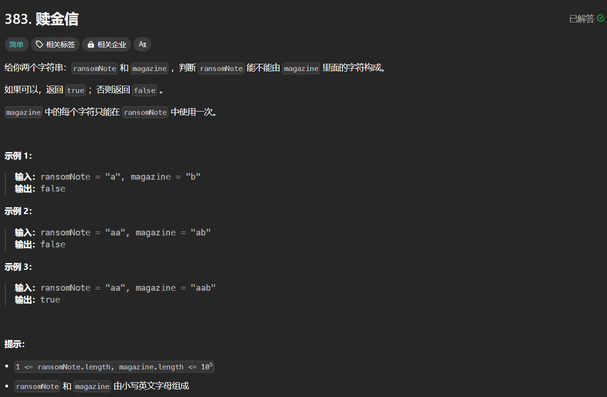
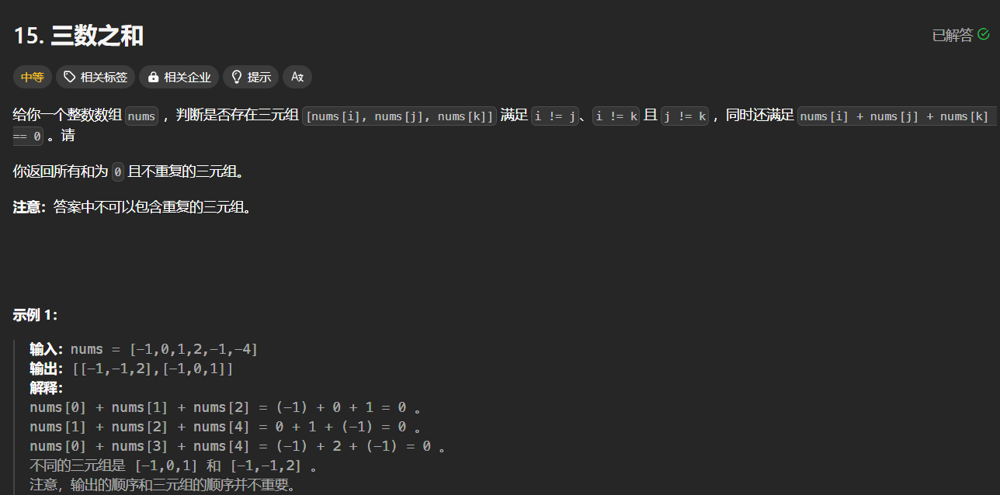
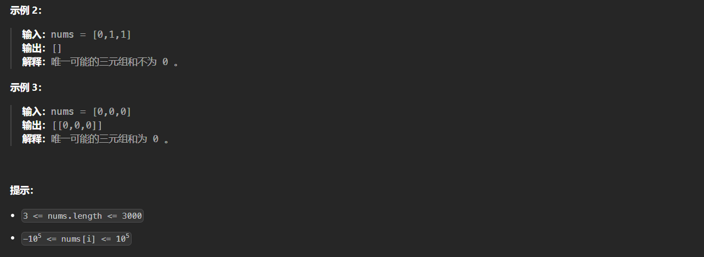
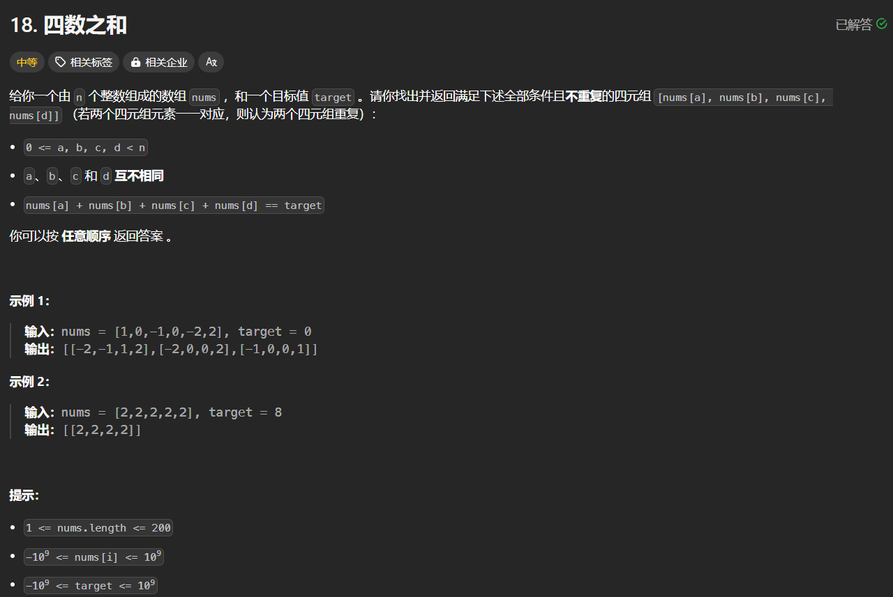

# 代码-哈希表

[TOC]

## 概述

哈希表通过哈希函数将元素映射到特定数字，从而可以实现$O(1)$的时间复杂度索引元素。

## 题目

### [242.有效的字母异位词](https://leetcode.cn/problems/valid-anagram/description/)



**题解：**

- 第一种思路：因为只有26个字母，所以构建一个长为26的数字记录a-z的个数即可，先遍历一个字符串记录个数，然后遍历另一个字符串减小个数；

  ```python
  class Solution:
      def isAnagram(self, s: str, t: str) -> bool:
          res = [0] * 26
          for c in s:
              res[ord(c) - ord('a')] += 1
          for c in t:
              res[ord(c) - ord('a')] -= 1
          for i in range(26):
              if res[i] != 0:
                  return False
          return True
  ```

- 第二种思路：直接用`dict`或者collections库中的`defacultdict`或者`Counter`类解决

  ```python
  class Solution:
      def isAnagram(self, s: str, t: str) -> bool:
          return Counter(s) == Counter(t)
  ```

### [349.两个数组的交集](https://leetcode.cn/problems/intersection-of-two-arrays/description/)



**题解：**

- 用集合求解

  ```python
  class Solution:
      def intersection(self, nums1: List[int], nums2: List[int]) -> List[int]:
          return list(set(nums1) & set(nums2))
  ```

### [202/快乐数](https://leetcode.cn/problems/happy-number/description/)



**题解：**

- 求出数字各个位数平方之和之后，用数组记录即可

- 其中求数字各位数之和可以用求余，也可以把数字转换成字符串

  ```python
  class Solution:
      def isHappy(self, n: int) -> bool:
          def calc_squre(n):
              # return sum([int(c) for c in str(n)])
              r = 0
              while n:
                  r += ((n % 10) ** 2)
                  n = n // 10 
              return r
          record = []
          while n:
              record.append(n)
              n = calc_squre(n)
              if n == 1:
                  return True
              elif n in record:
                  return False 
  ```

### [1.两数之和](https://leetcode.cn/problems/two-sum/description/)



**题解：**

- 使用哈希表记录已经便利的数及其下标，并且搜索目标值与当前遍历数字的差是否在哈希表中

  ```python
  class Solution:
      def twoSum(self, nums: List[int], target: int) -> List[int]:
          res = {}
          for i in range(len(nums)):
              if target - nums[i] in res:
                  return [res[target - nums[i]], i]
              res[nums[i]] = i
  
          # 双指针
          # 对输入列表进行排序
          nums_sorted = sorted(nums)
          
          # 使用双指针
          left = 0
          right = len(nums_sorted) - 1
          while left < right:
              current_sum = nums_sorted[left] + nums_sorted[right]
              if current_sum == target:
                  # 如果和等于目标数，则返回两个数的下标
                  left_index = nums.index(nums_sorted[left])
                  right_index = nums.index(nums_sorted[right])
                  if left_index == right_index:
                      # 当两个数相等时,index方法找到的是第一次出现的下标
                      right_index = nums[left_index + 1: ].index(nums_sorted[right]) + left_index + 1
                  return [left_index, right_index]
              elif current_sum < target:
                  # 如果总和小于目标，则将左侧指针向右移动
                  left += 1
              else:
                  # 如果总和大于目标值，则将右指针向左移动
                  right -= 1
  ```

- 使用双端指针搜索，这需要首先对数组进行排序，同时需要注意如果找到的两个数字相等，那么用index方法从list中索引时返回的是第一次出现的位置，所以需要进一步索引

  ```python
  class Solution:
      def twoSum(self, nums: List[int], target: int) -> List[int]:
          sort_nums = sorted(nums)
          i, j = 0, len(nums) - 1
          num_sum = 0
          while i < j:
              num_sum = sort_nums[i] + sort_nums[j]
              if num_sum == target:
                  id_i = nums.index(sort_nums[i])
                  id_j = nums.index(sort_nums[j])
                  if id_i == id_j:
                      id_j = nums[id_i + 1: ].index(sort_nums[j]) + id_i + 1
                  return [id_i, id_j]
              elif num_sum < target:
                  i += 1
              else:
                  j -= 1
  ```

### [454.四数相加II](https://leetcode.cn/problems/4sum-ii/description/)



**题解：**

- 用哈希表记录两个数组的两数之和的个数，然后遍历另外两个数组，如果这两个数组的数字和的负数出现在哈希表中，结果加上哈希表的计数。

```python
class Solution:
    def fourSumCount(self, nums1: List[int], nums2: List[int], nums3: List[int], nums4: List[int]) -> int:
        sum12 = {}
        for n1 in nums1:
            for n2 in nums2:
                if (n1 + n2) in sum12:
                    sum12[n1 +n2] += 1
                else:
                    sum12[n1 + n2] = 1
        cnt = 0
        for n3 in nums3:
            for n4 in nums4:
                if -(n3 + n4) in sum12:
                    cnt += sum12[-(n3 + n4)]
        return cnt 
```

### [383.赎金信](https://leetcode.cn/problems/ransom-note/description/)



**题解：**

- 记录`reasomNote`的字母个数，然后与`magazine`对比即可，可以采用数组/字典/`defacultdict`/`Counter`

  ```python
  # 使用Counter
  class Solution:
      def canConstruct(self, ransomNote: str, magazine: str) -> bool:
          a, b = Counter(ransomNote), Counter(magazine)
          for k, v in a.items():
              if (k not in b) or (k in b and v > b[k]):
                  return False
          return True
  
  # 使用字典
  class Solution:
      def canConstruct(self, ransomNote: str, magazine: str) -> bool:
          counts = {}
          for c in magazine:
              counts[c] = counts.get(c, 0) + 1
          for c in ransomNote:
              if c not in counts or counts[c] == 0:
                  return False
              counts[c] -= 1
          return True
  ```

### [15.三数之和](https://leetcode.cn/problems/3sum/description/)





**题解：**

- 双指针：首先确定三元组左边元素，再对右边区间进行双指针遍历，需要注意各种去重逻辑

  ```python
  class Solution:
      def threeSum(self, nums: List[int]) -> List[List[int]]:
          result = []
          nums.sort()
          
          for i in range(len(nums)):
              # 如果第一个元素已经大于0，不需要进一步检查
              if nums[i] > 0:
                  return result
              
              # 跳过相同的元素以避免重复
              if i > 0 and nums[i] == nums[i - 1]:
                  continue
                  
              left = i + 1
              right = len(nums) - 1
              
              while right > left:
                  sum_ = nums[i] + nums[left] + nums[right]
                  
                  if sum_ < 0:
                      left += 1
                  elif sum_ > 0:
                      right -= 1
                  else:
                      result.append([nums[i], nums[left], nums[right]])
                      
                      # 跳过相同的元素以避免重复
                      while right > left and nums[right] == nums[right - 1]:
                          right -= 1
                      while right > left and nums[left] == nums[left + 1]:
                          left += 1
                          
                      right -= 1
                      left += 1
                      
          return result
  ```

### [18.四数之和](https://leetcode.cn/problems/4sum/description/)



**题解：**

- 与[15.三数之和](https://leetcode.cn/problems/3sum/description/)思路相同，此时除了双指针外，还需要引入额外两个循环遍历

  ```python
  class Solution:
      def fourSum(self, nums: List[int], target: int) -> List[List[int]]:
          nums.sort()
          n = len(nums)
          result = []
          for i in range(n):
              if nums[i] > target and nums[i] > 0 and target > 0: # 剪枝（可省）
                  break
              if i > 0 and nums[i] == nums[i-1]: # 去重
                  continue
              for j in range(i+1, n):
                  if nums[i] + nums[j] > target and target > 0: #剪枝（可省）
                      break
                  if j > i+1 and nums[j] == nums[j-1]: # 去重
                      continue
                  left, right = j+1, n-1
                  while left < right:
                      s = nums[i] + nums[j] + nums[left] + nums[right]
                      if s == target:
                          result.append([nums[i], nums[j], nums[left], nums[right]])
                          while left < right and nums[left] == nums[left+1]:
                              left += 1
                          while left < right and nums[right] == nums[right-1]:
                              right -= 1
                          left += 1
                          right -= 1
                      elif s < target:
                          left += 1
                      else:
                          right -= 1
          return result
  ```

  

​      