# 贪心

[TOC]

贪心类的题目更像智力题。

## 题目

### [455.分发饼干](https://leetcode.cn/problems/assign-cookies/description/)

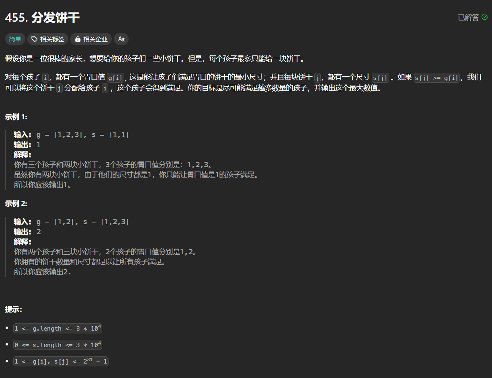

**题解：**

- :exclamation:可以有两种思路：

  - 首先满足胃口小的，那么就按从小到大遍历饼干，记录可以满足的孩子数目

    ```python
    class Solution:
        def findContentChildren(self, g: List[int], s: List[int]) -> int:
            g.sort()
            s.sort()
            idx = 0
            for i in range(len(s)):
                if idx < len(g) and g[idx] <= s[i]:
                    idx += 1
            return idx
    ```

    

  - 首先满足胃口大的，此时需要注意需要遍历胃口而不是饼干，因为如果遍历饼干，当碰到无法满足的孩子时，那么继续遍历饼干都无法满足这个孩子，但是没办法跳到下一个孩子。

    ```python
    class Solution:
        def findContentChildren(self, g: List[int], s: List[int]) -> int:
            g.sort()
            s.sort()
            idx = len(s) - 1
            res = 0
            for i in range(len(g)-1, -1, -1):
                if idx >= 0 and s[idx] >= g[i]:
                    res += 1
                    idx -= 1
            return res
    ```

### [376.摆动序列](https://leetcode.cn/problems/wiggle-subsequence/description/)

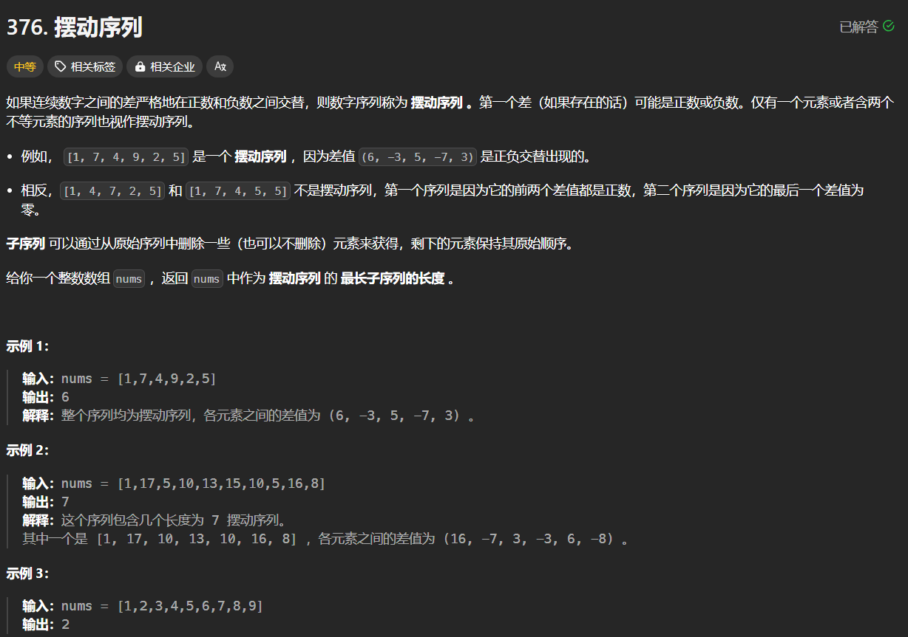

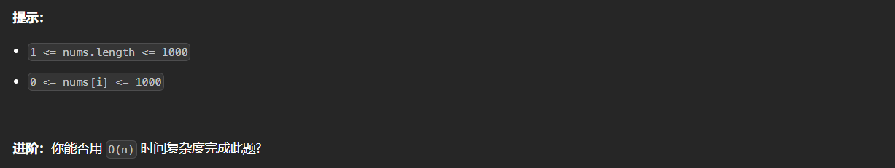

**题解：**

- :exclamation:思路：想象成找波峰波谷，波峰波谷中间的点删去。但是当涉及平坡的时候需要考虑特殊情况，对于平坡，可以限定只考虑第一个点或者只考虑最后一个点，如果记当前点与前一个点的差值为pre_diff,后一个点与当前点的差值等于post_diff，那么只考虑最后一个点时，即要求：$pre_{diff} \geq 0$且$post_{diff}<0$或者$pre_{diff} \leq 0$且$post_{diff}>0$。这样从第一个点遍历到倒数第二个点（默认计数最后一个点，第一个点前面的pre_diff初始为0）时会发现仍然无法通过。这是因为漏掉了单调趋势中存在平坡的情况， ==排除这种情况的方式只需要通过在发现峰值时再更新pre_diff为post_diff即可==。

  ```python
  class Solution:
      def wiggleMaxLength(self, nums: List[int]) -> int:
          if len(nums) <= 1:
              return len(nums)  # 如果数组长度为0或1，则返回数组长度
          post_diff = 0  # 后一对元素的差值
          pre_diff = 0   # 前一对元素的差值
          res = 1  # 记录峰值的个数，初始为1（默认最右边的元素被视为峰值）
          for i in range(len(nums) - 1):
              post_diff = nums[i + 1] - nums[i]  # 计算下一个元素与当前元素的差值
              # 如果遇到一个峰值
              if (pre_diff <= 0 and post_diff > 0) or (pre_diff >= 0 and post_diff < 0):
                  res += 1  # 峰值个数加1
                  pre_diff = post_diff  # 注意这里，只在摆动变化的时候更新pre_diff
          return res  # 返回最长摆动子序列的长度
  ```

### [53.最大子数组和](https://leetcode.cn/problems/maximum-subarray/description/)

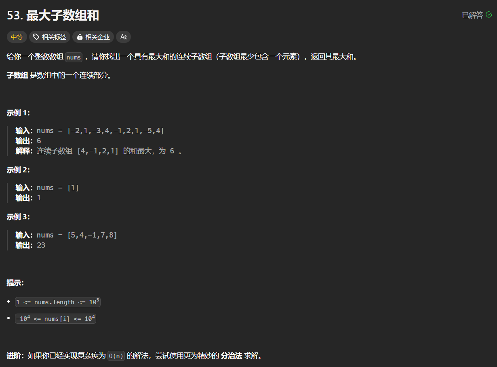

**题解：**

- 首先想到的应该是动态规划，`dp[i]`表示以下标`i`结尾的子数组的最大和，最后返回`dp`数组的最大值

  ```python
  class Solution:
      def maxSubArray(self, nums: List[int]) -> int:
          dp = [0] * len(nums)
          dp[0] = nums[0]
          for i in range(1, len(nums)):
              dp[i] = max(dp[i - 1] + nums[i], nums[i])
          return max(dp)
  ```

- 本题的贪心解法关键在于==求累计和的时候一旦累计和小于0，就应该重新开始累计==

  ```python
  class Solution:
      def maxSubArray(self, nums: List[int]) -> int:
  		result = float('-inf')  # 初始化结果为负无穷大
          count = 0
          for i in range(len(nums)):
              count += nums[i]
              if count > result:  # 取区间累计的最大值（相当于不断确定最大子序终止位置）
                  result = count
              if count <= 0:  # 相当于重置最大子序起始位置，因为遇到负数一定是拉低总和
                  count = 0
          return result
  ```

### [55.跳跃游戏](https://leetcode.cn/problems/jump-game/description/)

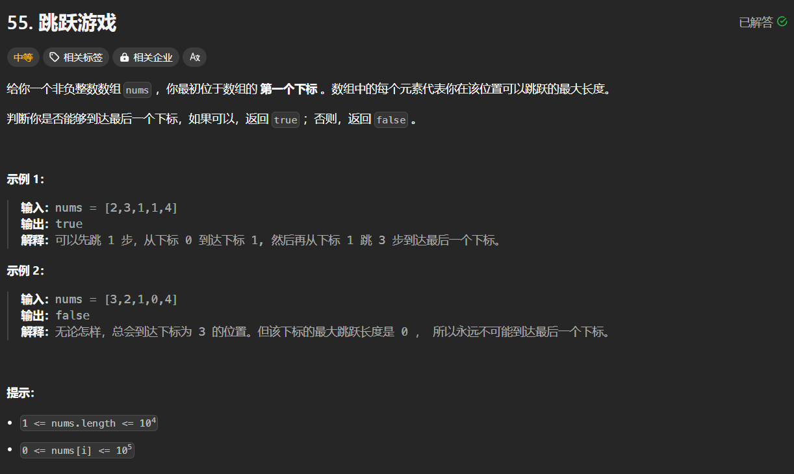

**题解：**

- 本题首先想到的是要维护一个当前遍历到的下标的最远跳跃覆盖范围，这其中的一个关键逻辑是能不能到达当前下标，这要求当前下标`i`必须不超过目前维护最大覆盖范围

  ```python
  class Solution:
      def canJump(self, nums: List[int]) -> bool:
          cover = 0
          for i in range(len(nums)):
              if i <= cover:
                  cover = max(i + nums[i], cover)
                  if cover >= len(nums) - 1:
                      return True
          return False
  ```

### [45.跳跃游戏II](https://leetcode.cn/problems/jump-game-ii/description/)

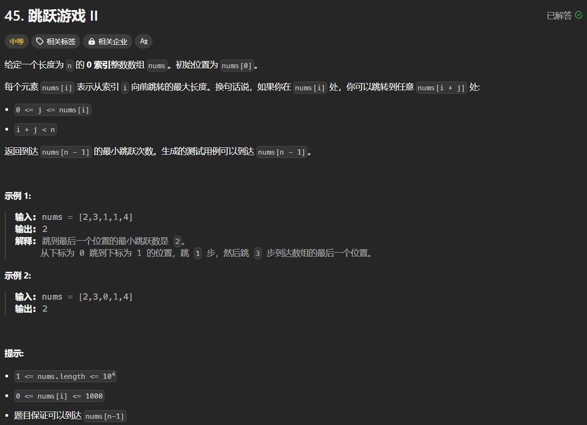

**题解：**

- :one: 首先初看本题想到的是动态规划，dp[i]定义为到达索引i所需的最小跳跃次数，状态转移方程应该表示为dp[i]=min(dp[i],dp[j]+1),其中j小于i,满足状态转移方程时$j+nums[j] \geq i$,初始化方式：dp[0]表示到达下标0的最小跳跃次数，应该为0；因为状态转移方程涉及求最小值，所以其他元素初始化为`inf`,可以写出如下代码：

  ```python
  class Solution:
      def jump(self, nums: List[int]) -> int:
          dp = [float('inf')] * len(nums)
          dp[0] = 0
          for i in range(1, len(nums)):
              for j in range(i):
                  if j + nums[j] >= i:
                      dp[i] = min(dp[i], dp[j]+1)
          return dp[-1]
  ```

- :two:由于题目中nums的长度有可能达到$10^4$,所以上述解答超时了，考虑进一步优化。第一个for循环不可避免，考虑优化第二个for循环，因为只要$j+nums[j] \geq i$时，其实就已经找到了dp[i]的解了，且j不需要从0开始，可以从上一个j的位置开始；并且此时状态转移方程根据此时的j可以直接确定：$dp[i] = dp[j] + 1$；那么此时dp数组初始化也不需要初始化为`inf`了，因此可以优化如下：

  ```python
  class Solution:
      def jump(self, nums: List[int]) -> int:
          dp = [0] * len(nums)
          j = 0
          for i in range(1, len(nums)):
              while j + nums[j] < i:
                  j += 1
              dp[i] = dp[j] + 1
          return dp[-1]
  ```

- :three:贪心策略：对于每一个位置 i 来说，所能跳到的所有位置都可以作为下一个起跳点，为了尽可能使用最少的跳跃次数，所以我们应该使得下一次起跳所能达到的位置尽可能的远。简单来说，就是每次在「可跳范围」内选择可以使下一次跳的更远的位置。这样才能获得最少跳跃次数。具体做法如下：

  - 维护几个变量：当前所能达到的最远位置 end，下一步所能跳到的最远位置 max_pos，最少跳跃次数 steps。
  - 遍历数组 nums ：
    - 每次更新第 i 位置下一步所能跳到的最远位置 max_pos。
    - 如果索引 i 到达了 end 边界，则：更新 end 为新的当前位置 max_pos，并令步数 setps 加 1。如果下一步最远距离大于数组最大下标，则跳出循环。最终返回跳跃次数 steps。

  ```python
  class Solution:
      def jump(self, nums: List[int]) -> int:
          end, max_pos = 0, 0
          steps = 0
          for i in range(len(nums)):
              max_pos = max(max_pos, nums[i] + i)
              if i == end:
                  end = max_pos
                  steps += 1
                  if max_pos >= len(nums) - 1:
                      break
          return steps
  ```

### [1005.K次取反后最大化的数组和](https://leetcode.cn/problems/maximize-sum-of-array-after-k-negations/description/)

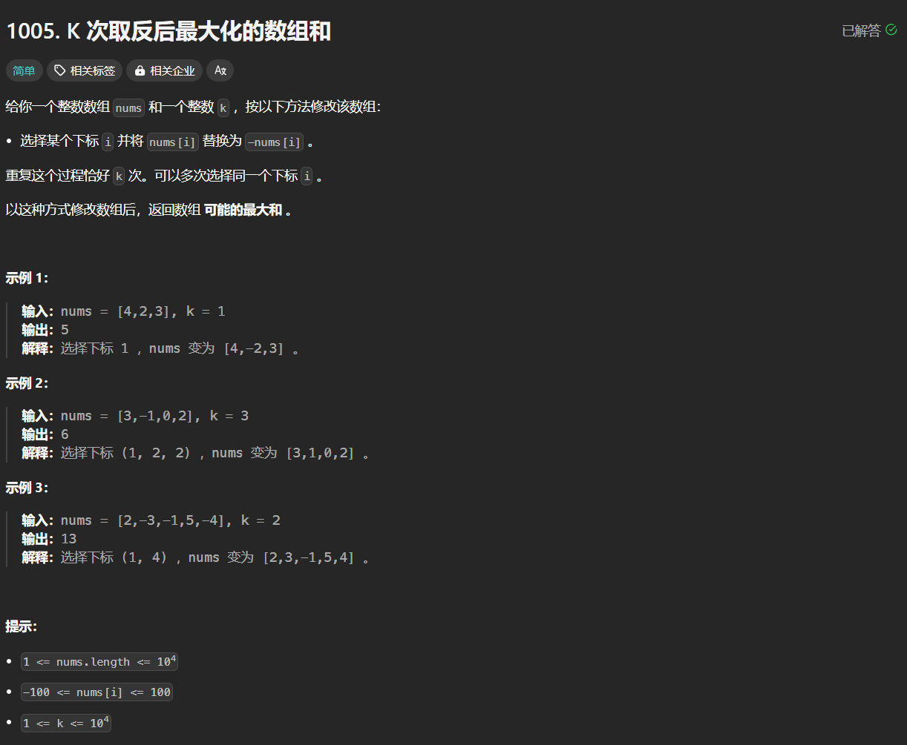

**题解：**

- :exclamation:由于我们必须反转k次，那么有不止k个负数的话，我们要反转里面最小的k个，这样最大。 有不到k个负数的话（数组会变为全部为正）， 剩下的次数反复反转所有数里面绝对值最小的那个 （如果偶数次负负得正所以不变，奇数次相当于只反转一次最小的那个）

  ```python
  class Solution:
      def largestSumAfterKNegations(self, nums: List[int], k: int) -> int:
          nums.sort()
          m, ans = inf, 0
          for num in nums:
              m = min(m, abs(num))
              if num < 0 and k:
                  k -= 1
                  ans -= num
              else:
                  ans += num
          # 只有一种情况我们需要减去最小的那个，k多余了且是奇数（由于已经加进去了所以要减2倍）
          return ans - 2 * m if k and k % 2 else ans
  ```

### [134.加油站](https://leetcode.cn/problems/gas-station/description/)

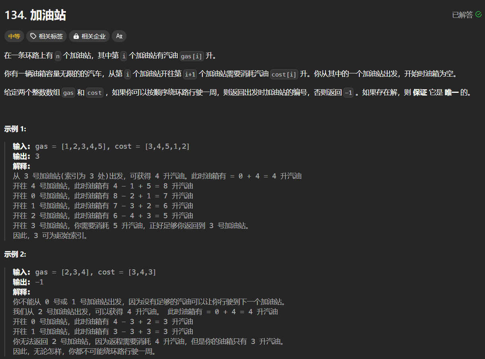

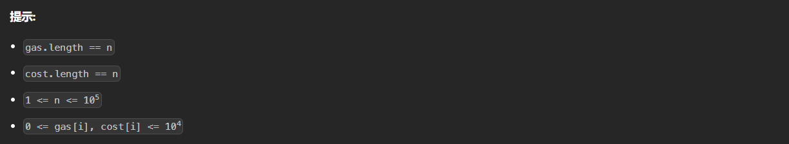

**题解：**

- :exclamation:前提：如果需要消耗的汽油总量$sum_{cost}$大于加油站可以加油的总量$sum_{gas}$，那么一定不能到达；如果$sum_{cost}\leq sum_{gas}$,则一定有解，且解唯一；

- 解法：从0开始，之后每到一个站点，更新剩余油量，如果到站点i时（假设存在负油量的情况），剩余油量小于0，那么说明站点0和i之间不存在满足题意的出发点；此时从站点i+1开始重新更新剩余油量，直到从某个站点出发一直到第len(gas)-1站点其剩余油量一直大于0，则满足条件。

  ```python
  class Solution:
      def canCompleteCircuit(self, gas: List[int], cost: List[int]) -> int:
          if sum(gas) < sum(cost):
              return -1
          start, total = 0, 0
          for i in range(len(gas)):
              total += gas[i] - cost[i]
              if total < 0:
                  start = i + 1
                  total = 0
          return start
  ```

### [135.分发糖果](https://leetcode.cn/problems/candy/description/)

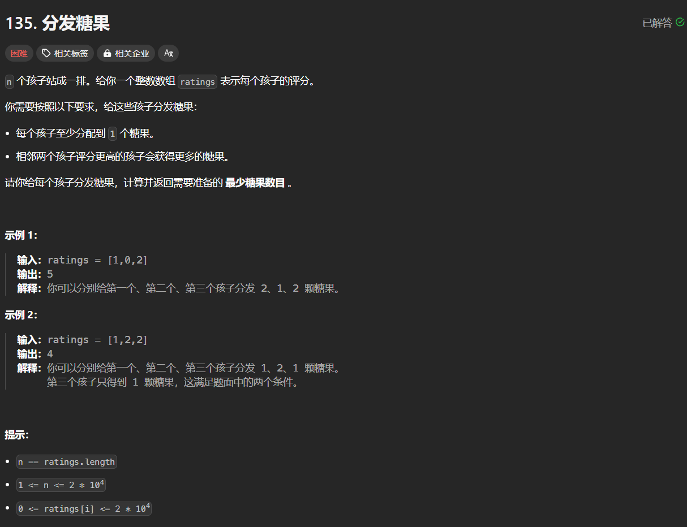

**题解：**

- :exclamation:思路：这道题的思路很直接但是也挺难想的：先从左到右遍历，处理右边孩子比左边孩子分数高的情况；然后从右向左遍历，处理左边孩子比右边孩子分数高的情况。注意从左向右遍历只能从右往左比，因为从左往右比遍历后续孩子没法满足条件，从右往左遍历同理。

  ```python
  class Solution:
      def candy(self, ratings: List[int]) -> int:
          n = len(ratings)
          candies = [1] * n
          for i in range(1, n):
              if ratings[i] > ratings[i - 1]:
                  candies[i] = candies[i - 1] + 1
          for i in range(n-2, -1, -1):
              if ratings[i] > ratings[i + 1]:
                  candies[i] = max(candies[i], candies[i + 1] + 1)
          return sum(candies)
  ```

### [406.根据身高重建队列](https://leetcode.cn/problems/queue-reconstruction-by-height/description/)

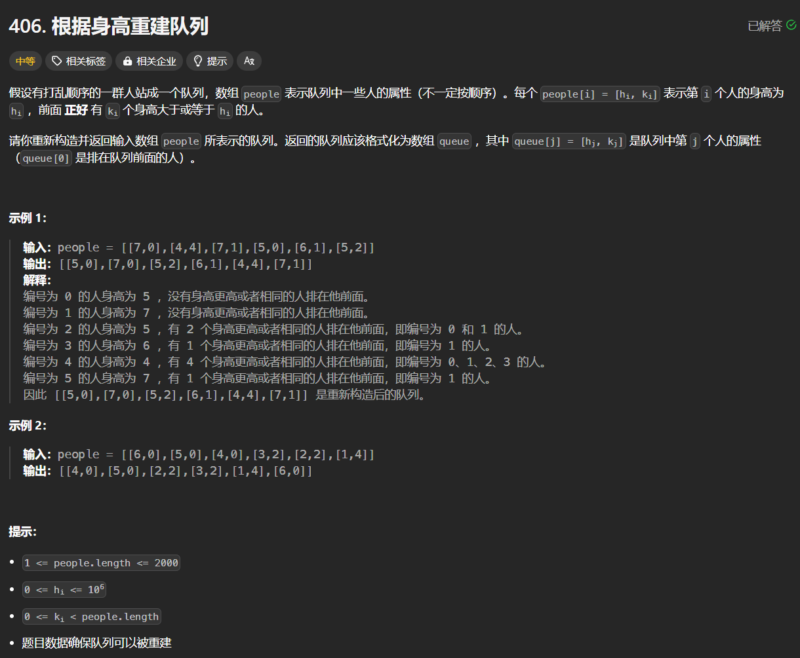

**题解：**

- :exclamation:思路：由于身高矮的人对身高高的人的k值没有影响，因此应该按身高从高到低插入元素；为了考虑k值，身高相同的人应该按照k值从低到高排序；每个元素插入位置等于其k值。

- 解法步骤：

  - 首先将数组按照身高降序排列，身高相同的按照k升序排列
  - 然后遍历数组（即从身高高的开始遍历），按照k值插入元素，因为身高较小的即使插入到前面也不影响已经插入身高更高元素的k值排列

- 代码：

  ```python
  class Solution:
      def reconstructQueue(self, people: List[List[int]]) -> List[List[int]]:
          people.sort(key=lambda x: (-x[0], x[1]))
          que = []
          for p in people:
              que.insert(p[1], p)
          return que
  ```

  ### [860.柠檬水找零](https://leetcode.cn/problems/lemonade-change/description/)
  
  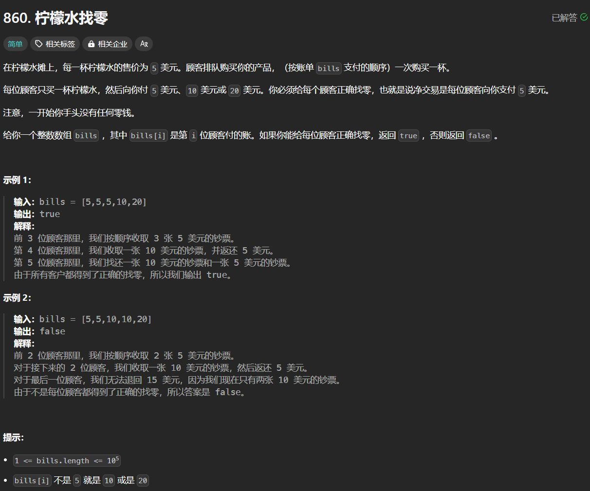


**题解：**

- :exclamation:思路：本题关键注意当收到10元时，手上必须要有5元，否则不能正确找零；收到20元时，手上要么有至少一个10元和5元，或者3个5元，因为10元更难找出去，所以收到20元时优先找零10元。

  ```python
  class Solution:
      def lemonadeChange(self, bills: List[int]) -> bool:
          five, ten = 0, 0
          for bill in bills:
              if bill == 5:
                  five += 1
              if bill == 10:
                  if five > 0:
                      five -= 1
                      ten += 1
                  else:
                      return False
              if bill == 20:
                  if ten > 0 and five > 0:
                      five -= 1
                      ten -= 1
                  elif five >= 3:
                      five -= 3
                  else:
                      return False
          return True
  ```

### [452.用最少数量的箭引爆气球](https://leetcode.cn/problems/minimum-number-of-arrows-to-burst-balloons/description/)

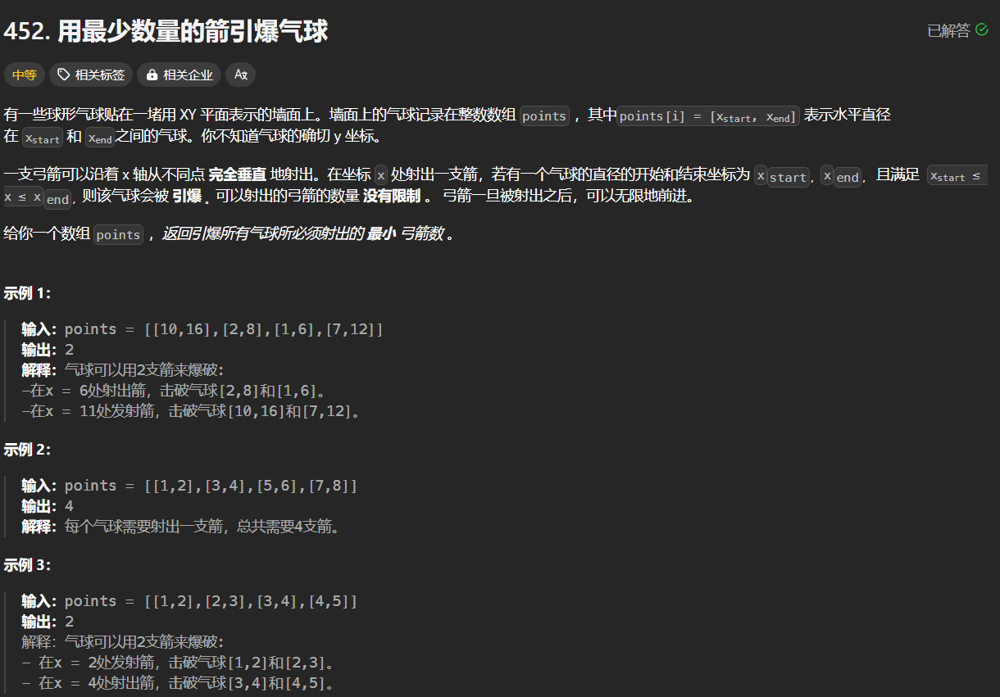

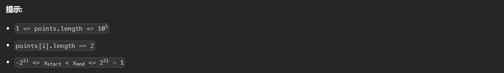

- :exclamation:思路：首先本题可以抽象成区间相交的问题。两个区间相交的条件为一个区间的起点小于等于（这里是否取等于号需要根据题目意思判断，本题需要取等号）另一个区间的终点；进一步地，==多个区间均相交的充要条件是：所有区间的起点均小于等于所有区间终点的最小值==。

- 回到本题，利用上述区间相交条件，只需要将所有区间按照起点排序，然后遍历区间，一旦碰到区间起点大于目前所记录到的最小终点，所需要的箭加一。下面是两种解法，第一种单独维护一个当前最小区间终点，第二种进一步优化空间复杂度，直接用列表元素代替此区间终点。

  ```python
  class Solution:
      def findMinArrowShots(self, points: List[List[int]]) -> int:
          points.sort()
          end = points[0][1]
          arrows = 1
          for i in range(1, len(points)):
              if points[i][0] <= end:
                  end = min(end, points[i][1])
              else:
                  arrows += 1
                  end = points[i][1]
          return arrows
  
  class Solution:
      def findMinArrowShots(self, points: List[List[int]]) -> int:
          points.sort()
          arrows = 1
          for i in range(1, len(points)):
              if points[i][0] > points[i - 1][1]:
                  arrows += 1
              else:
                  points[i][1] = min(points[i][1], points[i - 1][1])
          return arrows
  ```

### [435.无重叠区间](https://leetcode.cn/problems/non-overlapping-intervals/description/)

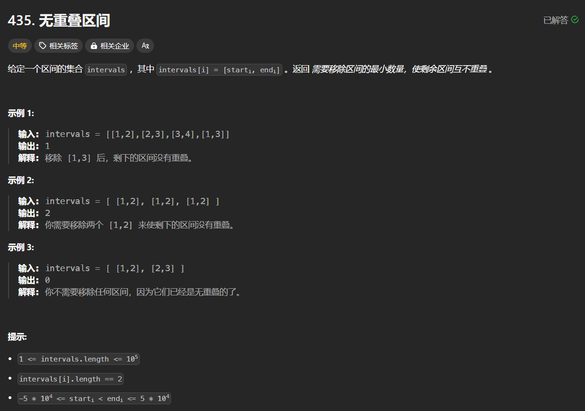

- 思路：本题也是区间重叠问题，首先找出重叠区间类别，然后用总长度减去

```python
class Solution:
    def eraseOverlapIntervals(self, intervals: List[List[int]]) -> int:
        intervals.sort()
        end = intervals[0][1]
        cnt = 1
        for i in range(1, len(intervals)):
            if intervals[i][0] < end:
                end = min(intervals[i][1], end)
            else:
                end = intervals[i][1]
                cnt += 1
        return len(intervals) - cnt
```

### [763.划分字母区间](https://leetcode.cn/problems/partition-labels/description/)

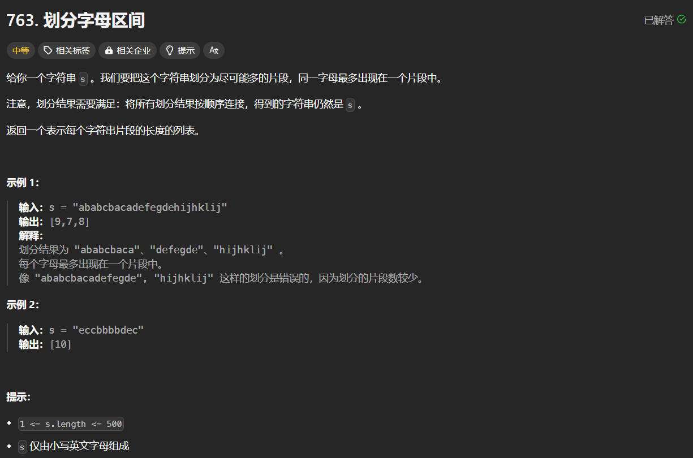

**题解：**

- :one: 本题第一种思路是找出每个字符出现的首尾下标，然后按照找区间重叠来解；

  ```python
  class Solution:
      def partitionLabels(self, s: str) -> List[int]:
          s_set = set(s)
          pos = {}
          for c in s_set:
              pos[c] = []
          for i, c in enumerate(s):
              pos[c].append(i)
          for c, value in pos.items():
              if len(value) == 1:
                  pos[c].append(value[0])
              else:
                  pos[c] = [value[0], value[-1]]
          pos_ls = []
          for p in pos.values():
              pos_ls.append(p)
          pos_ls.sort()
          end = pos_ls[0][1]
          res = []
          for i in range(1, len(pos_ls)):
              if pos_ls[i][0] < end:
                  end = max(end, pos_ls[i][1])
              else:
                  res.append(end + 1)
                  end = pos_ls[i][1]
          res.append(end + 1)
          for i in range(len(res) - 1, 0, -1):
              res[i] -= res[i - 1]
          return res
  ```

- :two:另一种是首先找出每个字符最大出现下标，然后遍历字符串，并且维护一个当前位置字符最大下标与之前记录的最大下标的更大者，一旦遍历到的下标等于当前维护的最大下标，说明找到一个分界点。

  ```python
  class Solution:
      def partitionLabels(self, s: str) -> List[int]:
          last_pos = {}
          for i, c in enumerate(s):
              last_pos[c] = i
          last = 0
          res = []
          for i, c in enumerate(s):
              last = max(last_pos[c], last)
              if i == last:
                  res.append(i + 1)
          for i in range(len(res) - 1, 0, -1):
              res[i] -= res[i - 1]
          return res
  ```

### [56.合并区间](https://leetcode.cn/problems/merge-intervals/description/)

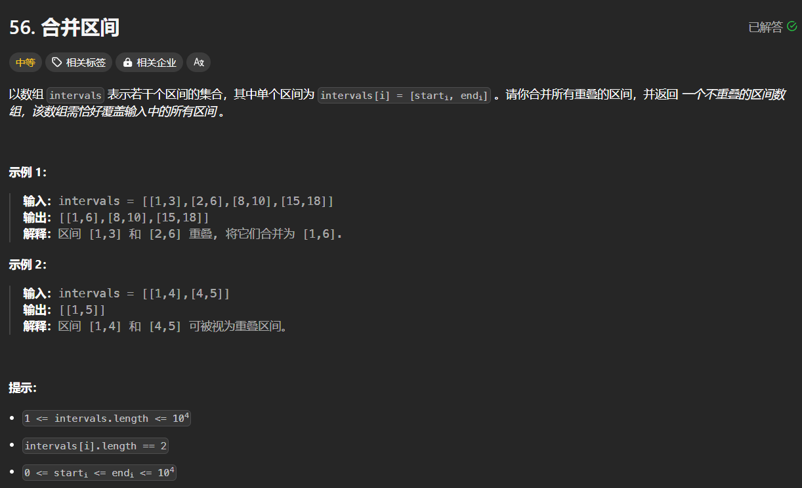

- :one:本题类似区间重叠，只需需要记录区间最大终点；

  ```python
  class Solution:
      def merge(self, intervals: List[List[int]]) -> List[List[int]]:
          intervals.sort()
          start, end, res = intervals[0][0], intervals[0][1], []
          for i in range(1, len(intervals)):
              if intervals[i][0] <= end:
                  end = max(end, intervals[i][1])
              else:
                  res.append([start, end])
                  start, end = intervals[i][0], intervals[i][1]
          res.append([start, end])     
          return res
  ```

- :two:代码可以进一步优化，不需要维护开始和结束变量，因为每当碰到一个不重叠区间时，直接把这个区间放入结果中，然后更改此区间的右边界就行。

  ```python
  class Solution:
      def merge(self, intervals):
          result = []
          intervals.sort(key=lambda x: x[0])  # 按照区间的左边界进行排序
  
          result.append(intervals[0])  # 第一个区间可以直接放入结果集中
  
          for i in range(1, len(intervals)):
              if result[-1][1] >= intervals[i][0]:  # 发现重叠区间
                  # 合并区间，只需要更新结果集最后一个区间的右边界，因为根据排序，左边界已经是最小的
                  result[-1][1] = max(result[-1][1], intervals[i][1])
              else:
                  result.append(intervals[i])  # 区间不重叠
  
          return result
  ```

### [738.单调递增的数字](https://leetcode.cn/problems/monotone-increasing-digits/description/)

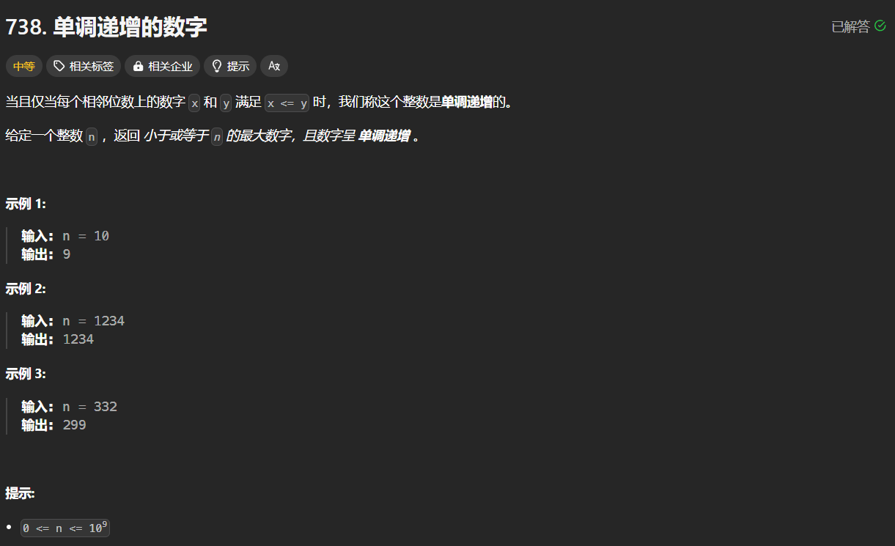

- 本题可以先考虑数字从左到右都有哪些变化形式，如果不考虑多种趋势，最简单的包括四种趋势：递增，递减，先增再减，先减再增。每一种列出一个示例就会发现所有情况下满足条件的数字是将当前数字从右往左找到的最后一个不满足递增性质的数字后面所有数字都变为9，当前数字减一。

  ```python
  class Solution:
      def monotoneIncreasingDigits(self, N: int) -> int:
          s = list(str(N))
          n = len(s)
          for i in range(n - 2, -1, -1):
              if int(s[i]) > int(s[i + 1]):
                  s[i + 1:] = '9' * (n - 1 - i)
                  s[i] = str(int(s[i]) - 1)
          return int(''.join(s)) 
  ```

  


