# 代码-链表

[TOC]

## 概述

- 链表的增删时间复杂度都是`O(1)`，查询的时间复杂度为`O(n)`（因为需要从头遍历查找）

- 解决链表题目往往定义一个虚拟表头更加方便；很多链表问题可以用双指针解决；

- python定义链表示例：

  ```python
  class Node:
      def __init__(self, val=0, next=None):
          self.val = val
          self.next = next
  ```

## 题目

### [203. 移除链表元素](https://leetcode.cn/problems/remove-linked-list-elements/)

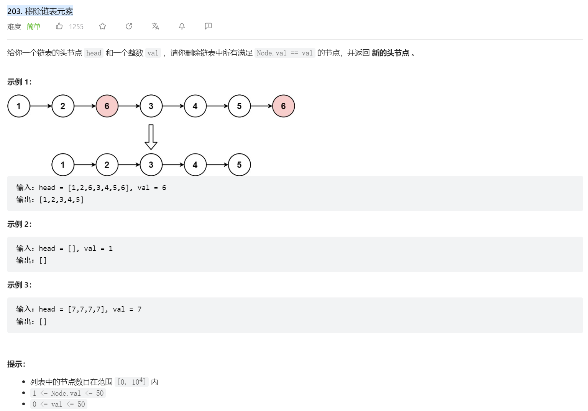

**题解：**

- 定义一个虚拟表头，然后遍历链表元素

  ```python
  # Definition for singly-linked list.
  # class ListNode:
  #     def __init__(self, val=0, next=None):
  #         self.val = val
  #         self.next = next
  class Solution:
      def removeElements(self, head: Optional[ListNode], val: int) -> Optional[ListNode]:
          dummy_head = ListNode(next=head)
          cur = dummy_head
          while cur.next is not None:
              if cur.next.val == val:
                  cur.next = cur.next.next
              else:
                  cur = cur.next
          return dummy_head.next
  ```

### [707. 设计链表](https://leetcode.cn/problems/design-linked-list/)

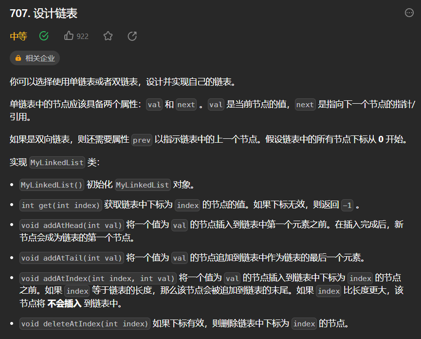

**题解：**

- 为了遍历便利，新的链表类应该定义一个虚拟头节点，同时因为需要用索引遍历，则还需要定义一个链表长度变量；需要注意索引是否正确，同时增删节点时需要更新链表长度，同时需要判断索引是否正确（对于`get/deleteAtIndex`，index不能大于等于链表长度；而对于`addAtIndex`，index则可以等于链表长度）

  ```python
  class ListNode:
      def __init__(self, val=0, next=None):
          self.val = val
          self.next = next
      
  class MyLinkedList:
      def __init__(self):
          self.dummy_head = ListNode()
          self.size = 0
  
      def get(self, index: int) -> int:
          if index < 0 or index >= self.size:
              return -1
          cur = self.dummy_head
          for i in range(index):
              cur = cur.next
          return cur.next.val
  
      def addAtHead(self, val: int) -> None:
          self.dummy_head.next = ListNode(val, self.dummy_head.next)
          self.size += 1
  
      def addAtTail(self, val: int) -> None:
          cur = self.dummy_head
          while cur.next:
              cur = cur.next
          cur.next = ListNode(val)
          self.size += 1
  
      def addAtIndex(self, index: int, val: int) -> None:
          if index < 0 or index > self.size:
              return 
          cur = self.dummy_head
          for i in range(index):
              cur = cur.next
          cur.next = ListNode(val, next=cur.next)
          self.size += 1
  
      def deleteAtIndex(self, index: int) -> None:
          if index < 0 or index >= self.size:
              return
          cur = self.dummy_head
          for i in range(index):
              cur = cur.next
          cur.next = cur.next.next
          self.size -= 1
  
  # Your MyLinkedList object will be instantiated and called as such:
  # obj = MyLinkedList()
  # param_1 = obj.get(index)
  # obj.addAtHead(val)
  # obj.addAtTail(val)
  # obj.addAtIndex(index,val)
  # obj.deleteAtIndex(index)
  ```

### [206. 反转链表](https://leetcode.cn/problems/reverse-linked-list/)

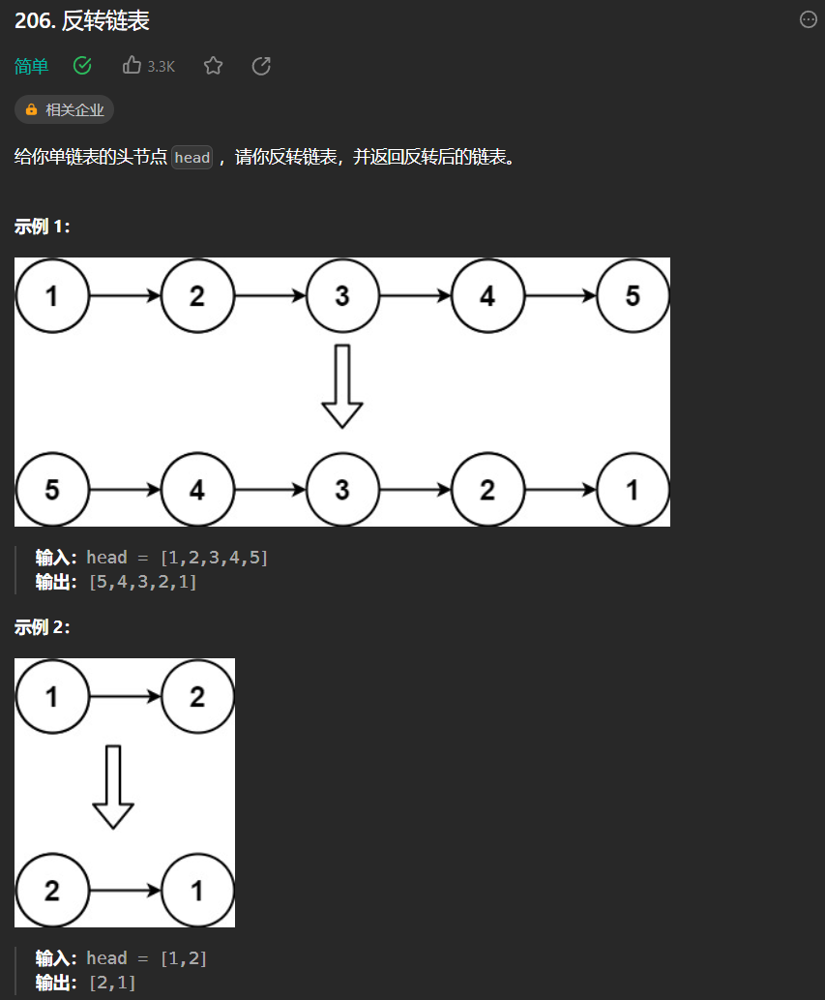

**题解：**

- 双指针：定义一个`cur`和`pre`指针，遍历`cur`指针，并不断改变指针指向。本题也可以用递归来解，但是太难理解了。

  ```python
  # Definition for singly-linked list.
  # class ListNode:
  #     def __init__(self, val=0, next=None):
  #         self.val = val
  #         self.next = next
  class Solution:
      # 双指针法
      def reverseList(self, head: Optional[ListNode]) -> Optional[ListNode]:
          cur, pre = head, None
          while cur:
              temp = cur.next
              cur.next = pre
              pre = cur
              cur = temp
          return pre
  ```

### [24. 两两交换链表中的节点](https://leetcode.cn/problems/swap-nodes-in-pairs/)

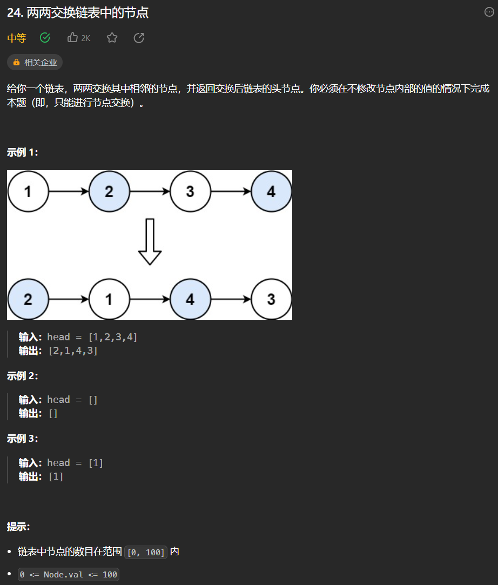

**题解：**

- 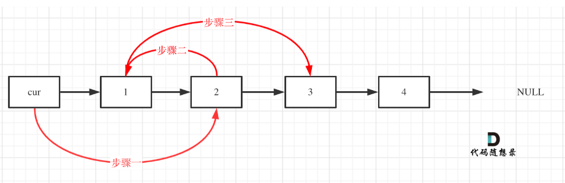

  ```python
  # Definition for singly-linked list.
  # class ListNode:
  #     def __init__(self, val=0, next=None):
  #         self.val = val
  #         self.next = next
  class Solution:
      def swapPairs(self, head: Optional[ListNode]) -> Optional[ListNode]:
          dummy_head = ListNode(next=head)
          cur = dummy_head
          while cur.next and cur.next.next:
              temp = cur.next
              temp1 = cur.next.next.next
  
              cur.next = cur.next.next
              cur.next.next = temp
              temp.next = temp1
  
              cur = cur.next.next
  
          return dummy_head.next
  ```

### [19. 删除链表的倒数第 N 个结点](https://leetcode.cn/problems/remove-nth-node-from-end-of-list/)

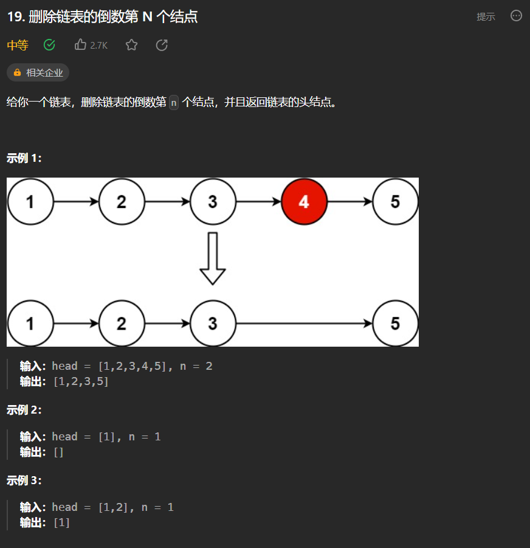

**题解：**

- 双指针：定义快慢指针，快指针领先慢指针n步，当快指针到达链表末尾的时候，慢指针到达指定位置

  ```python
  # Definition for singly-linked list.
  # class ListNode:
  #     def __init__(self, val=0, next=None):
  #         self.val = val
  #         self.next = next
  class Solution:
      def removeNthFromEnd(self, head: Optional[ListNode], n: int) -> Optional[ListNode]:
          dummy_head = ListNode(next=head)
          fast = slow = dummy_head
          for i in range(n):
              fast = fast.next
          while fast.next:
              fast = fast.next
              slow = slow.next
          slow.next = slow.next.next
          return dummy_head.next
  ```

### [面试题 02.07. 链表相交](https://leetcode.cn/problems/intersection-of-two-linked-lists-lcci/)

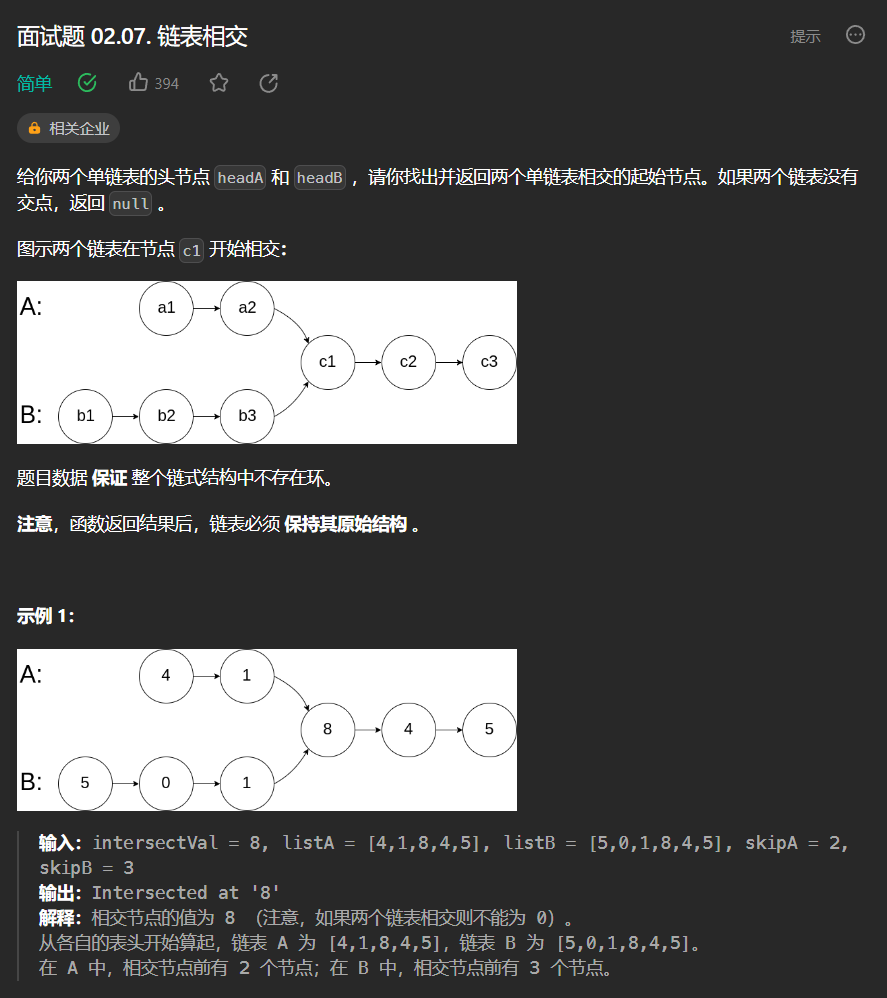

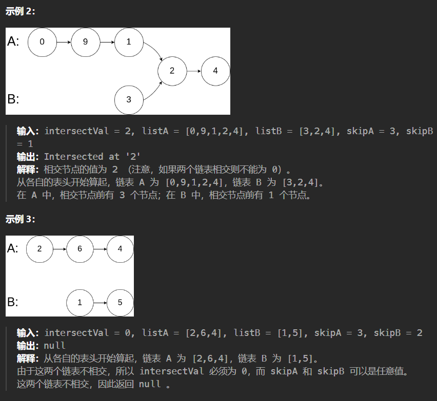

**题解：**

- 本题关键是理解题目意思，链表相交是指后半部分相同；据此只需要将更长的链表后移两个链表长度之差个节点再遍历比较两个链表的节点

  ```python
  # Definition for singly-linked list.
  # class ListNode:
  #     def __init__(self, x):
  #         self.val = x
  #         self.next = None
  
  class Solution:
      def getIntersectionNode(self, headA: ListNode, headB: ListNode) -> ListNode:
          lenA, lenB = 0, 0
          cur = headA
          while cur:         # 求链表A的长度
              cur = cur.next 
              lenA += 1
          cur = headB 
          while cur:         # 求链表B的长度
              cur = cur.next 
              lenB += 1
          curA, curB = headA, headB
          if lenA > lenB:     # 让curB为最长链表的头，lenB为其长度
              curA, curB = curB, curA
              lenA, lenB = lenB, lenA 
          for _ in range(lenB - lenA):  # 让curA和curB在同一起点上（末尾位置对齐）
              curB = curB.next 
          while curA:         #  遍历curA 和 curB，遇到相同则直接返回
              if curA == curB:
                  return curA
              else:
                  curA = curA.next 
                  curB = curB.next
          return None 
  ```

### [142. 环形链表 II](https://leetcode.cn/problems/linked-list-cycle-ii/)

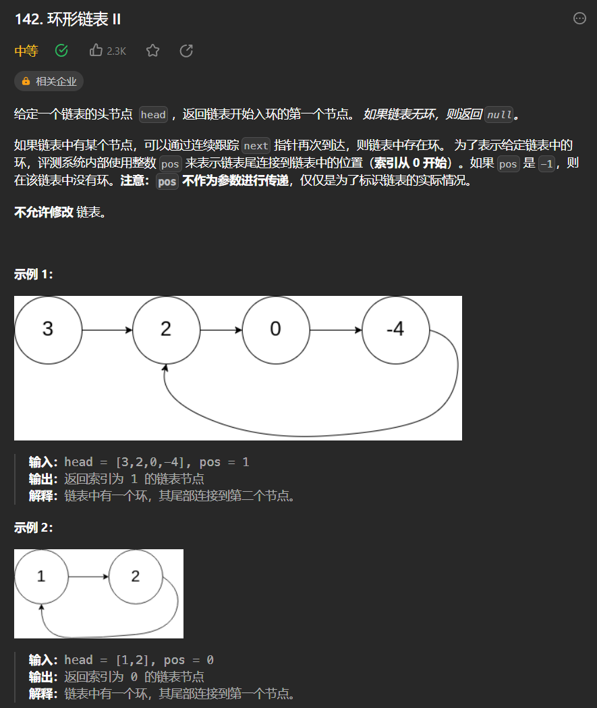

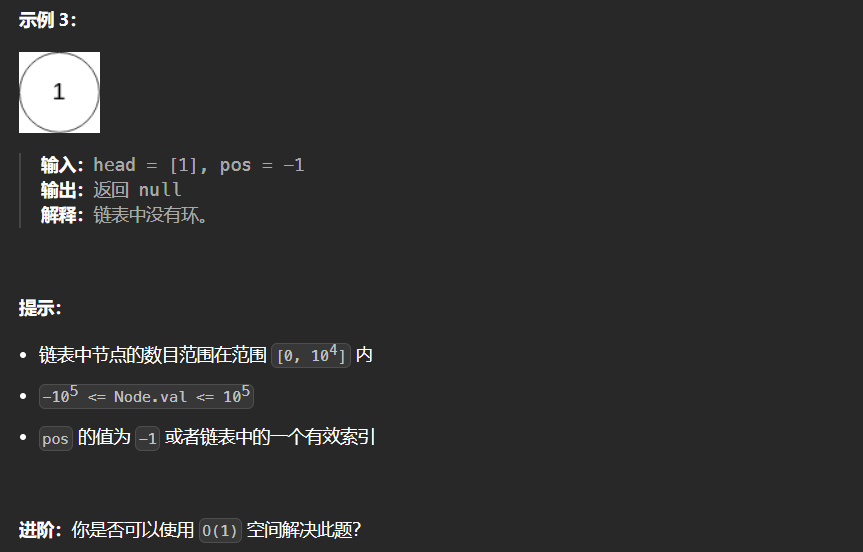

**题解：**

- 第一种方式直接遍历链表节点并保存到字典中，如果节点已经存在，说明存在环

  ```python
  # Definition for singly-linked list.
  # class ListNode:
  #     def __init__(self, x):
  #         self.val = x
  #         self.next = None
  
  
  class Solution:
      def detectCycle(self, head: ListNode) -> ListNode:
          visited = set()
          
          while head:
              if head in visited:
                  return head
              visited.add(head)
              head = head.next
          
          return None
  ```

- 第二种方法考虑两个指针，一个每次遍历1个节点，另一个每次遍历2个节点，如果存在环，那么两个指针一定会相遇，接下来需要找到环的入口；首先需要明确相遇时慢指针一定没有走完一圈，假设慢指针到达入口时，快指针领先慢指针a个节点，经过t时间后，两指针相遇，那么`2t-t+a=t+a=nS`，这里S为环的长度，因为$n \geq 1$,第一次相遇时`t=S-a`，这说明慢指针未走完一圈；假设快慢指针相遇位置距离环入口y（如下图），可以建立等式$x+y+n(y+z)=2(x+y)$，即$x=(n-1)(y+z)+z$，这说明当一个指针从头节点出发，另一个指针从相遇节点出发时，它们会在环的入口相遇

  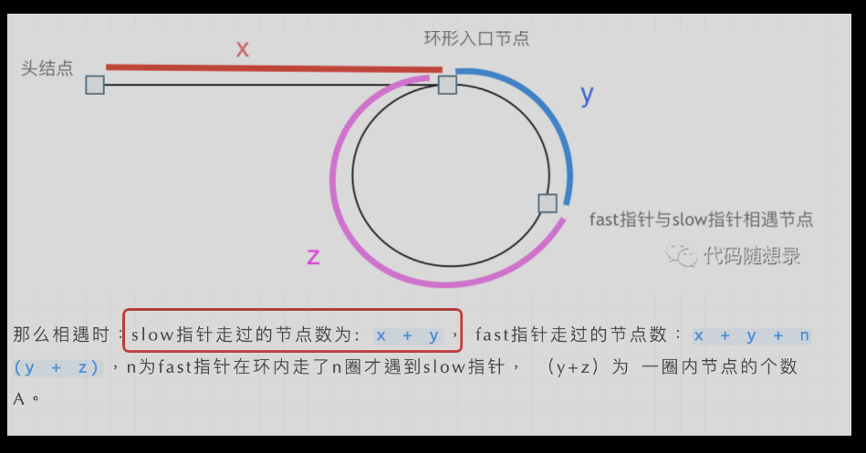

  ```python
  # Definition for singly-linked list.
  # class ListNode:
  #     def __init__(self, x):
  #         self.val = x
  #         self.next = None
  
  class Solution:
      def detectCycle(self, head: Optional[ListNode]) -> Optional[ListNode]:
          slow = head
          fast = head
          
          while fast and fast.next:
              slow = slow.next
              fast = fast.next.next
              
              # If there is a cycle, the slow and fast pointers will eventually meet
              if slow == fast:
                  # Move one of the pointers back to the start of the list
                  slow = head
                  while slow != fast:
                      slow = slow.next
                      fast = fast.next
                  return slow
          # If there is no cycle, return None
          return None
  ```

  


