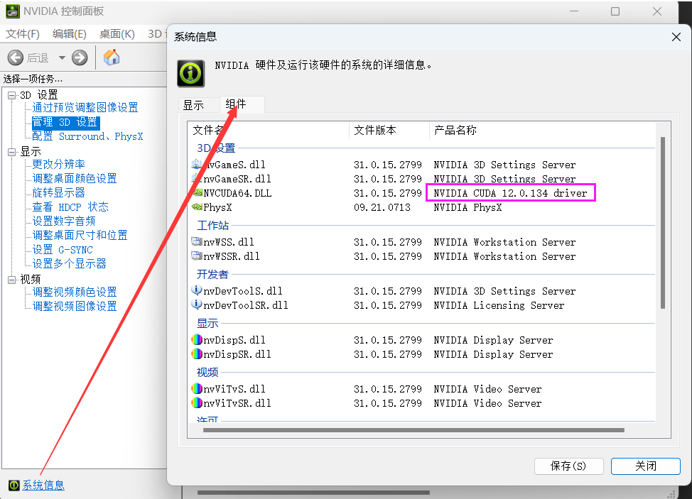

# GPU版本tensorflow和pytorch安装

[TOC]

## 安装cuda和cudnn

- 安装显卡驱动[网址](https://www.nvidia.com/Download/index.aspx?lang=en-us)
- 查看显卡支持的cuda最高版本!
- 查看cuda、cudnn、tensorflow版本对应关系[网址](https://tensorflow.google.cn/install/source_windows#gpu)
- 安装cuda[下载网址](https://developer.nvidia.com/cuda-toolkit-archive)，默认会添加环境变量
- 下载cudnn压缩包[网址](https://developer.nvidia.com/zh-cn/cudnn)，将三个文件夹复制到cuda安装文件夹下
- ==好像不用安装cuda也行？pip安装cudatookit也可以？==

## 安装tensorflow-gpu

- 根据tensorflow版本安装`pip install tensorflow-gpu==2.x.x`

## 安装pytorch-gpu

- 查看对应cuda版本的torch和torchvision，torch和torchvision版本依赖关系见[网址](https://github.com/pytorch/vision)

- 下载对应版本的torch和torchvision的whl文件[网址](https://download.pytorch.org/whl/torch_stable.html)

- 安装,先安装torch

  ```python
  pip install xxx.whl
  ```

## 参考

- https://blog.csdn.net/Netceor/article/details/119821270