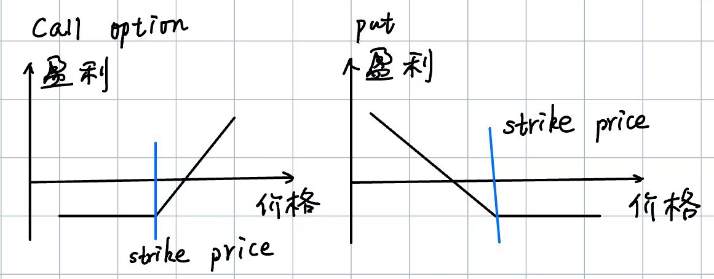

# 期权

[TOC]

## 期权市场机制

### 期权类型

- 基本术语：

  - 看涨期权（call option）：期权持有者在到期日（或之前）有权以敲定价格买入资产
  - 看跌期权（put option）：期权持有者在到期日（或之前）有权以敲定价格卖出资产
  - 到期日（expiration date）/满期日（maturity date）
  - 执行价格（exercise price）/敲定价格（strike price）
  - 美式期权：可以在到期日之前的任何时刻行使，大多数交易所采用美式期权
  - 欧式期权：只能在到期日才能行使
  - 期权持有人（多头），期权承约方（空头）

- 期权持有人持有看涨期权与看跌期权的盈利和标的在到期日价格的关系：

  

  - 对于看涨期权：如果在到期日标的价格低于执行价格，那么期权不会被执行，买入期权的费用全部亏损；如果价格高于执行价格，期权被执行，因此期权持有人可以以执行价格买入而以标的价格卖出（低买高卖）；
  - 对于看跌期权：如果在到期日标的价格高于执行价格，那么期权不会被执行，买入期权的费用全部亏损；如果价格低于执行价格，期权被执行，因此期权持有人可以以标的价格卖出而以执行价格卖出（低买高卖）；

- 期权承约方的盈亏与期权持有人恰好相反。

### 期权头寸

- 期权交易有4种头寸形式：
  - 看涨期权多头
  - 看跌期权多头
  - 看涨期权空头
  - 看跌期权空头
- 在不考虑期权最初价格的情况下，假定执行价格为$K$，标的最终价格为$S_T$，4种头寸的欧式期权收益分别为：
  - 看涨多头：$max(S_T - K)$
  - 看涨空头：$-max(S_T - K) = min(K - S_T, 0)$
  - 看跌多头：$max(K - S_T, 0)$
  - 看跌空头：$- max(K - S_T, 0) = min(S_T - K,0)$

### 标的资产

- 股票期权：大部分股票期权的交易在交易所进行。一份期权合约对应100只股票（即股票交易最小手数）；
- 货币期权：大部分货币期权的交易在场外市场进行。
- 指数期权：场内和场外市场都有交易。合约结算总是以现金形式，而不是交割指数交易组合。
- 期货期权：期货期权的有效期一般是在期货交割日之前的一小段时间。

### 股票期权的细节

- 执行价格：执行价格通常由交易所选定，当引入一个新的到期日时，交易所通常会选择2-3个最接近股票当前价格的执行价格。如果股价变动超过了最高执行价格与最低执行价格范围，交易所会引入新的执行价格的期权。
- 期权系列：一个期权系列是由具有**相同到期日与执行价格**的某个给定类型（看涨或看跌）的所有期权。

- 实值期权/平值期权/虚值期权：对于看涨期权，S>K为实值期权，S<K为虚值期权，S=K为平值期权；对于看涨跌权，S<K为实值期权，S>K为虚值期权，S=K为平值期权；
- 内涵价值：假设期权被立刻行使时具有的价值；期权的整体价值等于内涵价值与时间价值的和。
- 非标准期权：灵活期权，ETF期权，单周期权，两值期权，信用事件两值期权，末日期权
- 当公司发放现金股息时，交易所交易的期权的执行价格不一定会降低；当股票分股时，交易所交易的期权会进行调整；当公司发放股票股息（类似于分股，也会增加总股数）时，期权价格也会调整。
- 看涨期权多头与看跌期权空头是市场的同一方。

### 交易

- 大多数交易所采用做市商制度促使期权交易的进行。做市商报出买入价与卖出价，卖出价一定高于买入价，交易所设定买卖价差上限；
- 冲销指令：购买期权的投资者可以发出出售相同数量期权的冲销指令来结清头寸。当期权交易双方都冲销头寸时，持仓量才减一，否则不变；

- 其他术语

  - 佣金：买入期权与行使期权均会产生佣金；

  - 保证金：对于杠杆较小的期权，可以用保证金的方式购买；

  - 期权结算公司：所有期权交易通过期权结算公司会员结清；

  - 认股权证，雇员股票期权，可转换债券都类似于期权；

  - 场外期权市场规模已经超过了交易所市场；

## 股票期权的性质

### 影响期权价格的因素

- 有6种因素会影响股票期权的价格：

  - 当前股票价格：看涨期权价格随着股价上升而上升，看跌期权价格随着股价上升而下降
  - 执行价格：看涨期权价格随着执行价格上升而下降，看跌期权价格随着执行价格上升而上升
  - 期权期限：对于美式期权，随着期权期限增加，美式看涨与看跌期权价格都会上升（至少不会减少，因为期限较短的期权在行使时，较长的期权也可以被行使），而欧式看涨与看跌期权价格一般会增加（例如当长期限内存在股票分红等情况时，长期限期权价格可能低于短期限期权）。
  - 股价波动率：当波动率增大时，股价大幅上升或者下降的机会增大；看涨期权的拥有者可以从股票上升中获利，但股价下跌带来的损失有限；看跌期权的情形类似；因此波动率增大期权价格也会增加。
  - 无风险利率：当其他影响因素不变时，无风险利率增大会引起看涨期权价格增加，看跌期权价格下降（当利率增加时，投资者所要求的股票收益期望增加，期权持有人将来所收到的现金流的贴现值会下降，着两种效应的综合效应会引起看涨期权价格上升，看跌期权价格下降）。==暂时不理解==
  - 期权期限内预期支付的股息：股息将使股价在除息日下降，因此看涨期权价格与预期股息反相关，而看跌期权则与预期股息正相关。

- 符号：

  - $S_0$：当前股价
  - $K$：期权执行价格
  - $T$：期权期限
  - $S_T$：$T$时刻股价
  - $r$：在T时刻到期的无风险投资利率
  - $C$：买入一只美式看涨期权价值
  - $P$：卖出一只美式看跌期权价值
  - $c$：买入一只欧式看涨期权价值
  - $p$：买入一只欧式看跌期权价值

- 期权价格的上下限

  - 上限：美式看涨期权或欧式看涨期权给其持有者以指定价格买入股票的权力，因此价格不会超过股价，$c \leq S_0$或$C \leq S_0$，因为如果期权价格大于股价，套利人可以购买股票同时出售期权来获取无风险套利；美式看跌期权持有者有权以价格$K$卖出股票，因此价格不会高于执行价格，$P \leq K$，欧式看跌期权在T时刻价格不会超过K，因此期权价格不会高于$K$的贴现值$p \leq e^{-rT}K$，如果不成立，套利者可以卖出一个期权，同时将所得收入进行无风险利率投资。

  - 无股息股票上看涨期权的下限：
    - 无股息欧式看涨期权下限：$S_0 - Ke^{-rt}$，证明：考虑两个投资组合，A为一个欧式看涨期权加上在时间T提供收益K的零息债券，B为一只股票。在T时刻A的价值为$max(S_t, K)$，而B的价值为$S_T$，在T时刻A的价值总不会低于B的价值，那么在当前时刻A的价值也不会低于B的价值，所以有：$c+Ke^{-rt} \geq S_0$，即$c \geq max(S_0 - Ke^{-rt}, 0)$

  - 无股息股票上欧式看跌期权下限：
    - 无股息欧式看跌期权下限：$Ke^{-rt} - S_0$，证明：考虑两个投资组合，A为一个欧式看跌期权加上一只股票，B为在T时刻收益为K的零息债券。在T时刻A的价值为$max(S_T, K)$，那么在T时刻A的价值总不会低于B的价值，那么在当前时刻A的价值也不会低于B的价值，所以有：$p + S_0 \geq Ke^{-rt}$，即$p \geq max(Ke^{-rt} - S_0, 0)$

- 

